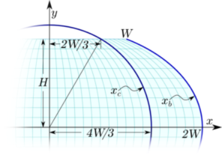
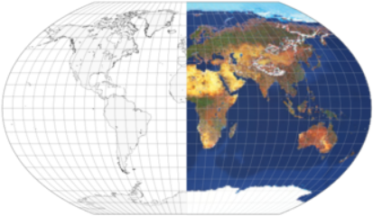

public:: true

# 推导Kavrayskiy's VII投影
- 考虑导Kavrayskiy's VII投影，我将其描述为:赤道承影面上为伪圆柱投影，两极为赤道的一半，纬线等间距，子午线120°包含在以地图为中心的圆中。这是什么意思？
- **伪圆柱投影:**
      仅在赤道投影面上，所有纬线都是水平直线，而经线是任意曲线
- **两极为赤道的一半**:
  根据定义，伪圆柱投影中的极点要么是点，要么是直线(“极线”)。与“尖极”投影相比，“平极”设计在高纬度地区通常具有较小的形状失真。大多数平极地图都有简单的极长和赤道长比，比如1/2或1/3
- **等间距纬线**
  除了等面积的伪圆柱形投影外，所有的伪圆柱形投影都有可变的纬线间距；相反，非等面积的Kavrayskiy VII有恒定的纬线间距，当然，这并不意味着沿其子午线的比例是相同的，甚至是恒定的。在没有进一步约束的情况下，$$y=\varphi R$$使中央子午线单独成为一条标准线
- **子午线120°包含在以地图为中心的圆中**
  在每一个假圆柱形投影中，沿任何纬线的比例都是恒定的。因此，所有的经线都有类似的形状，除了中央的经线（这里认为是0°），它总是直的。形状受到经度的影响。在这种情况下，如果120°的子午线（即）是一个圆弧，那么除了中央的子午线之外，其他的子午线都是椭圆弧，向中央的子午线变平，向地图的边界变长
- 
- 让我们画出Kavrayskiy's VII投影的东北象限。假设是极线长度的一半，以及它离赤道的距离；由于等距性质，$$h=\frac{R\pi}{2}$$。对于给定的纬度λ，设 $$x _{c}$$为圆形120°子午线的横坐标，$$x _{b}$$为180°子午线(基本边界子午线)的横坐标。
- 因为真正的距离是沿着每条假圆柱形纬线的线性关系，在任何给定的纬度上，$$x _{b}$$和一般的横坐标$$x$$都与$$x _{c}$$成正比。
-
  $$x_{b}=\frac{180}{120}x_{c}$$
  $$x=\frac{\lambda }{\pi }x_{b}$$
- 参考圆的半径$$\frac{4W}{3}$$马上就出来了。根据毕达哥拉斯定理，
-
  $$H^{2}+(\frac{2W}{3})^{2}=(\frac{4W}{3})^{2}$$
  $$9H^{2}+4W^{2}=16W^{2}$$
  $$H=\sqrt{\frac{4}{3}}W$$
- 赤道长度的一半是:
  $$2W=\sqrt{3}H=R\pi\frac{\sqrt{3}}{2}$$
- 再次使用毕达哥斯拉定理:
-
  $$x _{c}^{2}+y^{2}=\frac{16}{9}W^{2}=\frac{\pi^{2}R^{2}}{3}$$
  $$x _{c}^{2}=\frac{\pi^{2}R^{2}}{3}-\varphi^{2}R^{2}$$
  $$x _{c}=R\sqrt{\frac{\pi^{2}}{3}-\varphi^{2}}$$
-
  $$x=\frac{3R}{2\pi}\lambda \sqrt{\frac{\pi^{2}}{3}-\varphi^{2}}$$
  $$y=R\varphi$$
- 
- Kavrayskiy Ⅶ投影很容易理解和计算，它没有特殊的属性，既不保留形状也不保留面积。它只是具有良好和平衡的外观，对于许多用途来说通常已经足够了。