public:: true
上一页:: [[墨卡托投影和等距离方位投影]] 
下一页:: [[投影摘要和表格]] 
原文链接:: [Some Applications for Projections](https://web.archive.org/web/20180629152245/http://progonos.com/furuti/MapProj/Normal/ProjAppl/projAppl.html)

## 介绍
- 通常，正确选择投影、比例、方向和坐标对于地图快速、明确地传达信息至关重要，几个例子就证明了这一点。
  当提供参考资料时，本节中的地图不是扫描图或复制品，而是原始来源的近似重建图(例如，原始动物区地图不使用等面积投影)，用于说明目的。
## 动物区系和全球联系
- 为了进行动物分类，世界被划分为动物区系。
- 这里（继奥利弗·奥斯汀和亚瑟·辛格之后，《世界鸟类》，哈姆林出版社，1968年），一张基于莫勒恒星投影的地图展示了除南极洲以外的所有陆地。由于气候是区系特征的一个重要决定因素，大多数区域边界遵循纬度，因此，在极坐标图中大致同心。
- Buckminster Fuller二十面体投影的最新版本中采用了类似于先前星形地图的土地布局。在托马斯·B·艾伦2001年12月出版的《国家地理杂志》200（6）中，它被用来展示光缆线路和洲际网络流量。投影选择是恰当的，因为与南极洲的连接可以忽略不计，而且即使跨越海洋，也不需要破坏任何路由线路。
- 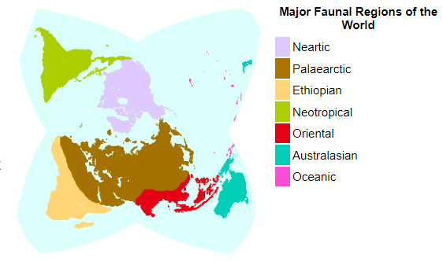 
  世界分区，修正的莫勒投影
## 迁徙路径
- 根据“走出非洲”理论，现代人在近10万年前作为一个单一的非洲物种出现，然后传播到世界各地(黄克明，走出非洲就要出门吗？，科学美国281(2)，1999年8月)。简单的坐标旋转避免了切断亚洲和阿拉斯加之间的迁移路径。
- 一些特殊的迁移路径与东亚的人口有关，这些人口后来可能居住在波利尼西亚、北亚和美洲。牙科人类学(Christy G. Turner II，亚洲的牙齿和史前史，Scientific American 260 (2)，1989年2月)提供了依赖于几种遗传因素的证据，这些因素不是文化上获得的，也很少受到环境的影响。
- 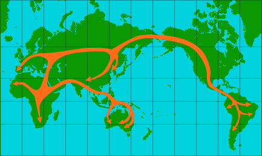 
  根据“走出非洲”假说，早期人类可能迁移；经剪裁的墨卡托地图，中央子午线150 E
- 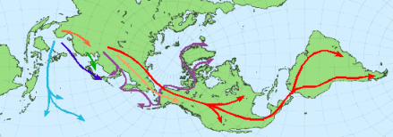 
  现在的牙齿和化石表明，过去有几次移民潮，当时海平面下降在现在孤立的日本和阿留申群岛之间架起了桥梁。卡西尼投影。
## 双关地图
- 有时，严肃的制图师为了使想法令人信服，会诉诸幽默。例如，约翰·p·斯奈德，一位著作、论文和投影的多产和有影响力的作者，也创造了一个完全没有适用性的等面积投影，除了证明面积保存本身并不是一个好的投影，正如阿诺·彼得斯投影的一些支持者显然认为的那样。
- 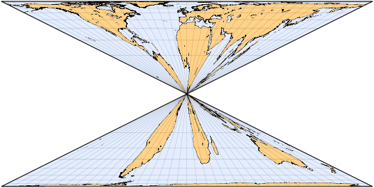 
  J.P.斯奈德的沙漏形投影
- 斯奈德异想天开的提议，设计了ca。1945年和1987年非正式提出，是一个伪圆柱形设计，在赤道上没有水平刻度，并有极端的垂直拉伸来补偿。反过来，它是平极的，两极有无限的水平刻度。生成的地图类似于沙漏，当用两个扁平的极点绘制时，形状失真比不相关的科利农地图强得多。
- 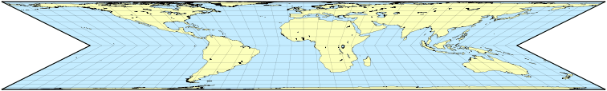 
  科里尼翁的投影在有两个平极的变体中的应用
- 马丁·加德纳提到一位地理学家获得了一个奖项(1973年)，奖项的形式是另一位多产作家瓦尔多·托布勒起草的蝴蝶结形状的框架地图。加德纳没有透露投影，但它可能是Tissot设计的局部地图的变体，托布勒在1974年提到了这一点。
- 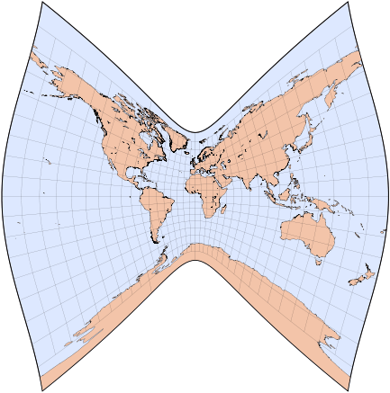 
  用于本地地图的Tissot投影，扩大到3度；参考纬度为0°。地图可能会出现奇怪的形状，甚至在某些参考纬度上与自己相交；这绝对不是世界地图的投影。
- 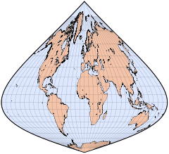 
  Tissot的投影，参考纬度90°S。
## 卫星轨道
- 太平洋上和平号空间站的坠毁引起了很多关注。大多数媒体报道使用圆柱投影来描绘车站沿着明显弯曲的曲线的最后时刻。当然，当以三维或方位正投影图的形式呈现时，低轨道物体的实际路径看起来要简单得多:
- 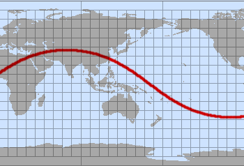 
  等距圆柱形投影中大圆的一部分
  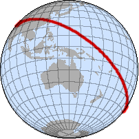 
  正视图中的相同曲线
- 尽管有流行的概念和插图，许多卫星在相对较低的轨道上巡航，几乎擦过地球的顶部大气层：和平号和国际空间站的典型平均高度是390公里，而航天飞机经常执行低于250公里的轨道（地球静止卫星的高度高得多，接近36000公里）。这个例子是简化的，因为轨道上的物体既不完全遵循圆形轨迹，也不保持恒定的高度；此外，行星本身并不静止，而是在它们的轨道下旋转。
- 分隔昼夜区域的曲线也大致是一个大圆，因此流行的桌面程序中的蜿蜒图形在矩形地图上显示 "太阳钟"。
## 星图
- 在人类历史的大部分时间里，恒星和行星主要用于导航和时间推算。在这个角色中，将天体视为附在一个绕地球缓慢旋转的巨大球形外壳上是完全恰当的。这样的球体可以通过与普通贴图完全相同的过程进行贴图。事实上，一些地图投影最初被早期天文学家用来绘制天空而不是陆地。
- 两张极地方位赤平极图显示了北极和南极的夜空。其他纬度和日期的观测者会看到星座或多或少地倾斜。
- 在北半球（北部）的天空地图上，北斗七星出现在9点钟的位置，在第二个最里面的圆圈。10点钟的明亮恒星是大角星；北极星略低于天上的北极。在南半球（南半球）的天空中，第二个最内层圆圈上两点处的两颗明亮的恒星属于半人马座，它们指向南十字，略低于右下方；天狼星是底部中心附近最亮的恒星。
- 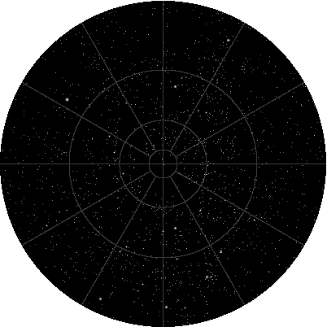 
  北半球星图
  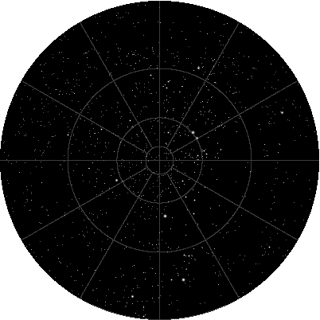 
  南半球星图