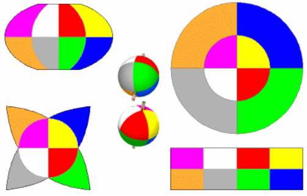

### 不可避免的变形
	- 一个球体（加上极轴）的两个准正交图，分为八个等部分，被四张相同比例尺的地图包围，从右上角顺时针依次是：方位等距离投影，兰伯特投影，莫勒的等面积四瓣星状投影(Maurer's equal-area star with four lobes), 温克尔三重投影。 
	  
	- 上面的几个投影描绘了相同的球形数据如何以不同的方式被拉伸、压缩、扭曲变形。
	  * 方位等距离投影只关注保持靠近中心极点部分的方位和距离，但外半球被大大拉伸了：它的极轴变成了一个圆点。
	  * 兰伯特投影的两个极点变成了线,但它覆盖了与原来的球体相同的区域,而且八块区域的形状完全一致相等。
	  * 星状投影比较特殊,具有不相等的八瓣和明显的连续形变；然而它的八瓣是等面积的。
	  * 在温克尔三重投影中，八块区域有不同的形状，面积改变，极点也是线性的，但整体上变形较小。总而言之,正交视图和地图也只能显示一部分的地球,
	- 所有的投影都有变形,没有投影能适合所有情况,如果投影面是斜切的话,八块区域将会更加奇怪