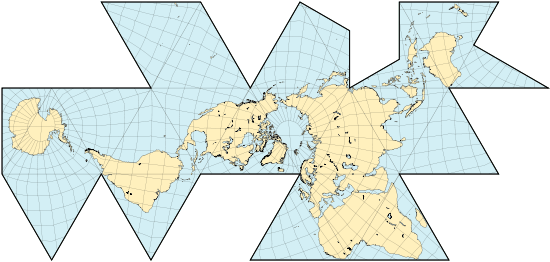

public:: true
上一页:: [[立方体和八面体地图]]
下一页:: [[用于打印和折叠的地图]]
原文链接:: [projPoly3](https://web.archive.org/web/20180316202124/http://www.progonos.com/furuti/MapProj/Normal/ProjPoly/projPoly3.html)

# 立方八面体地图
- 立方八面体是一个准规则的实体，由六个正方形面和八个等边三角形面组成，混合了立方体和规则八面体的特征。它是理查德·巴克明斯特(“巴克”)富勒提出的第一张多面体地图的基础，富勒是测地线圆顶的著名倡导者。
- 在富勒的地图中，立方八面体首先被刻入球体。它的边只是向外投影，形成了球形的正方形和三角形，它们的边有相同的长度，因为每个多面体的顶点都与球体相切。由于日晷投影的性质，每个球面边都是测地线弧。
- 然后通过富勒投影将每个球面三角形转换为地图上边长相同的平面三角形，这是一个相对简单的程序。给定球面上的一个点，为每条边找到另一个经过该点的大圆，并且与边的两端有相同的距离。在平坦的三角形内，一个较小的三角形是由三条线的交叉点定义的，每条线都与一条边平行，其距离与相应的大圆和球面边之间的测地距离成正比；地图上的理想点是较小三角形的中心。方形面也是类似的映射，但程序被简化了，因为只有两个大圆足以定义任何点。
	-  
	  在两个对称半球的立方八面体上的纯日晷投影。
- 因此，对于每一个面来说，球面和映射边缘的比例都是相同的，失真向中心增长，但受到地图的中断性质的限制。该投影既不是等面积的，也不是正形的。
- 富勒出版了他的Dymaxion™立方八面体地图的几个变体（很难在名称中看到任何制图含义,它代表了Dynamic Maximum Tension。事实上，它可能更像是一种促销手段，因为它被体现在Fuller的几个原型设计中，包括车，房间和浴室的原型里），对各大洲有不同的安排。1943年，理查德-埃德斯-哈里森起草了一份立方八面体地图，其两极位于正方形面的中心，可以作为一个实体进行切割、折叠和组装，并由《生活》杂志出版。1944年，富勒申请了一项美国专利，并于1946年获得了该专利，其中包括两幅平面地图：一幅是更传统的安排，赤道沿四个正方形面的对角线排列，两极在另外两个面上；另一幅是之前发表的斜面版本，它改变了大陆的位置，以减少切割，但南极洲除外。这将是富勒最终的立方八面体布局，直到几年后被他的二十面体版本所取代（见下文）。
	-  
	  富勒在展开的立方八面体上的投影的重建，以常规形式出现在富勒1944/1946年的专利中（方里网抽稀）。
	-  
	  富勒地图在立方八面体上的近似重建（方里网抽稀），具有相同的投影，但减少了大陆切割，也包括在富勒1944/1946年的专利中。
# 二十面体地图
- 二十面体是正规多面体中面数最多的一种，长期以来一直是世界地图的宠儿。英国的J.N. Adorno（1851年）和美国的J.M. Boorman（1877年）获得的专利中都提到了二十面体地图，尽管对实际投影过程的细节（或重要性）介绍很少。
- 另外两项美国专利更注重制图，分别由Joel E. Crouch（1944年申请，1947年授权）和经济学家Irving Fisher（1945/1948年；他的地图之前在1943年出版）申请，其特点是极点位于相反的顶点的二十面体。这两项专利在如此短的时间内被授予明显相似的主题，也许可以解释为两者至少都关注了用于轻松安装和拆卸地图面的机械标签、链接和夹子，以及投影方法本身。事实上，费舍尔用了一些段落来为他选择的日晷投影进行辩护，而克劳奇只是建议将其作为最直接的应用方式，但也提到其他方式也同样可以接受。费舍尔的设计无疑是当今最著名的两个设计之一，被作为类似地球仪销售。
	-  
	  展开的二十面体上的Gnomonic投影。Irving Fisher 1945/1948年的专利中出现的中央经线。
- Fisher提出的另一个二十面体地图是等面积的；该方法被Snyder推广到其他多面体。在二十面体相对较小的面中，投影的尖角不是特别明显。
- 在最初批评了Fisher对多面体的选择之后，大约在1954年，Buckminster Fuller自己在他的Dymaxion地图中放弃了立方八面体而选择了二十面体，基本上保留了他相同的投影--既不是保角也不是等面积--但没有两个不同面形状的复杂问题。富勒还继续强调大陆地区，在两个面被进一步细分后，其安排避免了切割海岸线。该设计更名为Dymaxion Air-Ocean世界地图，目前由巴克明斯特-富勒研究所推广，该研究所拥有与该地图及其布局有关的商标。与最初的设计相比，它从未获得过专利。
	-  
	  使用富勒投影在二十面体上重建Dymaxion地图，按比例放大，以符合日晷投影版的尺寸。其中两个三角形面被细分并重新排列，以避免切割澳大利亚/南极洲、韩国和日本。
	-  
	  使用日晷投影的二十面体地图，但采用富勒的大陆版图。
	-  
	  二十面体地图使用了日晷投影和范伟克布局的近似重建，这种布局最大限度地减少了大陆中断(像富勒一样)，同时避免了面部细分。
	-  
	  Fisher/Snyder在二十面体上的等面积多面体投影，同样按比例放大，以符合日晷版本的尺寸。中央子午线与费希尔的专利一样。
	-  
	  二十面体地图结合了费希尔/斯奈德的等面积多面体投影和富勒的大陆布局。使用经纬网，尤其是极线的形状，作为比较三个投影变形的参考。
	-  
	  在Fuller's Dymaxion（左）、gnomonic（中）和Fisher/Snyder's（右）投影中，在相同的缩放系数下，以一个极点为中心的单个5°方里网。
- 不幸的是，对富勒设计的流行描述往往夸大其词：它经常被声称是目前最准确的平面世界地图，而且没有任何明显的失真。除了 "最准确 "这个限定词，当然这取决于地图的用途，他的投影在任何地方都会产生明显的形状和面积失真（甚至在面的边缘，只保留了距离），尽管由于其中断的性质，受到面的延伸的限制。虽然富勒投影的面积畸变范围比二十面体日晷投影的要小得多，但其最大角度畸变却更大。
- 事实上，可以说二十面体Dymaxion地图的大部分好处来自其最小切割大陆分布，而不是投影方法。然而，同样的安排被批评为不熟悉和潜在的混乱来源。为了反驳这一点，支持者认为，一个全新的布局是经过深思熟虑的，对于富勒的“地球飞船”概念来说是必不可少的，它有一个单一的、统一的、未切割的有人居住的土地。此外，当呈现为可分离的面时，地图可能会以几种“正确”的方式被拆开和重新组装(这是大多数多面体地图支持者的共同主张)——这是富勒人文主义愿景的另一面。
# 正十二面体地图
- 也许所有五个柏拉图立体中最像球体的是正十二面体(它的体积与内切球的体积相差最小；另一方面，二十面体具有较大的体积/表面比，其体积最接近外切球体的体积)；不幸的是，它的面不会平铺在一个平面上，因此折叠中的大多数面仅由一条或两条边连接，从而导致太多的间隙。
- 1937年在美国申请的一项专利于1939年被授予James A.Smith，内容是关于十二面体的伪地球仪，最好是使用gnomonic投影法。该专利申请强调了这些面可以通过螺钉连接到一个带有20个径向钉子的轮毂上进行组装和固定，或者出于教育目的，以几种不同的安排平放。它还提到每个面都可以在两面印上不同的特征，甚至是天球星图，而且与普通地球仪相比，这个装置将更加便携和便宜。
	-  
	  正十二面体上的日晷投影
# 菱方八面体地图
- 菱方八面体不是一个规则的实体，它由正方形和三角形面组成：每个正方形都被三角形所包围，反之亦然。与之前的实体相比，由于面数较多，它看起来令人愉快地呈圆形。然而，它的展开形式使得在多个面中找到合适的特征分布而又没有过多的切割的问题显而易见。
	-  
	  两个组装好的菱形八面体，极点在相对的正方形或三角形面上的中心位置
	-  
	  菱形八面体地图折页，"中央 "经线0°；更多的面意味着更少的扭曲，但也意味着更少的连续性。可打印的版本