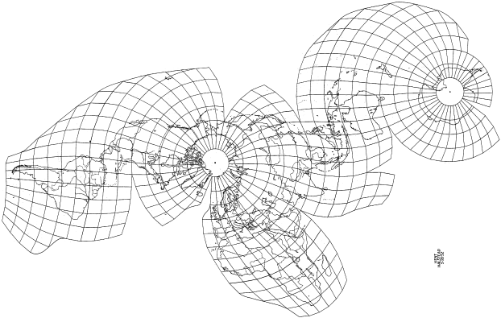
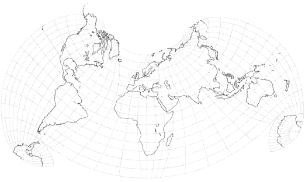

public:: true
上一页:: [[经典分瓣投影]] 
下一页:: [[分瓣技巧]]
原文链接:: [Arbitrary Interrupted Maps](https://web.archive.org/web/20180630041428/http://progonos.com/furuti/MapProj/Normal/ProjInt/ProjIntA/projIntA.html)

- 一些中断的投影是使用非常具体的或手工制作的原理设计的；它们的详细描述可能相当复杂，使得这些投影通常很难在计算机上如实再现。
# 施皮豪斯的分瓣地图
- 在使用哈默和奥古斯特投影设计了强调几乎连续的海洋的地图后，阿特斯坦·斯皮豪斯提出了更复杂的方法，比如修改(面积不相等)的哈默地图，在三个凸角处中断，或者在海岸线处中断地图，而不是像往常一样，在经纬线处中断地图。
# Kent Halstead的投影
- 一个非常不同的设计是Kent Halstead在1953年出版的 "Equidistant"，具有许多不对称的分瓣。与大多数投影不同的是，它是建立在一个特定的方里网上。
	-  
	  Kent Halstead的等距中断投影，带有10°步长的方里网。在这幅手绘地图中，有几个特征被简化了，与原来的描述不完全吻合：例如，极冠被不间断的圆圈所约束，一些在分瓣边界分割的单元的边缘长度不完全相加。Copyright © 1952 Kent Halstead.
- 每个网格 "单元 "的边缘--即10°宽的四边形，在两极周围退化为三角形--被映射为真实长度和恒定比例的直线段。从每一个极点开始，这些单元被分别和依次投射（可能是在连续的环中），有足够的剪切力来适应之前铺设的单元。沿着某些特权经线的剪切是最小的（例如，北纬100度和东经60度的经线大部分是连续的，并以几乎直角的方式穿过平行线），但在离它们更远的地方，角度不可避免地变得越来越偏斜。每当积累的剪切力过大时，并列关系就会被任意打断，同时避免在大陆上切割。在网格铺设完毕后，每个单元的内部可以通过相对边缘之间的线性插值进行投影。因此，这种投影是沿所有经线和平行线的等距投影，它们在大多数交叉点上都是断裂的，但既不是保角也不是等面积的。
- 当然，网格的间距可以减少，产生一个更平滑、更有曲线的网格，相应的描述也更复杂。即使是10°的步幅--648个单元--其结果也是一个令人愉快和平衡的地图。
- 复合世界投影是由Halstead（2008年，个人通信）提出的一个非常不同的设计。它是中断的，但避免了星形投影中常见的广泛的分瓣方向，从而保留了传统地图中一些熟悉的南北走向。其结果在视觉上和数学上都比他的等距投影更优雅。
- 复合世界投影是基于Lambert的等面积方位投影的部分斜面，松散地并列着大陆地区的特权：叶状边界尽可能避免分割海岸线，而中间的海洋地区被任意拉伸以保持关节的平滑，明显地偏离了理想的面积等值性。
-  
  Halstead的综合世界中断投影。原始图片由K.Halstead提供。