public:: true
上一页:: [[圆柱投影]]
下一页:: [[圆锥投影]]
原文链接:: [Pseudocylindrical Projections](https://web.archive.org/web/20180701163420/http://progonos.com/furuti/MapProj/Normal/ProjPCyl/projPCyl.html)

# 介绍
- 正轴投影时,在高纬度地区，所有的圆柱形投影都有强烈的形状变形，而且通常面积也被大大夸大了。特别是，两极被无限拉长成线，或者甚至不能被包括在内，如墨卡托投影中。伪圆柱形投影类别试图对形状与面积进行另一种权衡；在正常的赤道投影面，它们的定义是：
  * 纬线呈平行直线，不一定等距
  * 经线为任意曲线，沿每条纬线的距离相等
- 一些值得注意的从圆柱投影继承下来的特性:
  * 水平纬线在视觉上保留了纬度关系，从而使那些主要取决于离赤道距离的现象，如白昼时间、气候、风和温室变暖，更容易产生关联性。
  * 平行线上的任何一点都有恒定的刻度，便于按其方向测量
- 由于它们的纬线和经线并不总是以直角相交，伪圆柱映射的并不是保形性；事实上，大多数在极地依然有强烈的形状扭曲。因此，许多都是为了等价而设计的。
- W.Tobler提出了 "多圆柱 "地图的概念，它由许多具有正确平行长度但任意高度的薄圆柱地图组成，通过类比多圆锥投影是圆锥群的概括而提出的。更广泛地说，任何伪圆柱形投影在概念上都可以通过将部分圆柱形地图（可能是无限的）并列在一起而创建，不一定使用相同的纬线比例。
- 尽管它们的几何约束比圆柱设计灵活得多，但一些决定仍然适用于所有伪圆柱投影：子午线的形状（直线、圆锥截面、正弦曲线、任意曲线）、纬线的距离分布、线性或尖极 . 不同的作者经常采用相同的选择组合，并且几个伪圆柱“投影”实际上是同义词。 鉴于这些替代方案，这一大组的预测分类有些随意； 许多设计可以很容易地分配到多个部分。 在无数可能的伪圆柱投影中，有几个是有用的教学设备和世界地图的流行选择。
## 从圆柱形到伪圆柱形
- 伪圆柱地图概括了“多圆柱”概念，该概念可以表示为应用于离散纬度范围的圆柱投影群的概括。
- 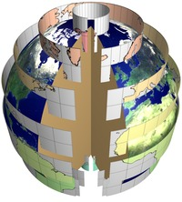
- 在这里，九个带有部分圆柱等距地图的条带覆盖了地球（为了清晰起见，部分被移除）。 每个条带与不同的标准纬线相切并拟合，其中一半埋在地球内部（赤道条带是例外）； 长度各不相同，但所有九张地图的垂直比例尺都相同。
- 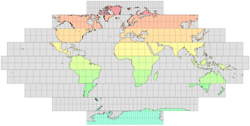   
  推广上面的扁平离散映射，无限多条的连续极限情形将是伪圆柱正弦投影；由于条带将完全覆盖地球表面，因此很容易看出最终结果是等面积的。对齐每个条带的中央经线不是强制性的:其他排列(见例子)是可能的，但可能没那么有用。
# 经典伪圆柱投影
## 正弦(Sanson-Flamsteed)投影
- 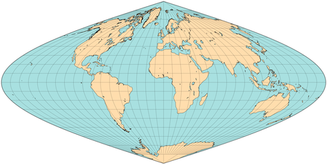 
  正弦(桑松-弗拉姆斯蒂德)地图，经纬网间距10°
- 尽管名字相同，但 "Sanson-Flamsteede "投影并非由Nicholas Sanson（约1650年）或John Flamsteed（1729年，死后出版）首次研究，而可能是由Mercator研究的--至少在Mercator地图集的后期版本（1606年）中，它被列入南美洲地图，并被称为Mercator等面积投影，或Mercator-Sanson。由于在正轴投影时，所有经线都是正弦曲线，所以也被称为正弦投影，可以很容易推导出来。
- 正弦投影是等面积的，并保留了沿纬线的距离，即赤道地图中的所有纬线都是标准线，但只有中央子午线是标准经线。虽然赤道带的复制几乎没有失真，但由于裁剪，极冠的易读性很差。部分恒定的比例和简单的结构仍然推荐像非洲和南美洲这样的大陆进行这种投影，通常是在方便的重新调整之后，对于世界地图来说，会应用于分瓣地图。
## Mollweide 投影
- 由德国人Karl B. Mollweide创建，同名的伪圆柱形投影以一个椭圆为界；两极为点，其赤道是中央直线子午线的两倍，但都不是标准线。所有其他经线都是椭圆弧，平行线的间距不等，以保持面积。只有中央子午线与标准平行线40°44'12 "N和S的交点没有变形。尽管它的几何形状很容易推导出来，但计算却比今天仍然重要的另一种经典的伪圆柱形，即正弦投影更复杂--这一点以及沿中央子午线的均匀比例的损失是为减少极地地区的拥挤所付出的代价。
- 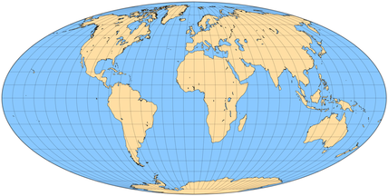
  正轴Mollweide 投影地图
- 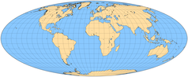 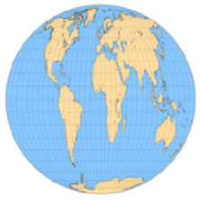
- Bromley（左图，标准赤道）和Tobler（右图，圆形）所做的经过调整的莫尔维德投影也是等面积的。
- 尽管摩尔韦德的投影具有等面积的特性和令人愉快的形状，但自1805年发表以来，摩尔韦德的投影几乎没有得到认可，只是在法国人雅克-巴比内特于1857年将其作为同源投影提出后，才变得更加知名。从历史上看，它的其他常见别名包括椭圆、巴比内特、同位素（来自希腊语homo的 "相同"，因此为等面积）。
- 这种投影具有深远的影响，在融合（John P. Goode的homolosine，Allen K. Philbrick的Senu-Mollweide，György Érdi-Krausz）和平均（Samuel W. Boggs和Oscar S. Adams的eumorphic；一些作者还将其与Winkel II联系起来）的设计中与正弦形结合。单独或组合的中断式变体也很受欢迎。
- 其他变化包括斜轴投影面，如约翰·巴塞洛缪的亚特兰蒂斯和通过正交倒数因子的简单重新缩放，这保持了面积等效性，同时改变了纵横比和角度变形模式。例如，瓦尔多·托布勒(1962)建议用标准纬线73° 7 ' 43.85 "南北将整个地图做成圆形；罗伯特·h·布罗姆利的投影(1965)拉长了椭圆，合并了赤道的标准纬线。
- 莫尔维德的2:1椭圆偶尔会被误认为艾托夫和哈默的投影，两者都不是伪圆柱投影，尽管后者也是等面积的。更容易混淆的是阿皮安第二个球状投影的椭圆全世界延伸，数学上简单得多，面积也不相等。
## Foucault's Stereographic Equivalent
- 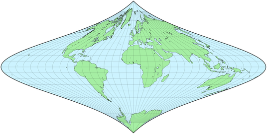
- 德·佩蒂特·福柯在1862年提出的一种伪圆柱投影是立体圆柱投影的等价物:它的水平纬线的间距与方位立体投影和布劳恩圆柱立体投影的赤道方向的间距相同，为了保持面积而计算的经线是五阶曲线。
- 尽管它是继正弦和摩尔维德投影之后的第一批“现代”伪圆柱投影之一，但立体投影的等效物只不过是一种新奇的东西:由于平行间距在较高纬度增加得更快，水平尺度相应地缩小，产生具有过度角度失真的尖锐极点。另一种由方位角原理导出的平行间距等面积伪圆柱投影，即四次等距离投影，只是稍微成功一点，但实际上要有趣和有用得多。同样的概念，应用于方位角正投影，显然会导致Lambert的圆柱形等面积投影；从方位等距投影到正弦投影；对于gnomonic来说是不实用的。
## 直线方里网的地图
- 少数正轴伪圆柱形投影的方里网只包括直线，可能在赤道处断开。其中包括最古老的梯形投影、Eckert's I和II、像HEALPix网格这样的合成物，以及Snyder的带有严肃信息的制图笑话中（译者注：原文大概是谐音梗的意思，在最后有提及）。
### Collignon投影
- 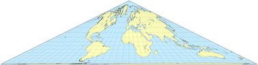 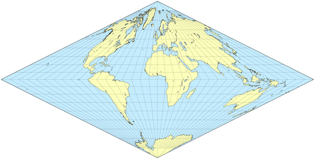 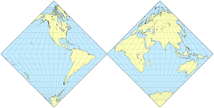 
  尽管保留了地域关系，克里尼翁投影的不寻常的变形使它成为一个新奇的角色。原投影有完全直的经纬网；这里展示的其他地图是一个对称的菱形，在两个半球有间断的变化。
- 1865年引入的埃杜尔·科利翁(douard Collignon)的投影保留了一些面积，但严重扭曲了形状。在赤道方面，南北半球可以是一个等腰三角形，底部在赤道上，高度为赤道长度的一半，也可以是一个等腰梯形，底部在赤道上。所有的经纬线都是直的，但是经线在赤道处可以随意断开。
- 世界地图的常见排列方式是一个不间断经线的等腰三角形，并以平坦的南极为基础。补充选项（倒三角、对称菱形和沙漏形）和两个或多个菱形的间断变体同样有效，但在实践中从未见过。尽管其结构简单，这种投影被认为只是一种好奇心；最近，它作为HEALPix格式的一部分找到了实际应用。
## 抛物线等面积投影
- 1929年，John E.E.Craster中校提出了三种假圆柱形等面积投影的特点，其经线是基于圆锥截面。他拒绝了椭圆和双曲线版本，并为抛物线设计提供了一个简略的坐标表。后来Charles H.Deetz和Oscar S.Adams(1934)提出了数学细节，包括一个中断的版本，并由Adams(1945)再次提出。
- 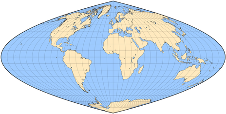 
  卡斯特抛物线投影
- 虽然具有相同的2:1比例，表面上类似于正弦曲线，但卡斯特的抛物线投影有更多的凸子午线，在边界子午线附近的高纬度地区，形状失真有所减少。它的数学发展是求解三次函数的一个有趣的应用。
- 作为基于三角曲线和圆锥曲线的伪圆柱投影系列(1934)的一部分，Reinholds Putniņš适时地指出他的P4投影与Craster的抛物线相同。
## 西蒙和其他人的投影
- 在战前的德国，卡尔·西蒙提出了四个伪圆柱投影，第一个无疑是最著名的。除了一个之外，其他所有人后来都被其他作者独立地重新发现了。
### 洛西姆塔尔投影
- 西蒙称他的第一个投影(1935年)为Wegtreue Ortskurskarte，以1966年出版它的W.Tobler的名字命名，今天几乎总是被称为loximuthal。这个词很好地总结了它的独特之处:给定一个参考纬度，所有与中央子午线相交的直线都是等角航线（ loxodrome）。此外，它们都是方位角正确的标准线，类似于穿过方位等距地图中心的直线。
- 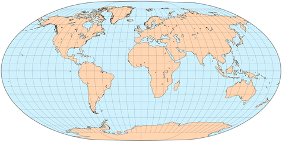 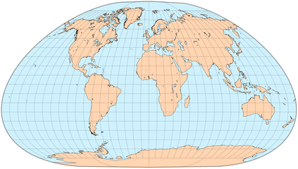 
  中央子午线为0的洛西姆塔尔地图。参考纬度是0度(顶部)和51.5度，靠近格林威治(上图)。必须为每个感兴趣的点创建Loximuthal地图，如以下图示例所示。
- 相比之下，在墨卡托地图上，所有的等角航线都是直线，但是比例不仅在不同的loxorome之间快速变化，而且沿着相同的直线变化；方位角也不一致。
- 洛西姆塔尔投影面积不等，仅在中央子午线与参考点(也是标准点)平行相交的地方是共形的。与大多数伪圆柱投影不同，它不是相对于赤道对称的，除非选择赤道作为参考纬度。
### 四次等面积投影（The Quartic Authalic Projection）
- 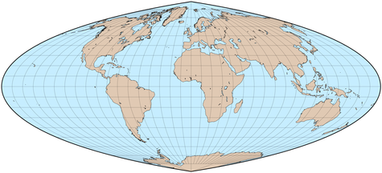
- 和福柯的立体对等物一样，四次等面积是另一种由方位原理导出的等面积(四次，因为它的经线是四阶曲线，自积来自希腊语autos ailos，“相同面积”)投影；这是西蒙发表的第三个投影(1937年)，由亚当斯独立开发(1944年发表，1945年再次发表，附有详细的分析，没有名字)。
- 因为它的纬线像兰伯特方位角等积投影的赤道面一样间隔很远，所以它是导致更著名的哈默投影的变换的极限情况。亚当斯更喜欢两个半球的间断版本，他强调了它的极点是如何不如正弦曲线的极点尖锐，而赤道带避免了莫尔维德的垂直夸张。尽管如此，除了作为麦克布赖德和托马斯的平极四次投影的灵感之外，四次authalic通常被忽略。
- 最后，西蒙的第四个投影是简单的四次等深线，具有相互的水平和垂直缩放，以保持面积，同时适合2 : 1的纵横比。
## Kavrayskiy's Fifth Projection
- 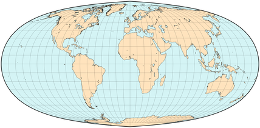
- 除了圆锥和圆柱投影外，俄罗斯的弗拉基米尔·卡弗雷斯基还提出了三种伪圆柱设计，其中的V和VI是基于三角函数的等面积设计。第五个(1933年)有尖的极点，在北纬35度和南纬35度的平行线和根据正弦曲线计算的经线，但不是正弦曲线本身。第六部(1936)与瓦格纳1932年的第一部投影完全相同，都是正弦子午线。
## 平极伪圆柱投影
- 带有极线的地图被称为平极地图，以直线而不是点来表示两极。当然，所有的正轴圆柱形投影都是平极的，但这个术语通常适用于一大群伪圆柱形设计。
- 极线以水平比例失真为代价，避免了正弦曲线和莫尔维德投影的拥挤外观，水平比例失真在极点是无限的。
- 像瓦格纳和埃克特这样的制图员发展了整个平极投影“家族”。其他带有极线的投影包括内尔伪圆柱投影(第一个知名的投影)、温克尔投影一和温克尔投影二。
### 埃克特的六个投影
- 1906年，德国教授马克斯·埃克特(后来的埃克特·格雷芬多夫)发表了六个伪圆柱投影，它们在正轴时有一些共同的特征:
  * 中央子午线是直的，长度是赤道的一半，是奇数投影中的一条标准线
  * 两极是平的，只有赤道的一半长
  * 偶数序号的投影面积相等，奇数序号的投影具有等间距的纬线
- 因此，在所有六个方案中，极点由一个正方形构成，整个地图由一个两倍宽的矩形构成。边界经线是简单的曲线。
- 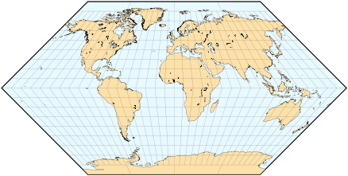 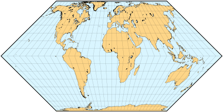 
  Eckert的第一个和第二个投影
- 虽然这六个投影没有一个是共形的，但奇数投影呈现出更好的整体形状(在正中心没有形状失真)；为了保留面积，偶数投影压缩了两极附近的垂直比例，并在赤道附近拉伸。
- 埃克特的第二个设计是等面积的，将所有经线映射为在赤道处断开的直线。第一个投影相似，但面积不等，因为平行线间隔相等。两者都不仅仅是好奇。
- 对于他的第三个和第四个投影，埃克特把外经线做成半圆；所有其他的经线都是规则的椭圆弧，除了中央经线，像所有埃克特平极地图一样，是直的，长度是赤道的一半。第四种设计适度用于世界地图；第三个有时被误认为是奥特利厄斯的椭圆形地图的投影，它缺乏沿纬线的恒定比例，因此不是伪圆柱形的。
-  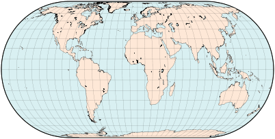 
  Eckert III (top) and IV maps
- 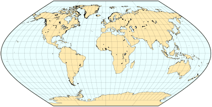 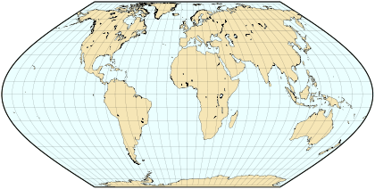 
  Eckert V (top) and VI maps
- 第六个也是最受欢迎的埃克特平极投影有边界子午线，形状为正弦曲线周期的一半。表面上相似的第五种设计有规则的平行间隔，并且面积不等。
- 其他几个伪圆柱投影，最著名的是西蒙，麦克布赖德和托马斯，以及瓦格纳的一系列，也是基于极线和正弦子午线。
### 罗塞恩正弦投影
- 卡尔·罗塞恩的伪圆柱投影(1926)的形状是从正弦曲线中导出的，纬度被压缩:极点被映射到与北纬53° 7′48″和南纬53° 7′48″对应的直线上，因此长宽比从2∶1变为约3.388∶1。这类似于艾托夫、哈默、埃克特-格雷芬多夫的投影中的坐标压缩，但没有补偿扩展。投影被放大，平行线被隔开以使整个地图面积相等。
- 罗森的方法后来被乌尔马耶夫所概括。
- 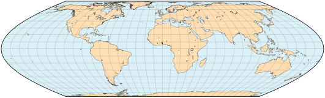 
  Map in Rosén's projection.
### 罗宾逊投影
- 在关于圆柱形世界地图是否适合教学的广泛争议之后，传统的地图集出版商兰德·麦克纳利(Rand McNally)要求著名的制图员和教育家阿瑟·H·罗宾逊开发一种新的地图投影，该投影具有减少的整体失真和简单、不间断的经纬网。
- 所产生的折衷投影没有应用几何透视过程，如用于经典方位角投影，也没有实现某些先前定义的目标，如墨卡托的目标，或使用简单的数学函数，如Sanson-Flamsteed、Mollweide和Eckert系列的正弦或椭圆弧，而是将赤道方面的边界经线用常规值定义，通过手工计算，以产生一个 "看起来正确 "的地图（因此其俗称正视）。一个表格定义了这些经线的纬度5°增量的x、y坐标值；其他点必须是内插的（内插方法没有硬性规定）。就像所有的假圆柱形投影一样，在正常的方面，经线沿着所有平行线等距排列，这些平行线是水平的、笔直的（在38°N和38°S之间，有规律的排列）。赤道的长度几乎是中央经线的两倍；两极是平的。
- 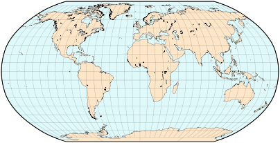 
  罗宾逊地图，用三度多项式内插法计算
- 罗宾逊投影于1963年设计，1974年正式出版，在受到国家地理学会制图人员的赞扬后才真正流行起来；1988年，它作为该学会杂志的插页出版，并被选为其参考世界地图，取代了范德格林顿投影。
### Kavrayskiy's VII Projection
- 另一种既不保留形状也不保留面积的折衷设计是1939年Kavrayskiy的第七投影，它是一个平极伪圆柱，具有椭圆子午线和中心子午线的正确比例。与罗宾逊的相比，它的数学推导和描述要简单得多。
- 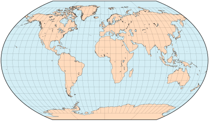
  Kavrayskiy's projection VII
### 平极四次投影
- 费利克斯·w·麦克布赖德和保罗·托马斯创造的几个投影的极线只有赤道的三分之一长。第四个也是最著名的(1949)，平极四次投影，有四阶曲线作为经线，并且是等面积的。
- 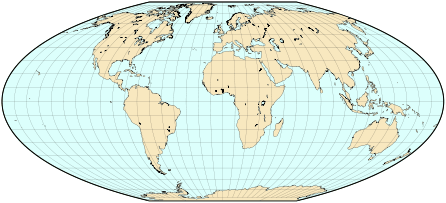 
  McBryde-Thomas IV (flat polar quartic) map