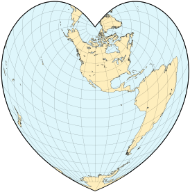
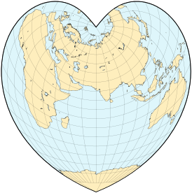
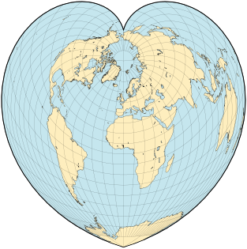
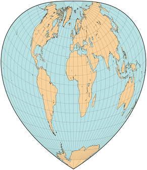
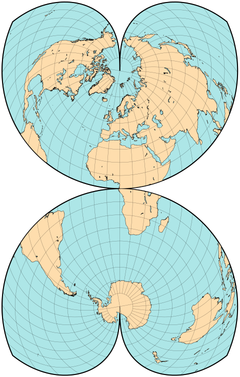
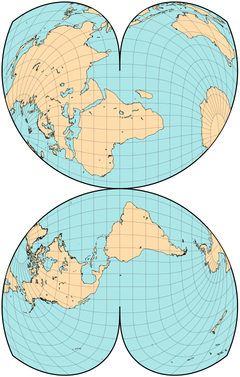
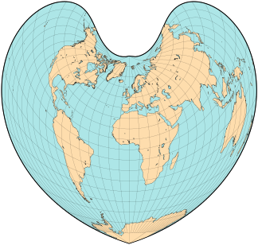
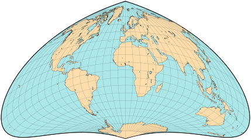

public:: true
上一页:: [[圆锥投影]]
下一页:: [[修正方位投影]]
原文链接:: [Pseudoconic Projections](https://web.archive.org/web/20180701195108/http://progonos.com/furuti/MapProj/Normal/ProjPCon/projPCon.html)

- 在被称为伪圆锥投影的投影组的法线方向上，所有的纬线都是具有公共中心点的圆弧；然而，与真正的圆锥投影相比，子午线并不局限于直线。这个概念相当古老，被托勒密使用过。
# 心形投影
## Stabius-Werner 投影
- 地图的形状并不拘泥于矩形、圆盘或椭圆。有些甚至不是凸形的，如维也纳的约翰-斯塔比乌斯（Johann Stabius）（又称斯塔布）设计的美丽投影（约1500年）所创造的地图。他的三个心形（"心形"）投影在约翰内斯-维尔纳（Johannes Werner）的论文中得到推广，以至于它们通常以后者的名字命名。它们在正轴投影面时都有一些共同的特点:
  * 纬线是指以某一极点（通常是北极）为中心的圆弧，所有的线性比例都相同。
  * 中央子午线是一条直的标准线
  * 所有其他经线都是曲线
- 只有纬线的比例尺才能区分这三种投影方式。在使用第一种地图绘制的世界地图上，赤道是一个圆，边界经线会明显重叠，因此地图通常被剪成一个半球。在第三种中，赤道的比例尺比中央子午线的比例尺略大，因此在60°纬线以北有少量重叠。
-   
  斯塔比乌斯-沃纳第一个投影中的半球
-  
  Stabius-Werner的第三个投影，包括整个世界，但西伯利亚的最东端除外
## 沃纳投影
- Stabius-Werner的三个投影都是等面积的，清楚地表明了地球的圆度，就像在子午线上切开地壳并剥落一样。然而，只有第二个版本--被称为维尔纳投影--被广泛使用。它的赤道长度是中央子午线的两倍，因此所有的纬线都是标准线，没有重叠的地方。
-  
  Werner（Stabius的第二个投影），极地投影面
- Oronce Finé（1531年）和Mercator（1538年）的作品采用了在赤道上中断的蝴蝶形维尔纳地图，中央经线强调了东半球。
- 今天很少看到这种投影的原始形状，但它被用于一些专门的形式，特别是Wilhelm Schjerning的第六投影（在南极洲周围以不规则花瓣中断，作为强调海洋的倒星形地图）。古德的极地等面积图（类似的，北极地块的特权，多条中央经线），并与方位半球的一部分结合，形成更传统的星形，在 "四面体 "和威廉-奥尔森的投影中，有重新缩放的纬线。
-  
  Schjerning V投影
- 在1904年的同一篇论文中，Schjerning提出了另外五个投影--一个等距圆锥，两个修正的方位角，以及Stabius-Werner第二投影的两个变化。Schjerning IV，一个斜轴投影，以及Schjerning V，一个纬线缩短50%的正轴投影。在按比例重新调整后，第五种设计重新获得了Werner的原始面积，但没有获得无扭曲的中央子午线。
- {:height 385, :width 240}  
  蝴蝶形中断的Werner地图。正轴和横轴（在25°E处中断）
## Bonne 投影
- Bonne 伪圆锥投影曾经在大比例尺地形图中非常流行，现在已经普遍废弃，通常被横向墨卡托地图取代。虽然以法国人R.Bonne（1727-1795）的名字命名，但它的使用时间更早，大约在1500年。它保留了区域，除了远离中心的地方，其形状失真是可以接受的。
- 在Bonne地图中，除了下面提到的一种特殊情况，所有的平行线都是圆的同心圆弧，都是等距的，都是标准线。沿着直线垂直的中央子午线，比例尺也是正确的。在构建时，选择球面上的一条纬线，并在该中央平行线上建立一个圆锥体的切线。该纬线在地图上的半径与沿锥体的半径相同。所有其他纬线的半径都被相应地标出。
- 因此，不同的中央纬线会产生不同的波尼地图。两种特殊情况是众所周知的: 
  * Werner投影，中心纬线为90°N，半径为零，是一个零尺寸的平 "锥"。
  * 正弦或Sanson-Flamsteed投影，中心纬线为0°。在这种特殊情况下，半径是无限的，"锥体 "是圆柱形的，每条平行线都是一条直线。
- 
  Bonne map, 中央纬线 45°N
-  
  Bonne map, 中央纬线 15°S
-