public:: true
上一页:: [[伪圆锥投影]]
下一页:: [[正形投影]]
原文链接:: [Modified Azimuthal Projections](https://web.archive.org/web/20180701195125/http://progonos.com/furuti/MapProj/Normal/ProjMAz/projMAz.html)

- 在真正的方位投影中，所有方向都从参考点开始保留，通常在地图中心相切。三个经典的透视方位投影一次只能显示一个半球；其他的(如方位等距)由任意约束定义，而不是纯粹的几何模型。
- 一些投影的灵感来自方位角原理或上述投影的修改；结果通常不完全是方位投影本身。例如，大多数星形投影基于方位投影的半球。
# Wiechel的投影
- H.Wiechel的1879年投影与方位等距投影和Lambert的方位等面积投影都有一些共同的特点。在其极地方面，一个极点是一个点，另一个极点，如果显示的是整个世界，则是地图的圆形边界。
- Wiechel投影中的一张地图可以想象成一张等面积方位地图，它被切成无限多个同心环，这些环都沿同一方向旋转，可以是任意顺时针方向，也可以是逆时针方向；每个环的旋转角度与其半径成正比。总映射面积不变，因此投影面积保持不变，但不再是方位投影。在极面，经线变成圆弧，像在方位等距投影，标准线；在完整的世界地图中，经线是半圆形的:它们几乎平行于圆形极点，造成巨大的形状扭曲。因此，地图通常仅限于单个半球。
- 这种很少使用的投影只在极地方面有一定的意义；有时它被归类为伪方位投影，与伪圆柱投影和伪圆锥投影类似，它们分别与圆柱和圆锥设计有一些共同的属性，但在法线方向有弯曲的经线。
	- ## Wiechel的投影有半球和整个世界的版本
	- 后者在圆极附近有明显的限制。非极地方面是视觉上引人入胜的新事物，但没有什么实际价值。
	  在极地方面，Wiechel地图结合了Lambert的方位设计的面积保存和方位等距投影的子午线长度。
	- 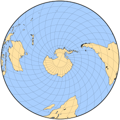 
	  南半球
	- 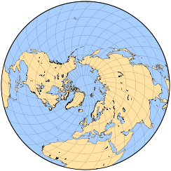 
	  北半球
	- 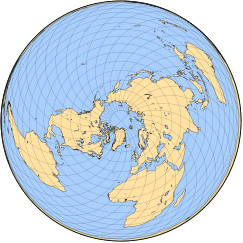 
	  南极为投影点的世界地图
	- 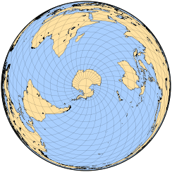 
	  北极投影点的世界地图
	- 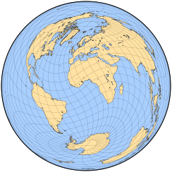 
	  正轴投影世界地图
# Aitoff 投影
- 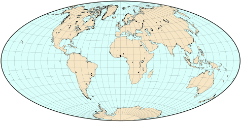 
  Aitoff投影世界地图
- 1889年，大卫-艾托夫宣布对正轴方位等距地图进行非常简单的修改。将经度值加倍，使整个世界都能容纳在地图的内盘中；然后将水平比例尺加倍，形成一个2：1的椭圆。因此，除了沿赤道和中央子午线外，该地图既不是方位角也不是等距角。它也不是等面积或等角的。
- 艾托夫投影是形状和比例尺失真之间的一个非常有趣的折衷。它清楚地表明了地球的形状，与莫尔维德的椭圆投影相比，极地剪切较少。然而，这个有影响力的设计很快就被Hammer的作品取代了。
# Hammer 投影
- 1892 年，恩斯特·哈默 (Ernst Hammer) 将完全相同的原理应用于兰伯特的方位角等面积投影，这应当归功于 Aitoff 之前的工作。
- 由此产生的2：1椭圆等面积设计，作者称之为Aitoff-Hammer，其他人起初称之为Hammer-Aitoff，后来干脆称之为Hammer投影，很快就流行起来，甚至今天还被用于世界地图。它本身也是一些改进的投影的基础，比如Briesemeister的斜轴投影。
- 艾托夫投影和哈默投影表面上的强烈相似性导致了相当大的混乱，甚至在技术文献中也是如此。
- 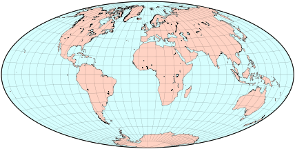 
  Hammer投影
# Schjerning 第二、第三投影
- 从某种意义上说，W.Schjerning 在 1904 年发表的所有投影都与方位等距有关，包括 Werner 的伪圆锥心形投影的三种变体。 这里总结了另外两个。
- Schjerning 的第二个投影更容易使用极地基础投影来描述，与许多星形投影一样，它的内半球与极地方位角等距的内半球相同。 外半球被分成两瓣，整个地图组成一个 2:1 的椭圆。 在左右两瓣外半球中，纬线由保留内半球间距的圆弧组成。 子午线沿每个纬线等距标记。 Schjerning II 投影是此基础投影的横轴体现，将极点移动到了椭圆短轴的末端。 不幸的是，内半球和外半球之间有明显的断裂； Schjerning 应用放大来改善亚洲的外观。
	- 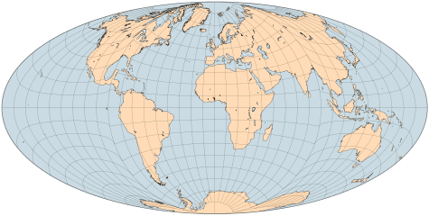 
	  Schjerning 的第二个投影的部分重建，亚洲部分没有扩大
- Schjerning III 投影也可以借助基本投影来描述，在这种情况下，由在中心极点连接的两个圆组成； 另一个极点在离中心最远的两个点之间分开。 在距中心极点正确距离处绘制纬线，然后沿每个纬线等距标记子午线。 最后的投影面是一个斜面，以伦敦为中心。
- 在 Schjerning 的第二个和第三个投影中，每个点与地图中心的距离都是正确的。 中心的方位角仅在第二个设计的内半球是正确的。 两种投影都不是等角投影或等面积投影。
	- 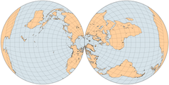 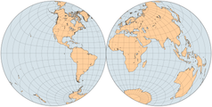 
	  图一是Schjerning III投影的基础投影，以极点为中心。图二是横轴的基础投影。下图是Schjerning的最终表现，以伦敦为中心。
	  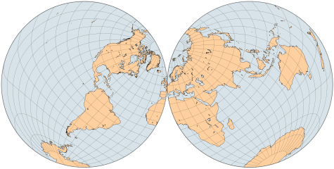
# Wagner IX 投影
- 作为Karlheinz (Karl Heinrich) Wagner系列的一部分，他的第九个投影（1949年）是对Aitoff投影的重新缩放。纬线的投影与Aitoff的一样，但为其实际值的7/9；这导致两极被映射为沿Aitoff投影的纬线70°N和70°S的弧形线。因此在带有极线的伪圆柱形投影中，极点的角度畸变比通常要小。反之，经线是以实际值的5/18来映射的。然后，投影的坐标在水平和垂直方向上以倒数比率拉伸，从而保持原来的长宽比（赤道是中央经线的两倍）。
- 这种投影既不是等面积的，也不是保形的。比例是恒定的，而且只沿赤道和中央子午线的方向相同。
- 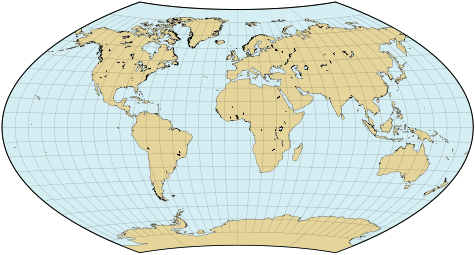 
  Wagner IX 投影
# Eckert-Greifendorff 投影
- 与Hammer的投影水平拉伸了赤道等面积方位图的一部分一样，Max Eckert-Greifendorff（以前称为Max Eckert）在1935年宣布的投影拉伸了Hammer地图的相应部分。换句话说，与哈默的想法完全相同，但经度压缩了四倍，水平比例尺乘以四倍。在重新缩放之前，它只使用原方位图中央子午线附近的一个狭窄区域；因此，纬线几乎是直线。
- 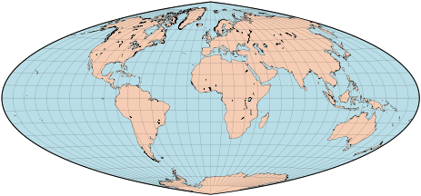 
  Eckert-Greifendorff map
# Winkel Tripel 投影
- 奥斯瓦尔德·温克尔(Oswald Winkel)的第三个也是最著名的混合投影被称为三重投影(德语中的三重投影，可能是指形状、面积和距离失真减少的三重折衷)。像他在1921年发表的另外两个一样，它是由一个简单的算术平均定义的，包括等距圆柱投影，使用标准纬线的任意值(作者更喜欢大约50° 28′N/S；另一个常见值是40N/S)；这些都不是最终结果的标准。然而，另一个投影是艾托夫的，因此，结果不是伪圆柱的。
- 温克尔的三投影是特别不规则的:它既不是等面积的，也不是共形的；纬线在赤道和两极是直的，在其他地方是弯曲的；比例是恒定的，但不相等，仅在赤道和中央子午线处相等。
- 然而，它设法呈现了一个愉快而平衡的世界，这导致了它被几个流行的地图集所选择。1998年，它被著名的国家地理学会选为新的参考世界地图，代替罗宾逊投影。
- 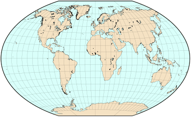 
  Winkel Tripel地图使用50°28′N/S作为参考，但不是标准纬线
- 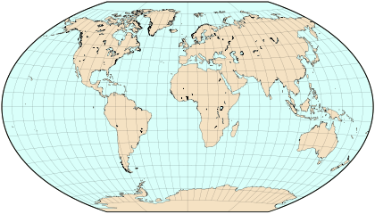
  使用40°N/S作为参考纬线的Winkel Tripel地图