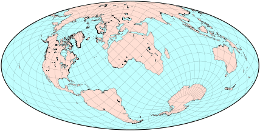
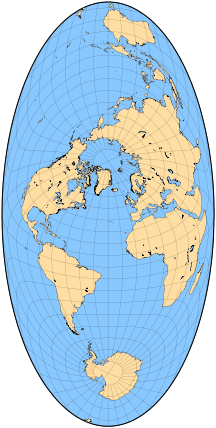
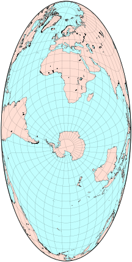
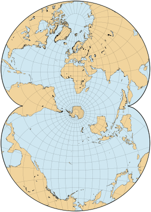
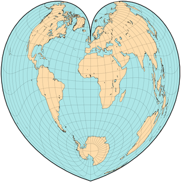
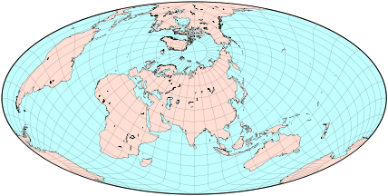
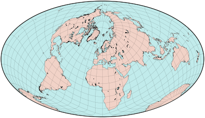
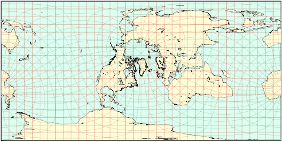
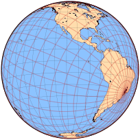

public:: true
上一页:: [[其他有趣的投影]]
下一页:: [[撕开地球的皮肤_分瓣投影]]
原文链接:: [Oblique Projections](https://web.archive.org/web/20181004024945/http://www.progonos.com/furuti/MapProj/Normal/ProjObl/projObl.html)

- 大多数地图集出版的地图都是以北极在顶部，南极在底部，大西洋在中间的某个地方为导向的。假设一个完美的球形地球，这样的设置只是一个惯例——人们可以首先以任何方式旋转地球，然后像往常一样投射旋转的坐标。当然，由于政治原因，西方驻华大使绘制的中世纪世界地图把北半球放在底部，而中国比平时更靠近中心。
	-  
	  坐标逆时针旋转45°的Hammer地图。 地球上的每一块都得到了体现（亚洲没有被切断，而是被切到了中间，并被拉长了）。
- 如果赤道和中央子午线都不与地图轴对齐并且都不在地图轴的中心，那么结果通常被称为斜轴投影(或者更恰当地说，倾斜地图)。虽然原始投影的一般属性(如面积和形状等效)仍然有效，但那些依赖于经纬网方向的属性通常不会被保留。
- 倾斜投影的一个常见原因是将一个大的、重要的区域移到失真较小的地方。亚特兰蒂斯地图（Bartholomew，1948年）将大西洋呈现为与地图主要维度一致的长条状。它还清楚地显示了北极 "海洋 "是更大的大西洋的一个相当小的延伸，它是以西经30°，北纬45°为中心的斜向莫尔维德投影。
	-  
	  亚特兰蒂斯地图是摩尔维德投影的倾斜版本，是以海洋命名的，而不是神话
- 阿特尔斯坦-斯皮尔豪斯在1942年宣布了另外两张强调海洋区域的地图，一张使用哈默的投影，另一张使用奥古斯特的保角投影，都以15°E，70°S为地图中心：很少有海洋地点（特别是加勒比海）被打断，海洋的相对大小被清楚地表达出来。 利用现代计算机，为这样一个 "良好 "的地物分布找到适当的旋转参数是相当容易的；我们只能想象原作者所采用的艰苦过程。后来，斯皮尔豪斯还发表了一幅以海洋为主题的世界地图，使用的是正方形的保形投影，然后用间断式地图扩展了他的想法。
	- {:height 436, :width 216} 
	- 斯皮尔豪斯使用哈默（左）和奥古斯特（右）投影对 "海洋 "地图进行的简化重建（原始地图有非常复杂的边界，由海岸线形成，而不是一个圆框）。在等面积投影和保角投影中对比相同的区域和投影面（Hammer地图中的比例尺被放大了75%，所以地图尺寸会比较相似
- 1904年出版的伪圆锥等面积Schjerning IV投影，是著名的Werner投影的一个斜轴版本，中心经线为0°，但以伦敦为中心，而不是以极点为中心。
	-  
	  The Schjerning IV projection
- 当然，有时一个基本要求（如保持坐标线的直线或平行，或在方位角投影中保持沿经线的正确方向）会阻止采用斜向地图。
- 一个经常被忽视的事实是，任何世界地图的边界上的点至少被表示了两次，因为在原始球体中，"边缘 "是连接在一起的（一个不相关的现象发生在圆柱形和其他平极投影中，如Eckert的和我的，它将两极拉伸成线段）。我们已经习惯了这种明显的比例失真（附近的点在地图上被大大分开），所以我们在传统地图上几乎注意不到它，也许在西伯利亚和阿拉斯加的最顶端除外。
- 倾斜的地图常常使这种扭曲变得很明显：注意亚特兰蒂斯地图中的新西兰岛屿，以及斯皮尔豪斯地图中的北美东西海岸。为了把温带地区放在中心位置而旋转投影，很容易形成两极地图。尽管人们也许可以为此使用多圆锥投影，但上述地图很好地显示了欧亚大陆，其形状比通常情况下更接近现实，而牺牲了北美洲和南极洲，并且如投影方里网所示，在南印度洋出现了巨大的角度变形。
	-  
	  以欧亚大陆为中心的倾斜Hammer地图
- 1948年，William Briesemeister发表了对Hammer投影的一个类似的、非常简单的修改：地图首先以10°E 45°N为中心点进行斜向投影；然后将其线性拉伸至7 : 4的长宽比（与Mollweide和传统Hammer的2 : 1相比）。因此，北极附近的平行线几乎是圆形的。
	- {:height 239, :width 401} 
	  Briesemeister投影的地图，是对Hammer投影的简单修改，清楚地呈现了除南极洲以外的所有陆地，有两个极点。
- Hammer投影的另一个倾斜版本是北欧投影（Bartholomew 1950），以0°W，45°N为中心：它与Briesemeister的地图非常相似，没有重新调整比例。
- 方位等距投影保留了从中心出发的径向距离，而等距圆柱投影则保留了垂直方向的距离。特别是，正如Botley在1951年所建议的，任何点到投影 "极点 "的距离都可以直接读作从地图顶部或底部的Y坐标。从任何一个投影 "极点 "的方位也可以立即作为从中心出发的X坐标，因为在原始地图中，子午线的间距是统一的。因此，这幅地图与我们熟悉的方位地图具有相同的目的（实际上它也适合于反方向点），但显示的方位不是等角的。
	-  
	   上图，巴西坎皮纳斯等距圆柱地图，底边无限拉伸；它的对极位于顶端。使用叠加的红色经纬网，可以直接找到从Campinas或其对映体到地球上任何其他点的角度(水平)和测地线(垂直)距离。在左边，一个类似的地图，有相同的经纬网，但是使用方位正交投影。