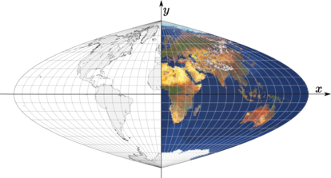

public:: true

# 克拉斯特抛物线投影推导
- 假设在赤道方向有一个尖极等面积伪圆柱投影，其边界经线为抛物线弧，轴在赤道上，是中心经线的两倍长。
- 
- 因为投影是伪圆柱的
-
  $$\frac{\partial y }{\partial \lambda}=0$$
- 换句话说，就是
-
  $$y=f(\varphi)$$
- 在不丧失对称性的前提下，让我们只考虑东北部象限，其中$$0\leq \varphi \leq \frac{\pi}{2},0\leq \lambda \leq \pi$$
- 当 $$H\gt 0$$时,以下约束成立:
-
  $$0\leq x^\prime = ky^2 \leq 2H$$
  $$0 \leq y \leq H$$
  $$x_b=2H-x^\prime$$
- 当$$x_b=0,y=H$$时,$$k=\frac{2}{H}$$,边界子午线由下式定义
-
  $$x_b=2H-\frac{2y^2}{H}$$
- 正如在 [[等积正弦投影]] 中的看到的,椭球中赤道和纬线$$\varphi$$之间面积的一半是$$\pi R^2 \sin \varphi$$,这一次，我们不是“发现”一个投影是等面积的，而是将这个属性作为一个约束来计算纵坐标Y。地图上赤道和任意给定纵坐标Y之间的面积的一半是
-
  $$S(Y)=\int _0^Y x_bdy = \int _0 ^Y 2H-\frac{2y^2}{H}dy = 2H_Y-\frac{2Y^3}{3H}\big|_0^Y=2HY-\frac{2Y^3}{3H}$$
- 当$$\varphi=\frac{\pi}{2},Y=H$$时
-
  $$S=\pi R^2=2H^2-\frac{2H^2}{3}=\frac{4H^2}{3}$$
- 因此$$H=\frac{\sqrt{3\pi}}{2}R$$,且
-
  $$x_b=\sqrt{3\pi}R-\frac{4y^2}{\sqrt{3\pi}R}$$
- 继续推算
-
  $$S(y) = \frac{-4}{3\sqrt{3\pi}R}y^3+\sqrt{3\pi}Ry$$
- 求解三次方程 $$S{y}-\pi R^2\sin\varphi=0$$
-
  $$a=\frac{-4}{3\sqrt{3\pi}R}$$
  $$b=0$$
  $$c=\sqrt{3\pi}R$$
  $$d=-\pi R^2\sin\varphi$$
  $$\begin{aligned} \Delta & = 18abcd-4b^3d+b^2c^2-3ac^3-27a^2d^2 \\
   & = \frac{16(3\pi)^{\frac{3}{2}} R^3}{3\sqrt{3\pi}R}-\frac{27*16\pi^2 R^4 \sin^2\varphi}{9*3\pi R^2} \\
  & =16\pi R^2(1-\sin^2\varphi) \\
  & = 16\pi R^2 \cos^2 \varphi 
  \end{aligned}$$
- 因为$$\Delta\geq 0$$,方程有三个实根,然而因为:
-
  $$-27a^2\Delta = -256 \cos^2\varphi \leq 0$$
- 根中有复杂的表达式,用一下表达式替换复杂的三次方程;
-
  $$p=\frac{3ac-b^2}{3a^2}=\frac{-9\pi R^2}{4}$$
  $$q=\frac{2b^3-9abc+27a^2d}{27a^3}=\frac{R^3\sin\varphi (3\pi)^{\frac{3}{2}}}{4}$$
- 然后根据Viète的方法,计算出根($$k=0,1,2$$时)
-
  $$t_k=2\sqrt{\frac{-p}{3}}\cos{\Big( \frac{ \arccos {\frac{3q}{2p}}\sqrt{\frac{-3}{p}}}{3} -k\frac{2\pi}{3} \Big)}$$
- 因为
-
  $$p < 0$$
  $$4p^3+27q^2=\frac{729}{16}\pi^3 R^6(\sin^2\varphi -1) \leq 0$$
- 三个根都是实根,而且$$t_2\leq t_1 \leq t_0$$
- 对S(y)的图形的检查表明，所需的最小正根是中间的一个，即t1。
- 
-
  $$\begin{aligned}
  t_1 & = 2\sqrt{\frac{-p}{3}}\cos\Big( \frac{1}{3} \arccos \Big( \frac{3q}{2p} \sqrt{\frac{-p}{3}}\Big) -\frac{2\pi}{3}\Big) \\
  & = \sqrt{3\pi}\vert R \vert \cos \Big( \frac{1}{3} \arccos \frac{-\sin\varphi\vert R \vert}{R} - \frac{2\pi}{3} \Big) \\
  & =  \sqrt{3\pi} R \cos \Big(  \frac{1}{3}\arccos(-\sin\varphi)-\frac{2\pi}{3} \Big)
  \end{aligned}$$
- 因为 $$-\frac{\pi}{2} \leq \alpha \leq \frac{\pi}{2} ,\arccos(-\sin \alpha )=\alpha + \frac{\pi}{2}$$
-
  $$\begin{aligned}
  t_1 & = \sqrt{3\pi}R\cos \Big( \frac{\varphi+ \frac{\pi}{2}}{3}-\frac{2\pi}{3} \Big) \\
  & =  \sqrt{3\pi}R\cos \Big(\frac{\varphi}{3}-\frac{\pi}{2} \Big) \\
  & = \sqrt{3\pi}R\sin \frac{\varphi}{3} = y
  \end{aligned} $$
  $$\begin{aligned}
  x_b & =  \sqrt{3\pi}R - \frac{4y^2}{\sqrt{3\pi}R} \\
  & =  \sqrt{3\pi}R-4\sqrt{3\pi}R\sin^2\frac{\varphi}{3} \\
  & = \sqrt{3\pi}R\Big(  1-4\sin^2\frac{\varphi}{3} \Big)
  \end{aligned} $$
  $$\begin{aligned}
  x  & = \frac{\lambda}{\pi}x_b \\
  & = \sqrt{\frac{3}{\pi}}R\lambda\Big( 1-4\sin^2\frac{\varphi}{3} \Big)
  \end{aligned} $$
- 或者,因为$$\sin^2\alpha=\frac{1-\cos2\alpha}{2}$$
-
  $$x = \sqrt{\frac{3}{\pi}}R\lambda\Big( 2\cos \frac{2\varphi}{3}-1\Big)$$
  $$y=\sqrt{3\pi}R\sin\frac{\varphi}{3}$$
- 这些是抛物线等面积投影的正向方程，这是由J.E.E.Craster提出的所有投影中最著名的。
- 
- 正弦和抛物线投影的整体形状很容易混淆，但也有区别。
  * 在相同的尺度下，正弦曲线更高更宽，而抛物线的边界子线更凸出
  * 抛物线的中央子午线不是一条标准线，沿此线的低角度变形区域较短
  * 反之，在靠近地图边界的高纬度地区，抛物线的高变形区域要小一些
-  
  Craster的抛物线（左上和右下象限）和正弦投影的变形模式的比较