public:: true
上一页:: [[正形投影]]
下一页:: [[倾斜和弯曲投影_斜轴投影]]
原文链接:: [Other Interesting Projections](https://web.archive.org/web/20180628080106/http://progonos.com/furuti/MapProj/Normal/ProjOth/projOth.html)

- 在几个世纪的地图制作中，无数的投影被设计出来。许多设计不能很容易地分成几大类(方位、圆柱、伪圆柱、圆锥或伪圆锥)，即使它们的设计是相似的或衍生的。
- 大量的投影，其经纬网是具有不同半径和中心的圆或派生圆锥曲线，被一些作者称为polyconic（不要与多圆锥投影的特定组别相混淆）。这是一个广泛的、人为的类别，包括其他不相关的投影。
# Van der Grinten的投影
- 美国人阿尔方斯·j·范德格林顿在1904年和1905年发表了两个投影，第一个早在1898年就设计出来了。两者都是为赤道投影面设计的，赤道和中央子午线是直线；所有其他纬线和经线都是圆弧，非中心经线沿着赤道有规律地间隔。
- 阿洛伊斯·布鲁多在1912年对第一版提出了两处修改；这四种设计很快被统称为“van der Grinten”投影(这个命名令人困惑):
  * 第一个原始投影，以圆为边界
  * Bludau对I的修改，纬线以直角穿过经线
  * Bludau对I的修改，有直线、水平的纬线
  * 第二个原始投影，以两个相同的圆为界，圆心相距1.2半径；内半球也是圆形的
- Van der Grinten的投影设计是传统设计的例子，不是从透视过程中得到的，而是从地图平面上的任意几何构造中得到的。它们既不是等面积的，也不是保形的（尽管表面上与拉格朗日、艾森洛尔和奥古斯特的投影很相似），而是为了 "看起来正确"，在传达一个圆形地球的概念的意义上（在这方面，它们类似于早期的球状投影），而不太偏离墨卡托的熟悉形状。
- 这四种地图中最著名的是范德格林顿I，也被称为格林顿投影，被广泛使用，特别是在1922年至1988年期间，国家地理学会选择它作为世界参考地图。在其他的投影中，只有III型的使用范围有限。
- 虽然可以将两极纳入地图，但在高纬度地区的面积失真很大，因此大多数范德格林顿地图在平行线80°N和80°S附近被剪掉。
	- ## 范德格林顿的原始投影和布卢多的派生
	- 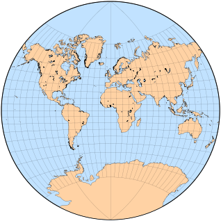 
	  Projection I
	- 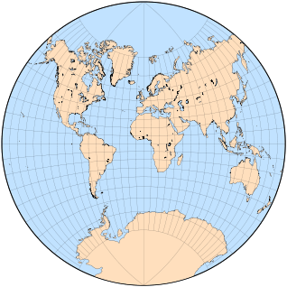 
	  Projection II (by Bludau)
	- 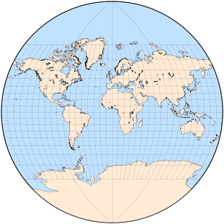 
	  Projection III (by Bludau)
	- 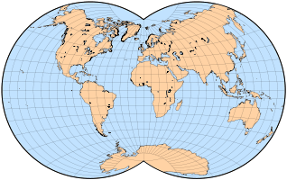 
	  Projection IV
# 莫勒的球状投影
- 古老的球状投影群包括经线和纬线的圆弧，以及通常局限于单个半球的地图。
  H.莫勒在1922年提出了三个类似球状特征的传统投影。
# Armadillo 和其他垂直投影
- 从1943年开始，著名的制图学教师和作家Erwin Raisz引入了一系列的投影，将球体映射到中间的弯曲表面。然而，不是像圆柱形或圆锥形地图那样 "展开"，而是将每个表面正投影到最终平面上。他创造了 "Orthoapsidal "这个词，源于希腊语和拉丁语中拱形凹槽的名称，即apse。
- 在最著名的正拱投影中，被称为“犰狳”，因为它模糊地类似于卷曲的装甲哺乳动物，球体被映射到半径为1和1的退化圆环的1/4上，这看起来像一个带有零尺寸孔的甜甜圈。纬线和经线在圆环面上是等距圆弧，但在最终地图上是非等距椭圆弧。
	- 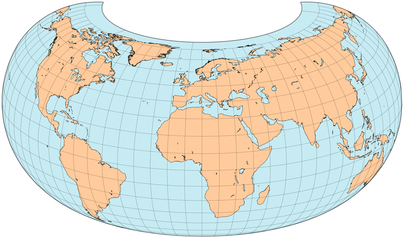 
	  重建Raisz喜欢的犰狳投影：倾斜20°，中央经线10°E，经度从170°E到150°E，部分重复以避免分裂阿拉斯加和西伯利亚。
	- 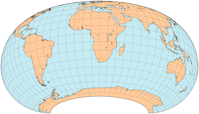 
	  强调南半球的犰狳地图：倾斜角20°，中央经线20°E，没有重复部分。
- 在传统形式的犰狳地图中，Raisz倾向于将东经10°作为中央子午线；然后将环形体倾斜20度，并将方里网平放在投影平面上。平行线的跨度超过360°，使主要的地貌没有分化。像新西兰和南极洲这样的南部地区被隐藏起来，但可以作为插页或延伸部分呈现。
- Raisz提出的最简单的正交设计，其结构是在一个赤道直径为极地直径两倍的扁形旋转椭圆体的一半上勾勒出来的--显然这个实体与大规模保形测绘所采用的基准椭圆体完全没有关系。第一个版本仅仅是通过压扁一个子午线间距被压缩到50%的球体，然后将其倾斜20°并进行正投影而得出。构造很简单，可以用几何方法完成，但与椭圆体赤道的长度相比，椭圆体子午线的长度大约大了54.2%，而且沿每条子午线的比例也不恒定。
	- 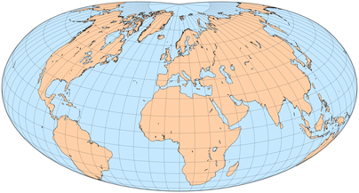{:height 225, :width 404}
	  基于旋转的扁椭球的一半的正交投影，轴的比例为1:2，因此偏心率为0.866，倾斜20°。极点是点，子午线比例是基于一个压扁的球体，就像Raisz的第一个提议。经度范围从东经150°到西经130°的重复部分，中央子午线10°
- Raisz随后建议将椭球子午线比例设为常数，并与赤道子午线比例相同；两极都变成半圆形弧。外观，表面上类似于著名的犰狳投影，但隐藏了更多的南半球，总体上得到改善，但建造变得更加困难，需要数值近似。
	- 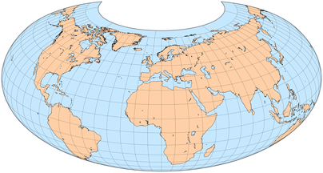 
	  根据Raisz的第二项建议，对偏心率为0.866的扁椭圆体进行正投影，倾斜20°：线性极点和恒定子午线比例与赤道的相同。经度从150°E到130°W，中央经线10°E。
- Raisz还提到了为了保留面积而再次改变子午线比例，但他可能指的是椭球面而不是最终的地图。
	- 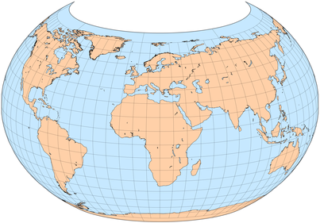 
	  我的 "鱼缸 "地图，是扁椭圆体上的正投影，偏心率为0.661，子午线比例恒定。经度从160°E到120°W，中央经线20°E，倾斜角15°。
- Raisz采用的另一个表面是两个片状的倾斜双曲面的一半；在这种情况下，北极地图被打断成四个相同的裂片，类似于Maurer的S231投影，而且与其他正交设计不同，它显示了整个世界，尽管大大压缩了较远的裂片。正如Richard Edes Harrison所画的那样，这个投影在《科学美国人》233(5)的封面上占据了显著位置；它在显然是10°N以南的地方被打断了（在60°E、150°E、120°W和30°W）。哈里森以其创新和详细的地图而闻名，他被引述为 "所有世界地图中最优雅的"。
	- 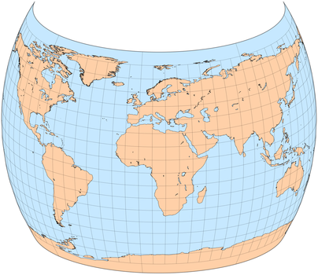 
	  椭圆体上的正投影，偏心率0.6，子午线比例不变，倾斜20°。经度从175°E到145°W，中央经线15°E。
- 按照最初的设计，正方形地图既不是保形的，也不是等面积的；纬线和经线不一定持有中间面的属性（如等距）。
- Raisz考虑了更多奇特的基底形状，如豆子和扇贝壳。他承认，正交原则可能更适合于教育地图，而不是专题地图或科学地图；另一方面，他认为观看者应该无意识地将正交地图视为三维代表，因此认识到扭曲是投影过程的内在因素，而不是代表区域的内在因素。
## 犰狳投影的发展示意图
- 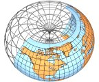 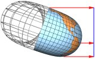
- 在将球体等距映射到类似于半个轮胎的区域后，倾斜区域被正射投影到蓝色平面中。
- 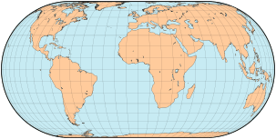
- 如果环形体不倾斜，其结果在表面上与埃克特的第三和第四投影相似。
# Arden-Close的平均投影
- Charles F. Arden-Close通过平均法设计了一些地图投影；他最著名的建议（1943年）是将赤道等面积圆柱形地图的一个半球与其横向进行简单的算术平均，其中一个地图中的赤道与另一个地图中的中央子午线重合。其形状像一个带圆角的正方形，其结果既不符合要求，也不是等面积的。
- 将坐标值加倍，他的方法可以很容易地扩展，以便在一张地图上显示整个世界。
## Arden-Close 在半球和世界地图中的投影
- 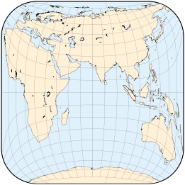 
  传统的东半球，中央经线70°E
- 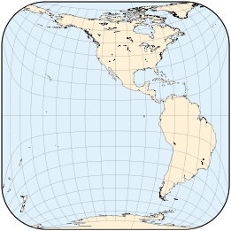 
  传统的西半球，中央经线110°W
- 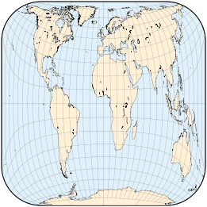 
  扩展到世界地图
- 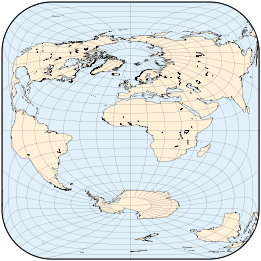 
  横轴的世界地图
# 为大比例尺设计的托布勒投影
- 有时，简化一个现有的投影实际上可能会增强其有用性，或者至少使其更容易使用。这是Waldo Tobler在寻找一种适合在计算机屏幕上有效呈现美国密歇根州等小区域的投影后得出的结论（1974）。必要条件是快速计算、形状和面积的合理保真度、容易计算的失真、简单的参数化以及精确和容易计算的逆向方程，以便快速地将屏幕和世界坐标联系起来。
- 在研究了几种保角和等面积的方法后，Tobler教授决定采用Tissot（1881）以前的投影，既不是保角也不是等面积的，也是为局部地图设计的。Tissot的投影是由一个幂级数定义的，但Tobler只保留了线性项，这可以直接推到逆方程。该投影由一个参考纬度设定参数，这也有助于优化失真。以赤道为中心的横轴投影与Plate Carrée相同。
- 虽然托布勒从未打算将他的地方地图投影用于世界地图，但这是一个有趣的练习，展示了其失真度如何随参考纬度而变化。
	- 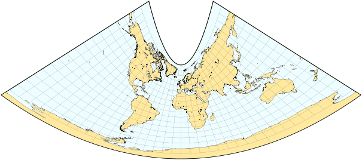 
	  改变参考纬线（上述30°N）
	-  $$90^{\circ}N$$
	-  $$75^{\circ}N$$
	-  $$60^{\circ}N$$
	-  $$45^{\circ}N$$
	-  $$30^{\circ}N$$
	-  $$15^{\circ}N$$
	- $$0^{\circ}N$$
	- $$15^{\circ}S$$
	- $$30^{\circ}S$$
	- $$45^{\circ}S$$
	- 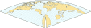$$60^{\circ}N$$
	- 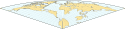$$75^{\circ}N$$
	- $$90^{\circ}S$$
# Gringorten 投影
- 在寻找适合全球气候分析的地图投影后，气候学家Irving I.Gringorten在1972年发表了一个非常独特的设计，今天几乎被遗忘。
- 他要求世界地图必须是方形的，以便有效地利用报告、文章和书籍中的印刷空间；它应该是等面积的，例如，气象探测器和站点的密度和分布可以一目了然；它还应该避免过度的形状失真；最后，应该尽量减少大陆的中断。
- Gringorten投影的细节是为球形地球的极地投影面设计的，一个以极点为中心的半球在一个内部的正方形上，而另一个半球被分成四个直角三角形，其极点在四个角上重复。除了中断，两个半球都是完全对称的，这种安排类似于皮尔斯的五角星地图。
  每个半球包括四个三角形象限，其顶点在一个极点上，围绕中央子午线对称。在每个象限内，平行线是椭圆弧线，在赤道上是直的，向极点凹陷。在象限边界，平行弧以一阶连续方式连接。鉴于这些限制，有一个以上的等面积子午线位置的解决方案，不幸的是，没有一个能满足另一个理想的属性：子午线以直角穿过赤道，因此在各半球没有中断。
- Gringorten的投影所要求的数学运算相当复杂，必须通过数字近似来计算。Gringorten的论文包括一个计算坐标表和一张北极地图，其中南叶以经线20°W、70°E、160°E和110°W为界。地图上有一个由100个编号单元组成的网格，建议作为普通经/纬度坐标系统之外的快速定位的辅助工具。南极洲被打断了，但这一不便可以通过插页、通过交换半球的第二张地图、或通过将三个网格单元从角落移到极点周围来缓解。
- 作者还提出了其他的变化，如斜面和子午线位置的替代方案。另一个直接的修改是重新安排象限的布局，类似于Peirce和Guyou的地图：例如，将每个半球设置在一个完整的正方形中。
- 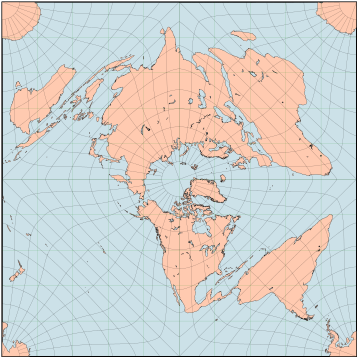 
  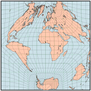 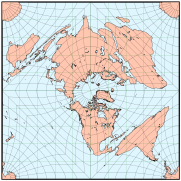
- Gringorten的方形地图的重建，在正轴（顶部）和横轴（左上方）投影面有一个叠加的10x10经纬网。右上，有替代的经线位置。下图是重新安排的象限，给每个半球一个完整的正方形。
- 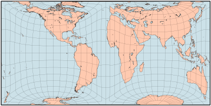
- 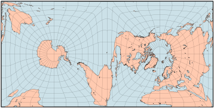