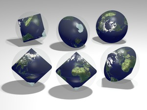

public:: true
上一页:: [[星形投影]] 
下一页:: [[经典分瓣投影]]
原文链接:: [Interrupted and Compound Conic Maps](https://web.archive.org/web/20180306071115/http://www.progonos.com/furuti/MapProj/Normal/ProjInt/ProjIntCon/projIntCon.html)

# 介绍
- 圆锥投影在概念上很容易在正轴投影面上建立，但很少被用来代表半球以上的范围。然而，如果在赤道或赤道附近被打断，整个世界的圆锥图的整体变形是可以接受的。
- 圆锥投影也在混合地图中与其他设计相结合；最常见的是伪圆锥投影，因为它们也有圆形纬线。
- 圆锥半球应用于天体图有着悠久的传统，甚至可能早于圆锥投影在地理上的广泛使用。威廉·席卡德(Wilhelm Schickard)早在1623年(1687年修订，圆锥常数为2/3)就使用了简单等距圆锥投影，随后约翰-雅各布·齐默曼(Johann-Jacob Zimmermann)在1692年(1706年，由德·拉兰德引用)和克里斯托弗·塞利留斯(Christoph Cellarius)在1705年使用了简单等距圆锥投影。奥古斯都·德·摩根(1836年)提出了星图的轮廓，它是两个圆锥投影，如果组合在一起，可以刻在一个球体上，具有相同的极径和赤道直径。投影大概是有45°标准纬线的中心点圆锥投影，但只画了黄道和一个部分经纬网。
	- 圆锥常数为0.707、在赤道处中断的中心点圆锥投影的平面图，以及刻在半透明球体中的组合双锥的多个视图。
	-  
# 兰伯特等面积圆锥投影
- 1945年，Oscar S.Adams提出了使用等面积圆锥投影使世界地图的角度失真最小化的参数。然而，他更倾向于在横向上采用两个半球的间断版本，在适当选择中央经线的情况下，美洲和欧亚大陆/非洲的大部分地区没有被切割。他还提出（极地）标准平行线为北纬24°28'11 "和南纬24°28'11"，以使每个半球的最大角度畸变最小化：所有有人居住的大陆都被一个零畸变的弧线所穿过。另外，北纬30°和南纬30°的标准纬度可以产生一个0.75的圆锥常数，并且更容易计算。
	-  
	  兰伯特横轴等面积地图，两个半球和圆锥常数0.707，如亚当斯所建议的。原始标准纬线突出显示。
# 兰伯特等角圆锥投影
## 更多的星图
- 约翰-兰伯特（Johann Lambert）1772年的开创性论文的标题已经说明了他对正确表示地球和天球的关注。他提到齐默尔曼的星图圆锥常数为5/6，并提出他的共形圆锥投影是一个更好的选择，建议常数为3/4、4/5和5/6。事实上，Lambert的圆锥正投影最早的应用记录之一是由Christlieb Benedict Funke（或Funks）在1777年发表的一个双圆锥星图，其锥体常数为2/3。
- 对于星座指南来说，形状的保真度比保留面积或距离更重要，正形圆锥地图是另一个流行的选择，即方位立体投影是一个非常好的选择。
	-  
	  这里用一张普通的地球地图代替天球图，有助于评估兰伯特的保角圆锥投影，当应用于双锥体时，常数为5/6，正如兰伯特所建议的那样。
	-  
	  在2/3不变的情况下（如1777年Funke的星图），这种间断的横向圆锥正形图类似于Cahill的蝴蝶图，正如John Savard所建议的那样（Savard选择了相当于40°的标准平行线，使地图的对称性稍差；在一个变体中，他还重新安排了地图的部分内容，以减少南极洲的间断情况）。
- 
- 使用常数为2/3、3/4和5/6的正形圆锥投影，以相同的赤道直径、一个球体和三个双圆锥进行渲染。
## 双倍的双圆锥
- 如Deetz和Adams（1921年）所述，美国航运局和美国海岸和大地测量局合作，对Lambert的保角圆锥投影进行了大量应用。委员会的A.B.Clements提出了一种具有圆形双半球的地图，即具有恒定1/2但重复的圆锥图，因此包括完整的圆。除两极外，每个半球都保持形状。
- 测量局设计并建造了一幅地图，其切线半球的直径为54英寸，由齿轮连接，可以随意转动，同步进行。因此，在地图上绘制的航运路线可以在任何一点跨越赤道，并且仍然是一条连续的线路。
	- 由克莱门茨建议的带有双半球的双锥图，由美国海岸和大地测量局建造，作为航运路线的大型齿轮图板。
	- 
# Conoalactic投影
- 由Anton Steinhauser创造的conoalactic投影（约1883年）密切遵循Petermann和Berghaus的星形建议的原则，但用一个等距圆锥投影代替内半球的方位等距投影。它由四个相同的分片组成，具有直的经线；中央经线复制了圆锥部分的恒定比例。边界经线为90°W、0°、90°E和180°。每片的纬线仍然是以北极为中心的圆弧。
- 北极映射到一个点，赤道跨越240；第二个标准纬线大约在北纬4° 17 ' 52.90”。这个投影既不等面积也不共形。
-  
  具有原始波瓣划分(顶部)和(上方)边界经线的conoalactic投影中的地图向西移动15°，以减少非洲和南美洲的剪切。