public:: true
上一页:: [[任意分瓣投影]] 
下一页:: [[多面体地图]]
原文链接:: [Interruption Devices](https://web.archive.org/web/20180708123512/http://www.progonos.com/furuti/MapProj/Normal/ProjInt/IntDev/intDev.html)

- 分瓣地图的主要目的是将重要区域移动到失真较小的地方，通常在每瓣的中心附近。几个制图技巧增强了分瓣的有用性。
# 重新定位和裁剪
- 特别是在伪圆柱投影的情况下，分瓣地图的每瓣都可以很容易地用它自己的任意中央子午线进行投影，而不一定与中央子午线相同。这引入了不对称的角度扭曲，在偏离其他区域的同时，使直的中央子午线附近的区域优先。中央子午线甚至可能随着纬度的变化而变化，就像菲尔布里克的正弦-莫勒维德投影和博格斯的正形地图的欧亚分瓣一样。
- 重新定中心也是一种不间断的大陆或区域地图的有效手段。感兴趣的区域居中，使失真最小化，剩余的投影区域被裁剪掉。重新定中心可能求助于不同的投影面，甚至倾斜的地图。
- 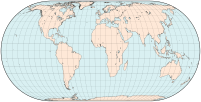 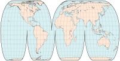
  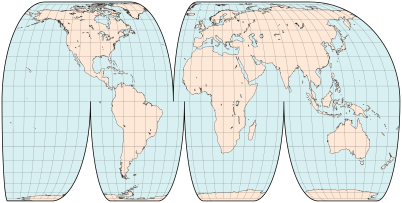 
  
- 左上:不间断的埃克特IV地图；右上角:分瓣版本保留了投影的属性，包括等效性，同时减少了像大陆这样的特权区域的角度失真。在右上，同样的投影被居中的波瓣打断:每瓣中只有一条子午线(不一定是中间的一条)被映射到一条直线上——如扭曲图案所示，再次改变了特权区域，例如西欧和澳大利亚。
## 重新集中开发失真较小的区域
- 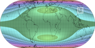 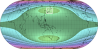 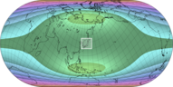
- 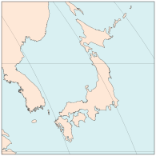 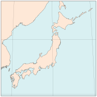 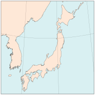
- 以经线0°为中心    以137°E为中心的经线   以日本为中心
- 这三张区域地图使用相同的埃克特四号投影显示日本岛屿。对这种投影的角度变形模式的分析表明，尽管它到处都保留了面积，但只有中央子午线和标准平行线40°30′N和S（在赤道方面）交汇处的两个小 "甜蜜点 "不存在角度变形。这三张地图涵盖了相同的区域，但略有不同，在第二个版本中，该区域更接近最佳点--东京位于35°N 139°E附近。第三张地图上的斜向版本实际上更加失真，同时失去了赤道的直线平行的有用属性。
# 压缩和镶嵌
- 一些制图设备实际上是编辑技巧，目的是为了清晰或打印方便。它们不影响失真模式，可以纯粹用作布局工具。
- 经常与分瓣同时应用，压缩地图意味着移除不重要的区域并连接剩余的部分。它可以节省出版空间，或者相反，在同一印刷区域允许更大的规模和更好的细节。
- 插图也是一种编辑工具，是一种脱离或叠加在主地图上的小插图，很有用。
  * 用于呈现一个被主投影严重扭曲、中断或无法显示(如墨卡托投影)的区域；方位等距通常用于极区
  * 特别是对于小的或不太为人知的区域的大比例地图，用于快速确定其在地球上的位置；方位正投影经常用于小半球
- 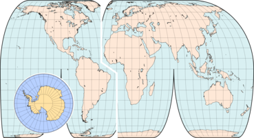 
  上图，使用埃克特四号投影绘制的地图，由于经线重新居中而被打断，在大西洋被浓缩。南极洲不间断地呈现在一幅插图中，插图是用兰伯特的等面积方位投影以相同的比例绘制的。
- 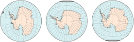
- 埃克特投影不是插图的最佳选择:在横向投影面，有强烈的角度扭曲(右)；在将南极移动到标准纬线的倾斜投影面，失真减少了，但也不太对称(最右边的细节)。
- 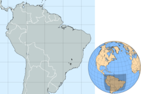
- 巴西和它的近邻，在主墨卡托地图和插图(阴影)中。
# 分瓣的滥用
- 像一些制图技术一样，分瓣也可能被误用或被认为是纯粹的编辑便利。匆忙或粗心准备的地图可能存在以下问题。
  * 没有明确标出压缩的区域
  * 没有标出中断的空隙，反而暗示了连续性
- 这样的地图对于广告来说可能足够好，但对于教学或科学目的来说是不可接受的。
- 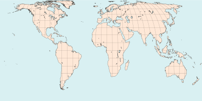 
  分瓣的埃克特IV地图，没有压缩，但分瓣的颜色像额外的海域；部分网格和去除南极洲有助于隐藏缺陷。虽然大陆形状比由圆柱形投影制作的矩形地图呈现得更好，但陆地/水域面积比率具有误导性，冰岛和格陵兰岛或西伯利亚和阿拉斯加之间的距离被大大拉长。