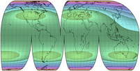

public:: true
上一页:: [[任意分瓣投影]] 
下一页:: [[多面体地图]]
原文链接:: [Interruption Devices](https://web.archive.org/web/20180708123512/http://www.progonos.com/furuti/MapProj/Normal/ProjInt/IntDev/intDev.html)

- 分瓣地图的主要目的是将重要区域移动到失真较小的地方，通常在每瓣的中心附近。几个制图技巧增强了分瓣的有用性。
# 重新定位和裁剪
- 特别是在伪圆柱投影的情况下，分瓣地图的每瓣都可以很容易地用它自己的任意中央子午线进行投影，而不一定与中央子午线相同。这引入了不对称的角度扭曲，在偏离其他区域的同时，使直的中央子午线附近的区域优先。中央子午线甚至可能随着纬度的变化而变化，就像菲尔布里克的正弦-莫勒维德投影和博格斯的正形地图的欧亚分瓣一样。
- 重新定中心也是一种不间断的大陆或区域地图的有效手段。感兴趣的区域居中，使失真最小化，剩余的投影区域被裁剪掉。重新定中心可能求助于不同的投影面，甚至倾斜的地图。
-  
   
  
- 左上:不间断的埃克特IV地图；右上角:分瓣版本保留了投影的属性，包括等效性，同时减少了像大陆这样的特权区域的角度失真。在右上，同样的投影被居中的波瓣打断:每瓣中只有一条子午线(不一定是中间的一条)被映射到一条直线上——如扭曲图案所示，再次改变了特权区域，例如西欧和澳大利亚。
## 重新集中开发失真较小的区域
-   
-   
- 以经线0°为中心    以137°E为中心的经线   以日本为中心
- 这三张区域地图使用相同的埃克特四号投影显示日本岛屿。对这种投影的角度变形模式的分析表明，尽管它到处都保留了面积，但只有中央子午线和标准平行线40°30′N和S（在赤道方面）交汇处的两个小 "甜蜜点 "不存在角度变形。这三张地图涵盖了相同的区域，但略有不同，在第二个版本中，该区域更接近最佳点--东京位于35°N 139°E附近。第三张地图上的斜向版本实际上更加失真，同时失去了赤道的直线平行的有用属性。
# 压缩和镶嵌
-