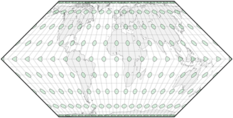
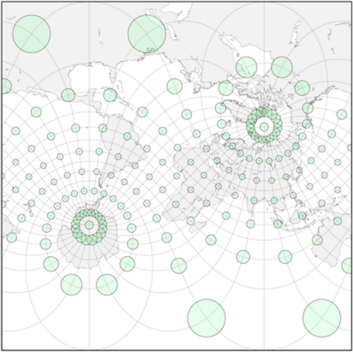

public:: true

# 评估和测量变形
- 每张平面地图都包含一些形状、面积或长度的变形；虽然有些区域可能没有变形，但其他区域可能会出现严重错误。在为地图选择合适的投影和方面时，客观地评估哪些区域受到影响以及受影响的程度是至关重要的。
## 变形椭圆
- 对地图投影的认真研究通常涉及比较它们如何受到三种主要的失真影响--面积、形状和距离。变形可以通过检查方里网和海岸线的形状进行视觉估计；也可以通过测量所选点集之间的距离来进行评估。然而，定量计算变形的系统方法必须等待 Nicolas A. Tissot 在1878年和1881年发表的极具影响力的论文(一些思想已经在1859年的一部作品中引入)，这些论文展示了他的指标，今天被普遍称为变形椭圆。
- Tissot 想象了一个以地球表面的某个点为中心的无限小的圆，并考虑了它被一个给定的地图投影所改变后的形状。他证明它是一个完美的椭圆，正好以地图上的相应点为中心。另外:
  * 如果在该点上的投影是等角的，那么这个椭圆将保持圆形，尽管几乎可以肯定比原来的大或小，而且可能会旋转
  * 如果该点的投影是等面积的，那么椭圆就可能不是一个圆，而是与原来的面积相同。
  * 如果在该点上的投影既不是等面积的也不是保形的，那么形状和面积都会变化
-  
  正轴墨卡托地图，在北纬85度和南纬85度处进行了剪裁，并附有Tissot的变形椭圆（同样，这里用于说明的超大圆圈实际上是椭圆，略微违反了符合性）。
- 投影的特征变形模式可以通过Tissot的变形椭圆阵列沿地图有规律地间隔来粗略地可视化。对于一些投影，每个椭圆的角度和长、短半径可以解析计算。在实践中，通常原始圆只是简单地用数字投影并在地图上渲染；为了可见——即使在缩放之后——它们通常必须比无穷小大得多，并且不一定看起来像完美的椭圆。
- 所有的等面积投影几乎都会有形状变形。例如，Hammer投影，除了正轴投影面，即在赤道和中央子午线的交汇处,都不是圆形的。Mollweide的投影只有在中央子午线与两条标准平行线的交汇处，即北纬40度和南纬40度，才没有形状变形。Eckert Ⅱ 投影也有两条标准平行线；如果用数字投影，在赤道上的角度变形的急剧中断会产生一些特殊形状的变形椭圆。
	- 正轴摩尔维特投影,哈默投影,埃克特Ⅱ投影地图的变形椭圆，由于我软件的限制，变形椭圆可能被渲染成椭圆形，甚至是不规则的形状；理论上的变形椭圆总是椭圆的。
	    
- 另一方面，在墨卡托的保角投影中，所有的变形椭圆都保持圆形，纬线保持平行，经线是直线，并且总是垂直于每一条平行线。面积没有被保留，且在地图的顶部和底部大大增加：两极的圆将是无限大的（这是可以预料的，因为经线在球体上相互交叉，但在墨卡托地图上从未接触。只有不同经线上的无限大的圆才可能像地球仪上的两极那样全部同心）
	- 
	  斜轴墨卡托地图。与正轴的相比，圆圈移动了，但其相对大小仍只取决于它们与纬线的距离。
- 另一种等角投影，方位立体图保留了每个圆的形状，自然也包括变形椭圆。
  在一个既不保形也不等面积的投影中，如正轴方位投影，变形椭圆既不保留原始形状也不保留面积。
## 缩放和角度变形
- 给定地球上的一个圆，Tissot考虑了成对的直径；他证明总有一对直径在圆心和它在地图上的投影上正交（即成直角），它们构成了椭圆的长轴和短轴。此外，还有一对在圆上以直角相交，但在地图上却最大限度地远离直角。这个偏差是该点的最大角度变形，当然，如果那里的投影是共形的，这个偏差就是零。
- Tissot开发了与投影中任何一点的比例失真（压缩或拉伸）和最大角度变形有关的方程式：为了保形，每一对正交方向的比例必须相同；为了面积等值，它们必须是相互对等的。用他的公式可以计算出任何需要的精度的变形模式，当绘制在地图上时，可以直接显示出主要区域或形状变形的区域。
-   
  前两张是正轴和斜轴方位投影地图,最后一张是斜轴方位立体投影的半球地图
- 如斜轴方位投影图和墨卡托地图所示，变形椭圆显示了一个整体变形模式，不受方位变化的影响:在方位投影地图中，变形仅取决于与地图概念中心的径向距离；在圆柱形地图中，仅在距概念上的“赤道”的垂直距离上。这些与正常版本呈现的模式完全相同。
## 一些实例
-  
  正轴等距离圆柱投影
- 变形椭圆在正轴等距圆柱地图上表明:
  * 至少在每个圆柱形地图中，水平比例尺总是在极冠中被夸大
  * 让纬线和经线在任何地方都垂直不足以获得一致性
- Finally, indicatrices may help distinguishing between easily confused projections, for instance three designs bounded by a circle, ordinarily used in the equatorial aspect, with meridians curved away from the Equator and extreme areal exaggeration near the poles:
- 最后，变形椭圆可以帮助区分容易混淆的投影，例如以下三个投影，都以圆为界，通常用赤道投影面，经线远离赤道而弯曲，两极附近的面积极度夸张:
  * 范德格林顿 I 投影既不是共形的，也不是等积的；两极附近的变形椭圆是裁剪的证据。
  * 范德格林顿 Ⅱ 投影经线和纬线以直角相交，因此没有裁剪；另一方面，远离赤道，沿经线的比例明显大于沿纬线的比例，因此地图不是共形的；显然两者都不等同
  * 在“拉格朗日”投影的简单情况下，纬线和经线总是以相同的比例正交，圆保持它们的形状:投影是共形的——除了在极点处,(理想的)变形椭圆只是圆的一半。这种投影是典型的共形投影，涉及的比例范围更广:地图的中心部分明显小于其他两个圆形投影
-   
  三个以圆为界的投影：范德格林顿I（既不保形也不等面积，与本页其他地图相比缩小了61.5%），范德格林顿II（同上），"拉格朗日"（除极点外保形，缩小了48.2%）。