下一页:: [[伪圆柱投影]]
上一页:: [[方位投影]]
原文链接:: [Cylindrical projection](https://web.archive.org/web/20180227085810/http://www.progonos.com/furuti/MapProj/Normal/ProjCyl/projCyl.html)
public:: true

# 介绍
- 在所有圆柱形投影中，赤道是最常见的，而且经常是唯一有用的投影面:
  * 所有坐标线都是直的
  * 纬线(按照惯例是水平的)交叉经线总是成直角
  * 沿着每条纬线的比例是恒定的，所以经线的间距是相等的
  * 所有纬线长度相同；经线也是如此
- 因此:
  * 整个世界的地图都是矩形的
  * 在离赤道同样远的任何一对纬线上，比例尺都是相同的。
  * 各个纬线的比例尺差别很大，在两极达到无穷大，两极在地球上的长度为零，但在圆柱形地图上却与赤道一样长。
	-  
	  如果赤道柱面图的宽度通过重新缩放进行归一化，那么（因为它们的子午线间距相同）投影的唯一定义特征是其纬线的间距。 在这里，显示了北半球的一个切片，带有度数和颜色渐变标尺（比较方位角正投影插图）。 蓝色极地纬度在等面积设计中必然被压缩，并在米勒、墨卡托和其他透视投影中被不同程度地扩展； 只有等距的 Plate Carrée 与地球一样呈线性间隔。 请注意，最左边的三个投影实际上是相同原理的重新缩放版本，并且墨卡托和中央圆柱贴图延伸到无限大。
- 横轴投影面时，两条相对的经线位于赤道投影面的赤道之上；其他属性则不成立。
- 滚动矩形地图并连接两个相对的边缘会创建一个管子，或一个没有端盖的圆柱体。 事实上，一些圆柱投影是由围绕球体紧密配合的管子在几何上推导出来的。 前者可能是割线或切线，因此两条纬线或赤道分别是标准线。
- 所有的圆柱形投影都非常相似，事实上只是通过纬线的间距来区分。非常重要的，独特的共形圆柱投影以墨卡托命名，并在其他地方讨论。在许多重新缩放的版本中，实际都是一个等面积的圆柱投影。
- 作为一个群体，圆柱形投影更适合于绘制以标准平行线为中心的狭窄地带。虽然对于比较纬度相近的地区很有用，但由于极地变形，它们不适合绘制世界地图。不幸的是，圆柱形地图经常被用于教科书和其他流行的出版物中，这可能是由于研究不力和其简单的形状整齐地适合页框。
## 等距圆柱投影和卡西尼投影
- 所有地图经纬网中最简单的属于正轴等角投影，有许多名称，如等距圆柱、平面投影和矩形投影。它是一个带标准经线的圆柱形投影:所有经线都有恒定的刻度，等于标准纬线的刻度，因此所有纬线的间距相等。它被归功于埃拉斯特斯(约。公元前200年)和提尔的马里努斯(约。100).它由于结构简单而广泛使用，甚至直到现代航海还在使用此投影。
- 等角投影的一种特殊情况叫做板状投影(Plate Carré)，或简单的圆柱形投影:赤道是一条标准的纬线，因此当它是所有经线的两倍长时，使地图成为一个2 : 1的矩形和经纬网的网格正方形。快速、简单的方程导致了它在粗糙的计算机绘制的地图上的复兴，使用于早期的机器或实时图形。它仍然常用于地球和行星特征的数字化纹理（"表皮"）中。
- 另一个特例，詹姆斯·加尔 (James Gall) 的等轴投影 (1885) 在 45°N 和 45°S 处具有标准纬线，为他的等面积投影设计选择了相同的纬度。
- César F. Cassini在1745年提出过一个横轴的等距圆柱形投影，并以自己名字命名。卡西尼的祖父Jean Dominique（生于乔瓦尼-多米尼克）是一个天文学家和制图师家族的最杰出成员。一些欧洲国家一直在大型地形图中使用卡西尼的投影。变形与正常投影面相同，因此中央子午线、赤道和其他三条90°倍数的子午线都是等比例尺的直线。
- 虽然很少提及，但是斜轴等距圆柱形地图对于快速计算地图上两点到任何其他点的角度和直线距离非常有用。
	- 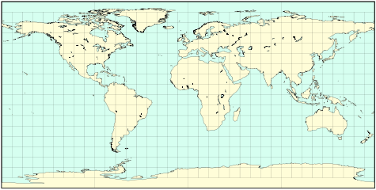 
	  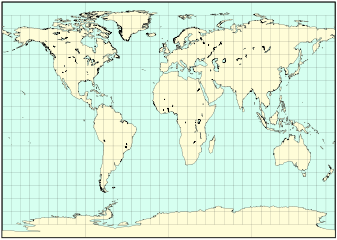 
	  赤道投影面上等距圆柱投影的两种特殊情况只在水平尺度上不同。在第一张地图上，通常称为plate carrée，标准纬线为0；在第二张地图上，加尔的等高线投影在北纬45度、南纬45度有标准纬线
	  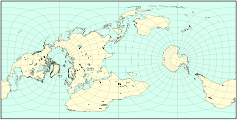 
	  卡西尼的投影是一个横轴的plate carrée投影，这里的中心子午线是东经70度和西经110度。
## 米勒圆柱投影
- 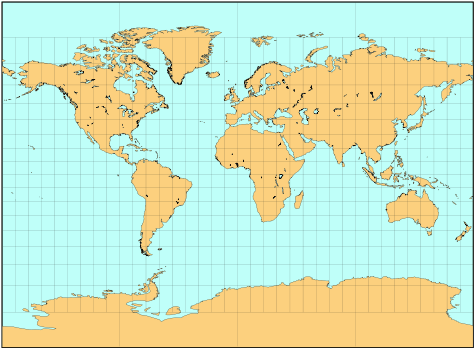
- 奥斯本-米勒（Osborn M. Miller）出版的所有投影中最著名的（1942年），在数学上被认为是对墨卡托的妥协，保留了其熟悉的形状，但极地的变形程度小得多。在计算墨卡托方程之前，它对纬度采用了0.8的缩减系数，并对结果采用了一个反系数。因此，该地图可以包括整个世界。该投影既不保形也不保面积。
- 米勒创造了其他几个投影，包括其他三个圆柱形设计；没有一个像以他的名字命名的那样受欢迎。
# 透视圆柱投影
- 一些圆柱投影是由基于透视的几何过程定义的。大致可以想象成一个半透明的球壳，被一根管子、割线或切线包裹着。当球体和管都围绕后者的轴旋转时，固定的光源沿着单个子午线发射光线，将球形特征的“阴影”投射到管上。在一个完整的旋转之后，管子沿着平行于它的轴的一条线被切割并且展开。
- 仅仅通过改变源的位置和管的直径，就会产生不同的投影。光源也可能无限远，使光线平行。
- 相比之下，其他圆柱投影，如等距圆柱投影、米勒投影和墨卡托投影具有任意定义的传统经纬网，而不是通过光源类比形成的。
- 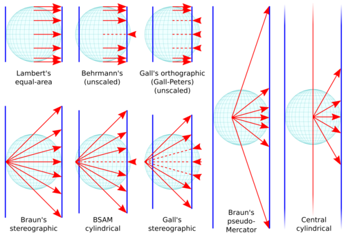 
  选定透视圆柱投影在相同比例因子下的横截面示意图显示了地图大小(在一种情况下为无穷大)和纵横比的差异。红色光线将单个子午线的0°、30°、60°和90°的点“画”到蓝色管上。数学推导在: [[正轴圆柱投影]] 中。
## 兰伯特的圆柱等面积投影
- 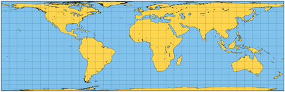
-
- 相同面积的圆柱投影切线——使赤道在其法向位置成为标准纬线——由约翰·H·兰伯特在赤道和横向以及其他几个投影中严格定义（1772 年）。 它通过逐渐压缩远离赤道的平行线以补偿过度的水平比例来节省面积。 然而，只有赤道没有形状变形。这种投影有时归因于阿基米德，但这种混淆可能源于他绘制的球体和外接圆柱体的体积图。
- 这种投影的视角很容易通过在地球上滚动一个柔性薄片，并将每个点水平地投射到如此形成的管子上而得到直观感受。换句话说，光线从圆柱体的轴线射向它的表面，然后沿子午线切割并展开。
- 像大多数圆柱投影一样，沿标准纬线投影的变形是可以接受的，但在极地区域几乎无法使用，因为极区被压缩了，所以地图比高的要宽得多。而且,像在其他圆柱投影中一样，沿任一纬线变形都是均匀的。
- 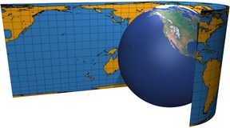 
  兰伯特等面积圆柱投影的图解展开为相切圆柱体，0°是标准纬线。
## 加尔正交投影
- James Gall的正交等面积投影（1855年）与Lambert的版本基本相似，但在北纬45°和南纬45°有标准纬线。 因此，投影圆柱体是正割的，而且更窄；垂直幅度必须成比例地扩大，以保持总的制图面积。因此，唯一真正的区别是长宽比（即宽度除以高度）。高尔的正交地图是兰伯特的两倍高。
- 尽管保留了面积，但这种投影的非常规形状变形模式限制了其实用性。
- 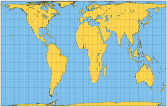 
  Gall/Gall-Peters's orthographic projection
## 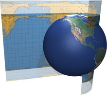 
Gall的正投影的发展。如果Lambert的圆柱体在45°N和45°S处成为正切，结果只有$2^{\frac{1}{2}}/2$ 倍宽；投影后，它会以反比垂直拉伸。
## “Peters” (Gall-Peters) 投影
- 1967年，Arno Peters发表了一个与Gall的1855年正交投影基本相同的圆柱形投影图。也许它实际上是一个独立的创造；尽管如此，彼得斯坚持声称它是一个原创的设计和新颖的东西，即使受到了严厉的批评。1973年后，该投影被大力推广，获得了广泛的媒体报道。它的所谓优点主要是与墨卡托投影的缺点相比较。
- 据称，彼得斯的投影没有距离或面积失真，也没有极端的形状失真。因为它是等面积的，所以它是平等的:第三世界国家，其中许多位于热带地区，以实际面积比例呈现，而墨卡托投影大大夸大了较高纬度地区的面积，包括欧洲、北美和前苏联。
- 尤其是最后一点，即所谓的对历史不公正的修正，帮助该设计被几个组织（如联合国教科文组织）接受为主要或唯一的投影，专业制图师谴责这一选择，他们指责彼得斯进行政治宣传和操纵不知情的人。媒体 在以“地图战争”命名的这一集中，彼得斯经常被视为大卫对抗已建立的制图巨人。
- 特别是这最后一点，即对历史上不公正现象的所谓纠正，帮助该设计被几个组织（如联合国教科文组织）接受为主要或唯一的投影，但专业制图师谴责这一选择，他们指责彼得斯进行政治宣传和操纵不知情的媒体。在这段被一些人命名为 "地图战争 "的事件中，彼得斯经常被看作是反对既定制图学的歌利亚的大卫。
- 遗憾的是，支持Peters投影的论点是错误的、夸大的或谬误的。它确实有严重的形状失真，而且它的失真模式沿着子午线发生了很大变化（墨卡托投影没有局部形状失真）。当然还有距离失真（在两极是无限的，就像所有圆柱形投影一样），而且距离只沿两条标准纬线保留。面积失真当然是不存在的；另一方面，许多其他的等面积投影已经存在，其中一些的整体形状失真要小得多
- 彼得斯的话语让制图师们感到不满，特别是他说他发明了第一个等面积的投影。
- 最后，墨卡托投影是一个错误的批评对象，因为它是作为一种导航设备而设计的，从未打算用于绘制世界地图；不幸的是，它被许多天真的杂志和教科书--误导性地--所采用，这意味着只有它应该被更好的候选者所取代--而彼得斯的断言中没有一个证明他是最佳的。
- 整个事件表明，不能因为单一的特征或基于宣传或政治宣传而选择投影，无论其原因多么令人同情。今天，Gall的正射投影仍然偶尔以Peters的名义出版。具有讽刺意味的是，对于一个被宣传为没有欧洲中心主义或对发达国家的任何特权的投影来说，它显示欧洲和美国/加拿大边界的形状失真较小，因为它们靠近北标准线；另一方面，非洲、东南亚和拉丁美洲的大部分地区位于失真最严重的地区。
## 其他等面积圆柱投影
- 除了Gall-Peters，其他不太知名的等面积圆柱形投影也采用了兰伯特的原理，只改变了标准的纬线，因此也改变了一般的地图比例。它们中的每一个都可以转换为其他任何一个，只需将宽度和高度按互为因数的方式重新调整即可。
- 其中一些变体的设计是明确的，以减少最大或平均变形（由作者方便地定义），如Behrmann和Trystan Edwards的投影就是如此。值得注意的是，由于某些原因，后者指定了一个变形标准，其标准纬线与实际选择的值不一致。
- 几位作者建议在正方形上画一个等面积的圆柱形地图；最近，瓦尔多·托布勒和陈在基于四叉树的地理信息系统的背景下提到了它。四叉树是一种分层数据结构，它递归地划分一个矩形区域，每层四个更小的块:信息可以根据需要以粗略或精细的细节有效地存储和检索。正方形区域不是必需的，但是便于实现；面积等效要重要得多。
###  兰伯特投影法的变体比较
	- 所有圆柱形等面积投影都是兰伯特原始设计的简单重新缩放，不同之处在于纵横比和标准纬线(下面用绿色标出)。比例尺是相同的。
	- 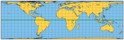 
	  Lambert (1772); 标准纬线 0°, 宽高比 3.141:1
	- 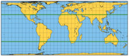 
	  W.Behrmann (1910);标准纬线 30°, 宽高比 2.356:1
	- 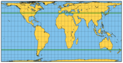 
	  Trystan Edwards (theoretical constraint, 1953);
	  近似标准纬线 37°24', 宽高比 1.983:1
	- 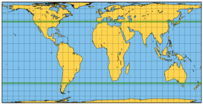 
	  Hobo-Dyer (2002);标准纬线 37°30',宽高比 1.977:1
	- 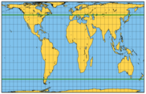 
	  Gall (1855), Peters (1967);标准纬线 45°, 宽高比 1.571:1
	- 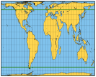 
	  Trystan Edwards (actual, 1953);近似标准纬线 50°52', 宽高比 1.251:1
	-  
	  Tobler and Chen (1986);近似标准纬线 55°39', 宽高比 1:1
- 除了Gall-Peters，其他不太知名的等面积圆柱形投影也采用了兰伯特的投影原理，只改变了标准纬线，因此也改变了一般的地图比例。它们中的每一个都可以转换为其他任何一个，只需将宽度和高度按互为因数的方式重新调整即可。
- 它们的形状变形模式是相似的，而且像所有的圆柱形投影一样，与经度无关：离标准平行线越远，水平比例尺受到的影响越大（在它们之间被压缩，在外围部分被夸大）。
- 其中一些变体的设计是明确的，以减少最大或平均变形（由作者方便地定义），如Behrmann和Trystan Edwards的投影就是如此。值得注意的是，由于某些原因，后者指定了一个变形标准，其标准纬线与实际选择的值不一致。
- 一些作者提出了在正方形上的等面积圆柱形地图；最近，Waldo Tobler和Chen在基于四叉树的地理信息系统的背景下提到了它。四叉树是一个分层的数据结构，它递归地划分一个矩形区域，每层四个小块：信息可以根据需要有效地存储和检索粗略的或精细的细节。正方形区域不是一个必要条件，但便于实施；面积等值更为重要。
## 立体圆柱投影:高尔投影、BSAM圆柱投影和布朗投影
- 詹姆斯·高尔首选投影(1885)的几何结构类似于方位立体图的透视，但有两个不同之处:
  * 投影面是一个北纬45度、南纬45度的正割圆柱体，就像他的正投影一样
  * 每个投影点的射线源都位于赤道上的相对子午线上。
- 面积未被保留，地图也不保形。只有在北纬45度和南纬45度的标准纬线上，比例才是真实的。除了整体扭曲之外，没有突出的特征。
- 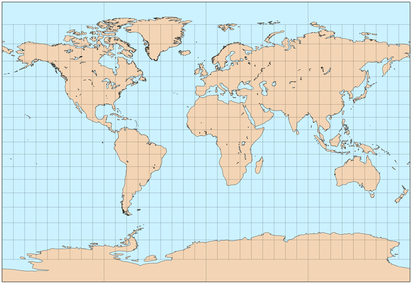 
  高尔的立体圆柱投影，标准纬线为30°（在B.S.A.M.上，中央经线为10°E）。
- 卡尔-布劳恩的立体圆柱图（1867年）是一种非常类似的投影，但是从切线圆柱体发展而来的。
- 另外两种被认为是Gall立体投影的特例的变体在苏联出版：Kamenetskiy（1929年）的地图使用55°作为标准平行线，B.S.A.M.（Bol's shoy sovetskij atlas mira，大苏维埃世界地图集，1937年）的一卷中的几幅地图使用30°。后者被称为BSAM圆柱形投影。
- 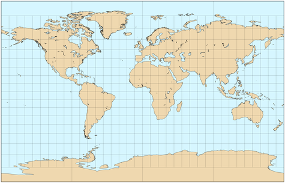 
  Braun's 立体圆柱投影
- 然而，Braun简要地提到了另一种变化：将光源从赤道移到赤道平面上的某一点，但在极轴到赤道的40%距离上。在北纬80度和南纬80度之间，结果与墨卡托的结果非常接近，最大误差为2.39%（反正墨卡托的误差在纬度80度以上几乎没有用处），而在北纬60度和南纬60度之间的误差为2.29%。甚至更好的近似度可以达到40.7%（北纬80°和南纬80°之间的误差为2.05%）和46.71%（北纬60°和南纬60°之间的误差为0.24%）这样的距离。尽管能够用微不足道的几何图形粗略地再现真正的保角投影，但这只是一个好奇心，其最大的优点是强调墨卡托的设计不是一个透视过程。
## 中心圆柱投影
- 在中央圆柱形（也称为中心圆柱形）投影中，垂直比例尺在远离地图中心线的地方增加得非常快，甚至比墨卡托投影还要快；同样，在赤道方面也不能显示极点。
- 它的起源尚不清楚，尽管它在方位角和中心角圆锥投影中有明显的相似之处。由于没有任何有利的属性，既没有等面积也没有保形，它几乎从未被使用，无论是在赤道方面还是横向方面（称为韦奇投影，以19世纪的J.韦奇命名）。
- 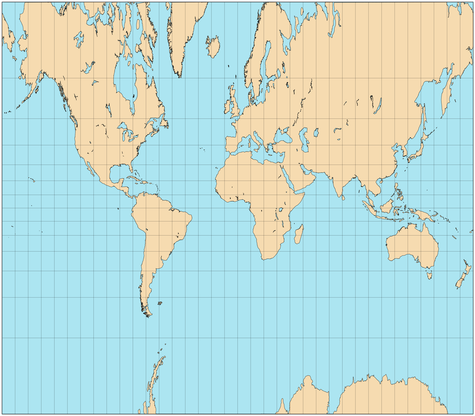 
  中心圆柱投影，从北纬70度到南纬70度