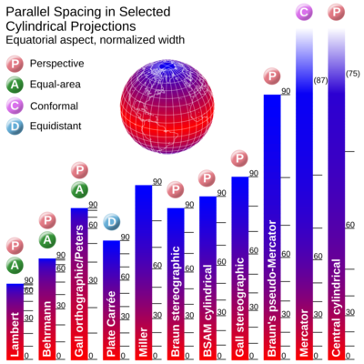

下一页:: [[伪圆柱投影]]
上一页:: [[方位投影]]
原文链接:: [Cylindrical projection](https://web.archive.org/web/20180227085810/http://www.progonos.com/furuti/MapProj/Normal/ProjCyl/projCyl.html)
public:: true

# 介绍
- 在所有圆柱形投影中，赤道是最常见的，而且经常是唯一有用的投影面:
  * 所有坐标线都是直的
  * 纬线(按照惯例是水平的)交叉经线总是成直角
  * 沿着每条纬线的比例是恒定的，所以经线的间距是相等的
  * 所有纬线长度相同；经线也是如此
- 因此:
  * 整个世界的地图都是矩形的
  * 在离赤道同样远的任何一对纬线上，比例尺都是相同的。
  * 各个纬线的比例尺差别很大，在两极达到无穷大，两极在地球上的长度为零，但在圆柱形地图上却与赤道一样长。
	-  
	  如果赤道柱面图的宽度通过重新缩放进行归一化，那么（因为它们的子午线间距相同）投影的唯一定义特征是其纬线的间距。 在这里，显示了北半球的一个切片，带有度数和颜色渐变标尺（比较方位角正投影插图）。 蓝色极地纬度在等面积设计中必然被压缩，并在米勒、墨卡托和其他透视投影中被不同程度地扩展； 只有等距的 Plate Carrée 与地球一样呈线性间隔。 请注意，最左边的三个投影实际上是相同原理的重新缩放版本，并且墨卡托和中央圆柱贴图延伸到无限大。
-