public:: true
上一页:: [[伪圆柱投影]]
下一页:: [[伪圆锥投影]]
原文链接:: [Conic Projections](https://web.archive.org/web/20180630041448/http://progonos.com/furuti/MapProj/Normal/ProjCon/projCon.html)

# 介绍
- 包裹在圆锥上的极地地图 
  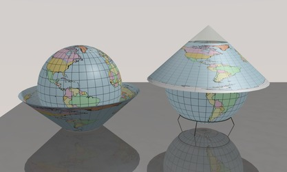
- 圆锥投影基本都是用于极地的投影面，其主要特征有：
  * 经线是等间距的直线，汇聚在一个点上，这个点可能是也可能不是极点。与球体相比，经线之间的角距离总是以一个固定的因子——圆锥常数——来减小
  * 纬线是圆的弧线，在经线的汇聚点同心。因此，每条平行线都以直角穿过所有经线，并且沿着每条平行线扭曲的模式是相同的。给定相同的常数，不同的圆锥投影仅通过平行间距来区分
- 为了说明问题，任何圆锥图都可以被包裹在圆锥上，尽管所有重要的圆锥投影都不是基于简单的透视模型--换句话说，圆锥面总是投影的结果，但很少直接参与其几何构造。
- 通常，有一条或两条纬线被选为标准线；在透视投影中，它们定义了圆锥体实际与球体相交的位置（分别是正切和正切情况）。在非透视设计中，没有这样的保证，尽管传统上保留了正切和正切的名称。
- 由于其固有的简单结构和变形模式，圆锥投影已被广泛应用于国家或大规模温带区域地图，而方位角和圆柱形地图分别适用于极地和热带地区，特别是由两条适度接近的子午线界定的区域，如俄罗斯或相邻的美国。椭圆体的情况已经发展为值得注意的大比例圆锥图。另一方面，圆锥投影很少适用于不间断的世界地图，一个半球必然比另一个半球遭受更多的变形。
- 被称为 "圆锥 "的投影相对较少；然而，许多其他的投影都是由圆锥原理支配的，因为方位盘和圆柱体都是圆锥的极限情况：前者是一个扁平的圆锥，标准平行线在一极，圆锥常数为1；后者是一个顶点在无限远处的圆锥，常数为0，标准纬线在赤道的南北两侧对称。只有一种类型的等面积圆锥投影，而且只有一种是共形的。
- 圆锥的约束被伪圆锥（有弯曲的经线）和多圆锥（有非中心的平行线）投影所放宽；除了多圆锥的非严格定义，圆形纬线被保留。圆锥和类圆锥是最古老的投影之一，是托勒密地图的基础（约公元100年）。
### 圆锥，尖的或不尖的:从方位角到柱面的两条平行线
- 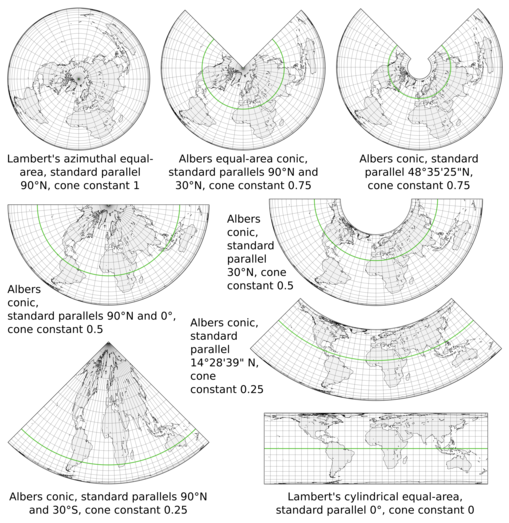
- 圆锥投影是方位角投影和圆柱投影的一般情况。上面的所有地图占据相同的面积，因为使用的三个投影(实际上是艾伯斯圆锥曲线的所有特定版本)是等面积的，并且以相同的比例因子应用。圆锥图的一般外观受圆锥常数的影响，圆锥常数又由标准平行线(上面用绿色突出显示)决定；地图是会聚在顶点还是包括截头圆锥(平截头体),取决于极点是否是标准纬线。
- 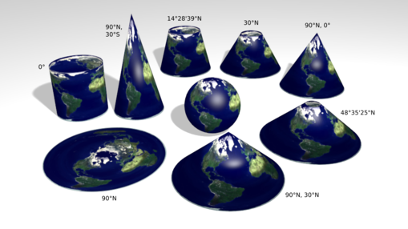
- 因为艾伯斯的投影不是由透视过程定义的，所以当被可视化为实际的圆锥模型时，这些地图并不完全适合底层的球体。例如，在标准纬线为北纬90度、南纬30度的版本中，它们不可能都与球体的对应部分在位置上重合，尽管它们相应的长度是相同的。
# 透视圆锥投影
- 透视投影使用一组具有共同原点的直线将地球仪和地图上的相应点关联起来，类似于几何透视的光线。与平面和圆柱体相比，圆锥体在光线的来源和方向上提供了更多的自由度。然而，透视圆锥投影从来没有意义。它们很少在地图学教科书中被提及——甚至不像中央圆柱形，作为一个负面的例子。尽管它们的几何简单，但它们几乎没有什么有趣的性质，即使与非常常见且更简单的等距圆锥曲线相比也是如此。
- 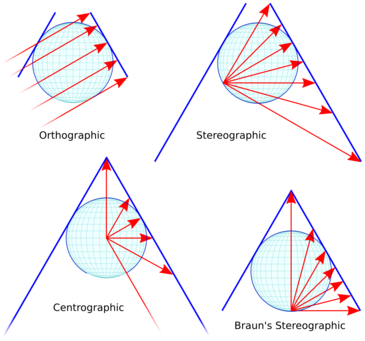 
  与30°N（任意选择的纬度，布劳恩的立体图除外）相切的透视圆锥投影的横截面。红色的光线显示的是间隔30°的平行线。切线纬度决定了蓝色映射面的延伸，也决定了限定可映射范围的蓝色细轮廓。
## 简单透视
- 传统上，透视圆锥投影的几何形状是由一条在切点（或正割情况下的角度中点）接触映射表面的线来定义的。在正视圆锥投影中，所有的光线都平行于该线，并且是表面的法线；在立体投影中，它们从反点射出；在中心投影中，从球体的中心射出。
	- 从上到下依次是正射法、立体透视法和中心法透视圆锥地图，所有地图都有一个标准的平行线30°N。正射地图和中心透视图不能显示南纬60°以南的地区；立体透视图可以显示整个世界，但在南纬60°时被任意截断，而中心图则在南纬35°时被截断。比较地图和上述横断面中的纬线间距和绘制的范围。
	  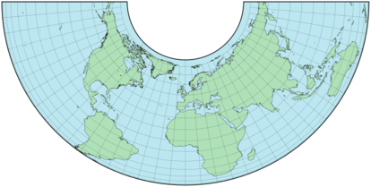 
	  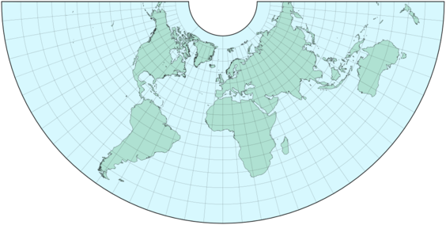 
	  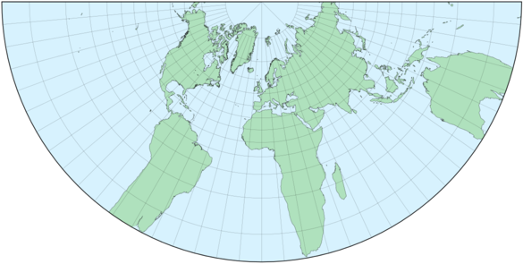
- 正交圆锥投影概括了方位正交和Lambert的圆柱体等面积投影，但除了后者的特殊情况外，它本身并不是等面积的，其切点对面的半球被限制在该点以外的90°纬度。立体圆锥投影弥补了方位立体投影和卡尔-布劳恩的立体圆柱投影之间的差距，并且像后者一样，可以显示整个世界。中心投影是方位角圆锥投影和已经提到的中心圆柱投影的一般情况，它被限制在与正交投影相同的可映射范围内，但在实践中被剪裁到几乎超过一个半球。
- 其他的解释也是可能的：例如，正射投影可以有与极轴正常的射线，从而使整个世界都可以被映射。或者布劳恩的立体透视地图，以一个极点为中心，而不是以一个反极点为中心。
- 在历史上，圆心几何模型是1758年P.Murdoch的三个圆锥投影的基础。C.Colles在1794年描述了一个正割案例。他们都没有得到太多的关注。
## 布劳恩的立体圆锥投影
- 布劳恩发表的立体圆锥投影（1867年，与他的立体圆柱一起）是在30°N处的透视设计切线，其定义是光线不是从南纬60°的反点射出，而是从南极射出。
- 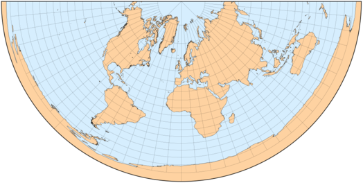 
  Braun's stereographic conic map
# 非透视圆锥投影
## 介绍
- 从历史上看，只有三种基本类型的圆锥投影获得了大量采用。它们的定义如下:
-
  * 正轴投影，沿着所有经线的真实比例
  * 等面积
  * 等角
- 作为制图学中的一个常规折衷方案，一旦指定了一个主要特征，就可以确定投影参数——在这种情况下，一条或两条标准纬线——以减少整体变形。这就意味着:
  * 对于等距地图，减少沿平行线的最大比例范围
  * 对于等面积地图，减少最大角度变形
  * 对于共形地图，最小化最大面积失真
  * 或者甚至是上述的适当折衷
- 纬线的最佳选择可以通过最小二乘法等分析或数值方法获得；有时，标准可以归纳为经验法则——例如，在感兴趣的最小和最大纬度之间的1/6和5/6处设置标准纬线(Deetz和Adams)。
## 等距圆锥投影和其变体
- 最容易构造的圆锥投影是简单的或等距的圆锥投影，具有均匀间隔的纬线。除了沿标准纬线外，既不等面积也不共形，但对于大多数温带国家来说，这是一个可以接受的折衷方案，它是方位等距投影和圆柱等距投影的一般情况。
- 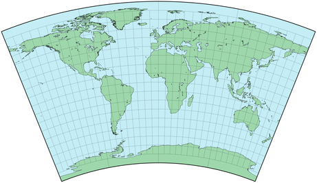 
  等距圆锥投影地图，标准纬线北纬30度，南纬45度
- 它的起源至少可以追溯到克罗狄斯·托勒密的第一张部分世界地图，那是纯粹的赤道以北的圆锥曲线。至少从17世纪开始，它就被应用于地球和星图，偶尔会有所修改，其中一些修改可能是由于绘制大直径弧的困难，而大直径弧经常与小圆锥常数一起出现。今天在当地和区域地图上仍然使用。
- 一些等距圆锥投影被归功于 "Delisle"（或de "L'isle"，或其他变体）。具有讽刺意味的是，尽管Joseph Nicholas de L'Isle在其家族企业出版的许多地图中确实采用了（真正的）等距圆锥，但他实际创建的投影（约1745年）并非严格意义上的圆锥修正，因为其子午线沿两条限制性直线而非纬线等距连接各点；因此它们一般不会在某一点汇合。
- 米德(1717年)的另一个改进是基于梯形单元或四边形，每个单元有1英寸宽。在每个细胞中，极限纬线和中心经线是标准线。这张不再是圆锥形的地图将会像蜘蛛网的一部分。米德和适当的“小岛”投影在今天已经完全过时了。
- 威廉·施耶宁(Wilhelm Schjerning)提出的第一个投影(1882年首次发表，1904年又发表了他的椭圆和心形/斜形建议)是一个北极等距圆锥曲线，常数为1/2。
- 杰出的数学家莱昂哈德·欧拉在1777年提出了在给定两条极限纬线的情况下选择圆锥常数的标准:在结果中，有时称为欧拉投影，给定一个纵向范围，沿极端纬度的距离误差与沿中心平行线的误差相同，但幅度相反。
- 俄罗斯和前苏联一样，涵盖了广阔的东西向山脉和中高纬度地区，是圆锥地图的理想主题。因此，一些俄罗斯和苏联制图师探讨了优化标准纬线位置的标准；著名的例子包括Vitkovskiy（1907）、Mendeleev（1907）、Mikhaylov（1911-2）、Krasovskiy（1922-5）和Kavrayskiy（1934）。门捷列夫（Dmitri I. Mendeleev）在对化学做出贡献后更加出名，他喜欢标准纬度90°N和55°N。Vladimir V. Kavrayskiy，其他各种投影的作者，赞成62°N和47°N。
	- 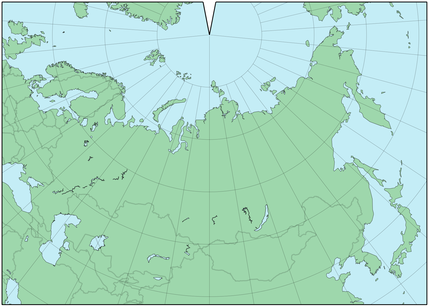
	  等距圆锥图，中央经线90°E。标准平行线90°N和55°N，根据Mendeleev。圆锥常数0.939。
	- 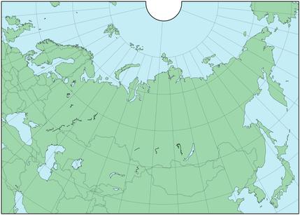 
	  等距圆锥图，中心子午线95度。给定限制纬线70度和40度，欧拉约束将圆锥常数设置为0.810。
	- 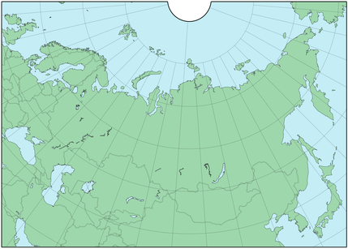 
	  等距圆锥图，标准平行线62°N和47°N，在Kavraiskiy之后。中央经线95°E，圆锥常数0.812。
## 兰伯特和阿尔伯特的等面积圆锥投影
- 在其他几个主题中，约翰-兰伯特（Johann Lambert）1772年的大量专著考虑了当经线被表示为由一个非真实的恒定角度分开的直线时--如方位角投影--但不像圆柱形投影那样平行时会发生什么：其结果可以顺便包裹在一个圆锥体上。兰伯特出生在阿尔萨斯（当时是瑞士的一部分），他应用微积分解决了以90°N或90°S作为标准平行线来保持区域关系的保真度的情况--即。由此产生的建议，即他的圆锥等面积，或兰伯特的等球面stenoteric（Adrien Germain和O.S.Adams使用的名称，可能是因为它在缩小子午线间距的同时保留了球体的面积）投影，后来被阿尔贝斯概括。
-