public:: true
上一页:: [[用于打印和折叠的地图]]
下一页:: [[墨卡托投影和等距离方位投影]]
原文链接:: [Premodern Projections](https://web.archive.org/web/20180227085810/http://www.progonos.com/furuti/MapProj/Normal/ProjPM/projPM.html)

# 介绍
- 在文艺复兴前或文艺复兴时创作的几种预测中，大多数早已废弃，只有少数具有一些突出特性的预测在今天被人们记住。关于这些投影的许多信息是不确定的。
  * 有几个经常被不知名的作者重新发明
  * 大部分零散的、不精确的描述今天仍然存在，有时是间接的参考资料或粗糙的副本
  * 特别是在中世纪，大多数地图只是为了说明地球的特征，因此缺乏精确的等高线，而且经常缺乏标度线
  * 由于不准确的复制或原始的绘图技术，许多地图没有准确反映作者的原始设计；经常使用直线或圆线作为更复杂曲线的近似值。
  * 因此，要确定经纬线的正确含义并不容易。
  * 如果没有经纬网，由于古代地理知识贫乏，对地物的测量和反向测绘价值有限
- 这里提到的投影主要是有历史意义的；有些是在适合某个主要投影组时已经提出的。由于我没有关于其他文化中制图发展的信息，所以明显有强烈的西方偏见。
# 等距圆柱和梯形地图
- 等距圆柱投影在基督教时代之前就非常普遍，这无疑是由于它的结构简单而实用。
- 也许同样古老或更古老，梯形投影也有类似的水平、笔直、等距的纬线，但经线会聚，不一定在一个点上。因此，最多两条纬线（在断裂子午线的情况下是四条），只有一条子午线是标准线。它既不是等值的，也不是共形的。
- 梯形投影归功于Hipparchus（在星图中），然后归功于Donnus Germanus，他用它来说明托勒密作品的版本。它的俗称Donis，源自Nordenskiöld使用的Donnus的一种形式。
- 这种原始的、过时的伪圆柱形投影的大多数地图只显示北半球的一部分；有些地图包括整个地球的对称半球，而其他地图则是真正的梯形，经线在赤道上没有中断。这种投影一直持续到18世纪。根据标准纬线的选择，梯形地图可能类似于Collignon、Eckert的I和II投影。对于不同周长的标准纬线，它也是等距圆柱形的一般情况。
	- 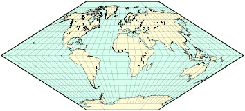{:height 169, :width 354}
	- 对称的梯形地图，标准纬线为南北40°和20°。
# 方位投影
- 值得注意的是，一些方位投影，即使在今天也很重要，早在两千多年前就被希腊人知道了，也许埃及人也知道。正投影、立体投影和日晷投影都是基于透视和欧几里得几何的立体原理，而方位角等距可追溯到15世纪，并且是任意构造的。
- 正射投影是图案意义上最逼真的地图之一，与下文的“球状”投影方法提供了有趣的对比。
- 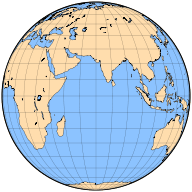 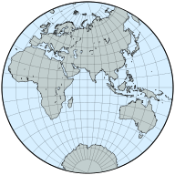
  赤道方位正交和立体半球，中央子午线70度
# 球状投影
- 显然，在西方中世纪的大部分时间里，来自古代的许多丰富的科学遗产被遗忘或忽视了；然而，尽管现代神话广为流传，但球状地球的想法从未因宗教因素而被禁止，并被大多数有识之士所接受。克里斯托弗-哥伦布捍卫的不是一个圆形的，而是更小的地球的想法；这种错误的说法使他提议的事业看起来合理可行。
- 所谓的球状地图本质上是简单的描绘一般地理特征的图像装置。他们的主要目的是强调地球的圆形；没有一个球形投影是等面积或共形的。最初，所有的都被限制在一个以圆为界的半球，只考虑赤道面。中央子午线和赤道都是直的垂直线。基本的几何约束，总结如下，定义了所有的历史设计。
	- ## 东半球重建的球状图；中央经线70°E
	- 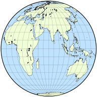 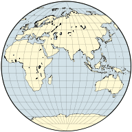 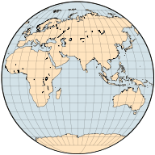
	- Bacon                                 First Apian                            Second Apian
	- 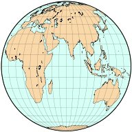 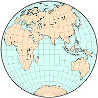 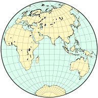
	- Second Fournier                First Fournier                      Nicolosi
- 尽管表面上与方位角投影相似，但球状地图并不是按照适当的透视规则绘制的：格点是利用容易绘制的曲线任意放置的。与制图学的惯例一样，没有一种方法是完美的：尽管乔治-福尼尔的第二件作品最符合三维地球仪的视觉效果，但 "Nicolosi "地图的全球形状失真可能最小；后者是最晚被广泛出版的，几乎可以肯定是最早被记录的。
- 大哲学家罗杰-培根（Roger Bacon）（约1265年）描述了已知最古老的一个半球的任意投影，由于Monachus（约1527年）和d'Ailly的工作而幸存下来。该设计被彼得-阿皮安（又名佩特鲁斯-阿皮安努斯）在两个提案中进行了修改（1524年），其中一个被特拉梅齐诺（1554年）采用，并被巴蒂斯塔-阿涅斯和亚伯拉罕-奥特留斯扩展。
- 富尼耶在1643年对球状风格进行了两次修改，第一次使用圆弧而不是直线作为纬线。Giovanni Nicolosi于1660年推出的投影图使进一步的改变得到了推广，虽然该投影图也是由Philippe de La Hire于1794年设计的，但可能是由杰出的伊斯兰学者al-Biruni（约1000年）首次设计的。现代提到的大多数 "球状 "地图都是指这种 "Nicolosi "设计，即使在19世纪，这种设计仍然广为人知。
## 经典球状投影的一般特征
-
  | 投影名称 | 纬线	| |  经线|
  | :-----| ---- | ---- | ---- | ---- |  ---- |
  |常用名| 形状| 等距处 |形状| 等距处|
  |Bacon | 直线 | 边界子午线 | 圆弧 | 每条纬线 |
  |Apian 1|	直线|	中央子午线	|圆弧|每条纬线|
  |Apian 2|	直线|	中央子午线	|椭圆|每条纬线|
  |Fournier 1|圆弧|边界和中央子午线|椭圆|赤道|	
  |Fournier 2|直线|边界子午线|椭圆|每条纬线|
  |Nicolosi|圆弧|边界和中央子午线|圆弧|赤道|
# 椭圆形和扩展球状图
- 尽管经典的球状投影都不是为了同时显示一个以上的半球，但都可以扩展为跨越整个世界；除了中央子午线外，中央的圆形半球与原始投影的半球相同。
- 椭圆形地图的平行线为直线，经线为简单的曲线。Agnese（约1540年）和Ortelius（1570年）的地图可能源自Apian的第一个设计，外半球使用固定半径的半圆弧。其结果适合2:1的框架，看起来像埃克特的现代投影III和IV，但它当然不是等面积的。它也不是假圆柱形，因为子午线的间距在内半球和外半球并不一致。
	- 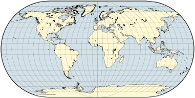 
	  奥特留斯地图的重建，是阿皮安第一投影的近似延伸；中央经线0°。
- 阿皮安第二投影使用了椭圆经线，而且作为一个现代的好奇心，可以使用反偏心的弧线进行扩展。尽管是伪圆柱形，它与莫尔维德的椭圆地图的相似之处只是表面的。
	- 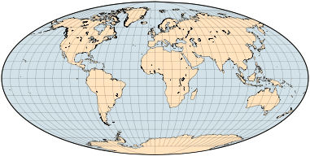 
	  阿皮安第二投影扩展到整个世界，中央子午线为0°。
- 类似的结构应用于Nicolosi的球状地图产生了一个苹果形的框架，与Van der Grinten的IV投影形成了有趣的对比。
	- 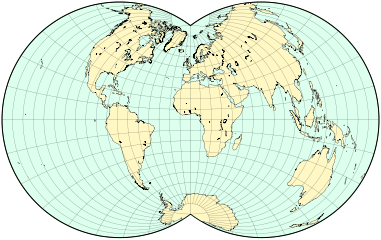 
	  尼科洛西 "投影扩展到完整的世界地图，中央经线0°。
# 八瓣投影
- 八瓣地图类似于星形投影，曾与早期的椭圆形地图同时短暂使用。它们将地球表面划分为八个形状相同的部分，通常以赤道和四条经线为界。每个球状三角形都被分别投射到一个大致为三角形的八瓣中；如果其边缘是以一个等边三角形的相反顶点为中心的圆弧，则分瓣的形状被称为Reuleaux三角形。
- 莱昂纳多-达-芬奇的一幅基于Reuleaux三角形的八瓣世界地图（约1514年）被认为是基于Reuleaux三角形的八瓣世界地图，其孔隙被安排在独立的、类似三叶草的半球中，但省略了标尺；其投影方法只能被推测。Oronce Finé出版了一个部分光栅尺（1551年），同样没有说明细节。很有可能的是，纬线是沿每个八度的子午线边缘和中央子午线等距的非中心圆弧；经线是沿赤道等距的。
- 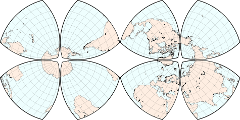 
  达芬奇八瓣地图的南半球和北半球的可能重建；边界经线从45°开始。在原始地图中，孔隙的间距略大。