public:: true
原文链接:: [Cartographical Map Projections](https://web.archive.org/web/20180702154323/http://progonos.com/furuti/MapProj/Normal/TOC/cartTOC.html)

- 下图是相同比例尺,不同的投影面下的南美地图。哪个投影是最好的？哪个是对的？简而言之,没有正确答案，至少不是一直都有正确答案。即使使用了同一种投影，仅仅是改变这个投影面就可以从根本上重塑大陆形状。但如果你想要一个有根据的答案，请继续阅读。
- 
- 制图学是制作地图的科学。它包括许多问题和技术，包括：
      * 测量地球的形状和特征
      * 收集和存储有关地形、地点和人员等地理信息
      * 将三维行星表示为平面地图（我的主要关注点）
      * 设计图示和图例来表达数据
      * 将地理信息印刷和出版
  
  为了不同的目的,我们设计了各式各样的地图。当看到两幅不同的世界地图时，我们会思考它们的区别：
    * 为什么把世界画成矩形或者椭圆形，不应该是圆形么？
    * 经纬网必须是平行的么，经线纬线是直的还是弯的？
    * 南美的“尾巴”是向东弯曲还是向西弯曲？
    * 到底什么才是绘制我们这个独特的星球的“正确”的方式？（或者更确切的说，是否有这么一种方式正确的描绘我们的地球？）
  
  制图学的一个重要问题是解决如何投影：即将点从一个几乎是球形的大石头上（我们的地球）转移到平面上(即纸上或者电脑屏幕上)。
  以下非正式的描述了一些重要的制图概念，地图是如何绘制的，以及为什么世界地图有这么多不同类型的投影。您可以从这里开始阅读，使用翻页来顺序阅读，或者使用以下目录：
	- 简介
		- 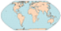 [[简单的地图背景知识介绍]]
		- 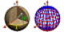 [[制图学基础知识和投影选择]]
	- 按地图目的划分投影
		- 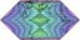 [[有用的地图属性]]
			- [[距离和比例尺 ]]
			  id:: 60c3668f-c4f3-4bbc-8e02-e991afc1df2e
			- [[测地线]]
			- [[方向]]
			- [[形状]]
			- [[面积]]
			- [[变形椭圆]]
			- [[角度变形模式]]
	- 制图学中的数学
		- 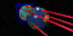 [[如何创建投影]]，以下投影为例：
			- [[正轴方位投影]]
			- [[正轴圆柱投影]]
			- [[Kavrayskiy's VII投影]]
			- [[等积正弦投影]]
			- [[克拉斯特抛物线投影]]
			- [[摩尔维特 (Mollweide) 投影]]
			- [[极/赤道方位等距等面积投影]]
			- [[等距圆柱投影_Winkel I / II]]
			- [[埃托夫/汉莫尔/温克尔三重投影]]
	- 主要投影组
		-  [[方位投影]]
		- 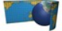 [[圆柱投影]]
		- 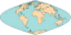 [[伪圆柱投影]]
		-  [[圆锥投影]]
		- 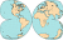 [[伪圆锥投影]]
		- 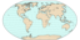 [[修正方位投影]]
		- 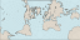{:height 48, :width 80} [[正形投影]]
		- 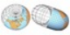 [[其他有趣的投影]]
	- 应对变形:
		- 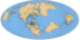 [[倾斜和弯曲投影_斜轴投影]]
		-  [[撕开地球的皮肤_分瓣投影]]
			- [[星形投影]]
			- [[分瓣和复合圆锥投影]]
			- [[经典分瓣投影]]
			- [[任意分瓣投影]]
			- [[分瓣技巧]]
		- 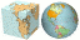 将地球改造成奇异行星:
			- [[多面体地图介绍和四面体地图]]
			- [[立方体和八面体地图]]
			- [[二十面体/十二面体/其他地图]]
			- [[用于打印和折叠的地图]]
	- 史海钩沉
		- 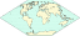 [[在现代之前发展的投影]]
	- 投影（施工中）
		- 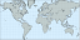缩小世界的投影: [[墨卡托投影和等距离方位投影]]
		- 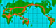 [[一些投影应用]]（建设中）
	- 总结
		- 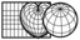 [[投影摘要和表格]]
		-  [[资源和链接]]
		- [[FAQ]]