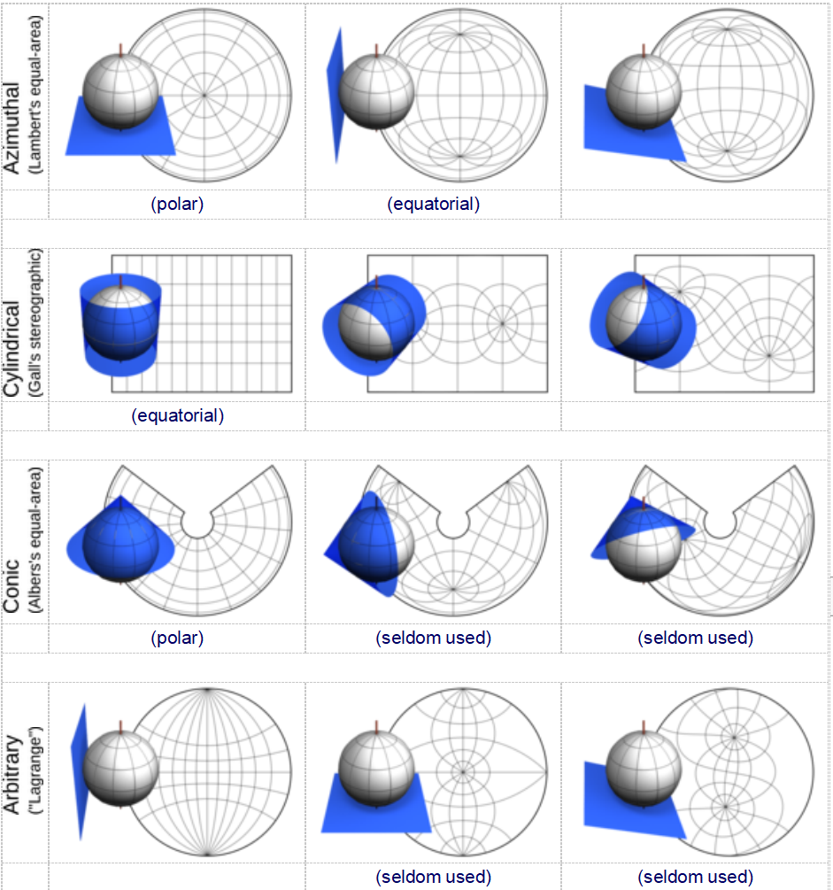

### 坐标原点的选择
	- 
	- 表格中展示了三种（正轴、横轴和斜轴)投影面应用于四种(方位等积、高尔立体、亚尔勃斯等积圆锥和拉格朗日)投影，蓝色表示切投影面(只给出了无限多个可能的投影面中的几个）。一些投影，如高尔立体投影，实际上可以通过透视几何得出；然而，对大多数投影来说，投影面只是说明性的：地图可以展示到一个投影面上，但不是从投影面计算出来的。
	- 一些投影群的独特方里网（例如方位投影和圆锥投影中的径向对称子午线，圆柱形图中的矩形网格）是通过指定的投影面来实现的。尽管有一个常见的误解，但这种分类并不是排他性的：大多数投影既不涉及圆锥体，也不涉及圆柱体，但也不是方位。对已完成的地图的微旋转，比如把它侧向或倒过来，投影面和投影都将保持不变。另一方面，修改投影面既不影响所表示的区域，也不影响整个地图的形状。