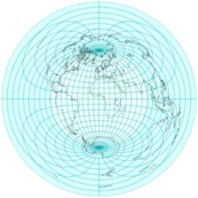
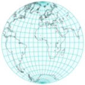
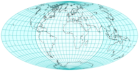
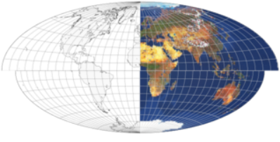
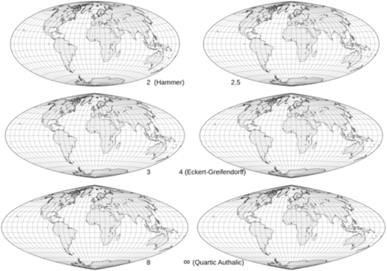

public:: true

# 方位投影的三种改进
## 从方位等距离投影到埃托夫和其他投影
-  
  普通正轴方位等距地图，内半球突出显示
-  
  内半球
-  
  两倍经度
-  
  水平比例拉伸两倍:埃托夫投影
## 推导埃托夫投影
- 方位等距投影以赤道为投影面时,以我们熟悉的 "水平 "面呈现整个世界；然而，在地图边界附近有明显的面积夸张。
- 艾托夫注意到，方位等距地图将一个 "内 "半球包围在一个半径为整个地图一半的圆盘中，他提出了一个非常简单而又有吸引力的修改方案。
  1. 用双倍的纵向坐标投射世界，有效地将所有东西都塞进内半球
  2. 两倍的水平比例，将圆盘拉伸成2:1的椭圆 压缩经度
-
  ---
	- **压缩经度**
	- 
	- 这一系列修改后的赤道方位角等距图显示了将经度压缩1到2倍后，整个世界就变成了以前由一个半球占据的空间。
-
  ---
- 最终的投影不再是方位投影，而是仅沿赤道和中央子午线等距。
  前向投影方程直接从赤道方位等距方程推导而来，替代并乘以横坐标中的系数2:
-
  $$\alpha=\arccos\Big( \cos\varphi \cos\frac{\lambda}{2} \Big)$$
  $$k=\begin{cases} 
  & 0\: \:  &if \: \: \alpha = 0 \\
  & \frac{\alpha R}{\sin\alpha} \: \: \: &otherwise 
  \end{cases}$$
  $$x=2k\cos\varphi\sin\frac{\lambda}{2}$$
  $$y=k\sin\varphi$$
- 艾托夫的方法是由约翰-兰伯特（Johann Lambert）开创的，压缩方位立体投影产生了 "拉格朗日 "投影。
## 推导出哈默和埃克特-格里芬多夫投影
-  
  埃托夫(上)和哈默(下)投影相同比例尺的比较
- 埃托夫的工作本身被哈默修改了，他的投影应用了同样的想法，但改为兰伯特的方位等面积投影。因此:
  * 全球比例小于艾托夫
  * 投影的内半球不到整个地图的一半宽，但包围了它的一半面积
  * 最终加倍恢复比例，最终地图也是等面积的
  * 沿着主轴的比例不再恒定
- 同样，可以推导出公式，用λ/2代替λ，这一次是在兰伯特的方程中:
    $$x = 2R\sqrt{\frac{2}{1+\cos\varphi\cos\frac{\lambda}{2}}}\cos\varphi\sin\frac{\lambda}{2}$$
    $$y= R\sqrt{\frac{2}{1+\cos\varphi\cos\frac{\lambda}{2}}}\sin\varphi$$
- 比例不同，但总体线条在艾托夫和哈默的投影中相当相似。在内半球几乎看不到经纬网间距的差异，这两个投影经常被贴错标签。
- Hammer的设计又被Eckert-Greifendorff修改了，在一个投影中进一步应用了2：1的重新比例。因此，除了用$$\frac{\lambda}{4}$$代替$$\frac{\lambda}{2}$$和将x因子从2改为4之外，其他公式都是相同的。
- 基于通过倒数因子压缩经度和扩展横坐标，保持中央子午线尺度不变的等积投影的极限情况是四次等积投影，即伪圆柱投影。
	- **展平纬线**
	- 
	- 修改后的赤道方位角等积地图，具有经度压缩/水平扩展的倒数因子。
## 温克尔三重投影
-  
  具有常规（顶部）和 40° 参考纬线的 Winkel 三重投影图
- 温克尔设计了对艾托夫投影的另一种修改。 就像在他的第一张和第二张混合地图中一样，他的三重投影平均了等距圆柱投影的 x 和 y 坐标，这次再次使用 Aitoff 投影,因此:
-
  $$\varphi_0=\pm\arccos\frac{2}{\pi}$$
- 通常被选为圆柱形基座的标准纬线(尽管最终投影没有标准纬线)。
- 方程直接来自艾托夫方程和等距圆柱方程:
-
  $$\alpha=\arccos\Big( \cos\varphi \cos\frac{\lambda}{2} \Big)$$
  $$w=\begin{cases} 
  & 0\: \:  &if \: \: \alpha = 0 \\
  & \frac{1}{\sin\alpha} \: \: \: &otherwise 
  \end{cases}$$
  $$x=\frac{R}{2}\Big( \lambda \cos \varphi_0 + 2w \alpha \cos \varphi \sin \frac{\lambda}{2} \Big)$$
  $$y=\frac{R}{2}(\varphi+w\alpha \sin \varphi)$$