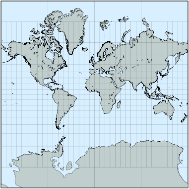
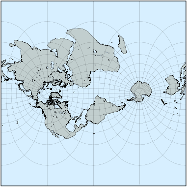
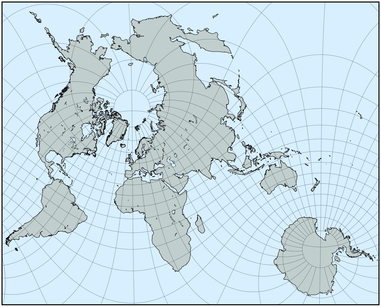
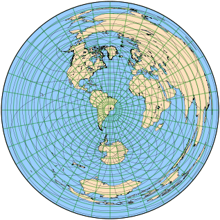
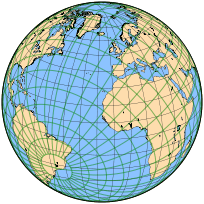

public:: true
上一页:: [[在现代之前发展的投影]] 
下一页:: [[一些投影应用]]
原文链接:: [Projections for Navigators](https://web.archive.org/web/20180628080201/http://progonos.com/furuti/MapProj/Normal/ProjNav/projNav.html)
alias:: 导航员和无线电报务员的投影

- 两个经典的地图投影，一个圆柱投影，一个方位角投影，值得从它们的组中分开描述。虽然墨卡托投影和方位等距投影对于专业制图应用至关重要，但互联网使墨卡托投影的可见度和受众远远超出了其预期目标。
-  
  在85°N和85°S纬线之间任意剪裁的常规（赤道）墨卡托地图
## 圆柱共形投影
### 墨卡托投影
- 伟大的佛兰德制图师格哈德-克雷默以拉丁化的名字杰拉德-墨卡托而闻名。以他的名字命名的圆柱形投影是一项革命性的发明，它有一个显著的特性:两点之间的任何直线都是一条恒向线，或者说是球体上的一条恒定路线。在共同的赤道面上，墨卡托斜子午线与所有子午线的夹角相同。换句话说，如果在赤道墨卡托地图上画一条直线，连接旅程的起点和终点，这条直线的斜率产生旅程不变的方向；保持恒定的方位就足以到达目的地。
- 这种投影几乎总是以正切的方式呈现，以赤道为标准纬线，不存在变形。当使用正切情况时，与赤道对称的两条平行线成为标准线；在改变长宽比后，产生的地图几乎是相同的，很像等面积圆柱形投影的变化。在这种情况下，"正切 "和 "正割 "这两个词只是概念性的，因为墨卡托投影不是由显影圆柱体上的透视过程来定义的。
- 作为唯一的保形圆柱形投影，墨卡托地图从16世纪至今一直是航海家的福音，尽管在两极附近存在着极端的区域扭曲：为了保持形状不变，南极洲被极大地拉伸，格陵兰岛被渲染成比实际尺寸大9倍的样子。事实上，拉伸在地图的顶部和底部稳步增长（在赤道形式下，在较高的纬度；两极实际上将被置于无限远的地方）。墨卡托地图很少延伸到北纬80°以上或南纬75°以下。
- 赤道的这种明显南移和中间纬度的面积夸大（这些纬度大多与发达国家重合），一再引起人们对其所谓的对第三世界的偏见的不满（它甚至被声称通过宣传欧洲、美苏或美国的所谓优越性来帮助种族歧视）；被误导或天真的争议和解决错误问题的建议包括 "彼得斯 "投影，它（与其他许多投影一样）保留了面积，但强烈扭曲了形状，没有特别有趣的属性可以弥补。虽然历史上有几幅地图被用于政治宣传，但这并不是投影本身的错：像所有保角投影一样，墨卡托的投影从未打算用于世界墙图。不过，它曾经在教科书中很常见。
- 最近，谷歌地图的世界观选择了球形（但使用的是椭圆基准，因此不完全是保角）的情况，在85°3′4″纬度之间进行剪裁，产生一个方形地图，便于有效地存储和检索。这种变体通常被称为Web墨卡托。
-  
  横轴墨卡托地图，中央经线30°W。这种投影不用于小比例尺或整个世界地图，因为即使离中央子午线稍远，其比例尺和面积失真也很明显。另一方面，它通常是大比例尺精确制图的最佳选择，只有朗伯的保角圆锥图可以与之匹敌。
- 虽然墨卡托地图是基础，但它并不是航海家使用的唯一地图，因为除非是短途旅行，否则恒向线通常不会与测地线相吻合。测地线可以绘制在日晷地图上，然后转移到墨卡托地图上，并在地图上逐段分割恒向线。
- 这种投影可能在1511年左右由Etzlaub首次用于赤道投影面；然而，只有在1569年墨卡托地图集出版后，它才被广泛知晓。由于当时没有严格的数学理论，墨卡托可能通过几何近似定义了分划；E.Wright于1599年正式提出方程式
- {{embed [[Web墨卡托]]}}
### 横轴墨卡托投影
- 更常用于大比例地图，横轴保留了墨卡托投影的每一个属性，但由于经线不是直线，所以它比导航更适合大比例地形图。它确实绘制了一条没有扭曲的中央子午线(正割时为两条)。
- 和往常一样，赤道、横轴和斜轴墨卡托投影提供了完全相同的畸变模式。
- Lambert在其开创性论文（1772）中提出了横轴以及球形情况下的方程。椭球壳是由伟大的数学家卡尔·高斯（约1822年）和路易斯·克鲁格（约1912年）提出的；它通常被称为高斯共形投影或高斯-克鲁格投影。
	-  
	  墨卡托投影的任何方面都不适合用于全球或小比例尺地图。对于球形地图来说，找到一个能显示所有主要陆地的斜面是一个简单的工作--视觉上有趣，但没有什么实用价值；对于小区域来说，椭圆型地图是一个更有用和困难的问题。
### 斜轴墨卡托投影
- 作为一项数学上的挑战，墨卡托投影在椭圆体情况下的倾斜方面已经引起了专业人员对大规模地方或区域地图的兴趣。已经提出了几种方法，通常基于中间投影面（如果依次应用连续的保角映射，最终结果仍然是保角的），并在细节上有所不同，如比例尺变形的范围；一般来说，球面版本中沿平行线的恒定比例尺没有被保留。
- Jean Laborde的版本（1926年）应用于马达加斯加，首先通过适当的平行线移动将椭圆体转变为保形球体，然后使用普通的横轴墨卡托投影，接着进行旋转，使马达加斯加的最长尺寸与地图的中央子午线对齐。
- 马丁-霍廷更著名的方法，有时被称为霍廷投影，首先用于东南亚（约1946年），然后是包括美国在内的其他地区。它的中间表面不是一个球体，而是一个posphere，一个总曲率恒定的参数表面。
#### UTM投影
- 横轴墨卡托投影最广为人知的用途是称为通用横轴墨卡托(UTM)投影系统的特殊形式。
- UTM定义了一个覆盖北纬84度和南纬80度之间世界的网格。这个网格被分成60个狭窄的区域，每个区域都以一条子午线为中心。区域由连续的数字标识，从西向东递增(第一个区域，紧挨着180°子午线的东边，编号为1；31区正好位于格林威治子午线以东)。一组平行线将网格分成行，用字母从C到X标记(I和O未使用，避免与数字混淆)，从南开始。因此，每个区域包括20个四边形，由一对数字字母标识。四边形又被进一步细分为100公里宽的正方形，由双字母组合识别。
- 每一个区域都是用正割情况下的横向墨卡托投影的椭球形单独投影的:中央子午线的比例减少了0.04%，因此它的东西约1° 37′的两条线具有真实的比例。UTM网格是为单独的大规模地形测绘而设计的，而不是为世界或区域地图而设计的。特别是，不同区域的纸张不会完全并列。
- 在每个四边形内，任何一点都可以位于两个米的距离内:从中央子午线向东的东方和从赤道向北的北方。中央子午线的坐标永远是50万；对于北半球的四边形，赤道的坐标被指定为0，对于南半球的四边形，赤道的坐标被指定为1000万。由于从极点到赤道的距离约为10，000公里，这种偏移原点确保坐标(虚假东距和虚假北距)始终为正。
- 除了少数例外，UTM电网相当正常: 
  * 南纬80度以南的极冠由方位赤平投影的椭球面绘制而成，包括半圆形“区域”A(格林威治子午线以西)和B
  * 同样，北纬84度以北的帽状构造被方位立体投影所覆盖，方位立体投影包括“区域”Y(格林威治以西)和Z
  * 除了第X行(北纬72度至84度)以外，所有四合院的南北方向跨度均为8度
  * 除了本初子午线正东方的第X行和第V行的几个四边形之外，所有四边形都从西向东跨越6度
- 最初的UTM系统是美国陆军在1949年采用的，后来世界各地的几个机构也采用了不同的系统。尽管有这个名字，但它实际上并不是“通用的”，因为每个网格可能基于不同的数据，所以来自不同网格集的图纸可能兼容，也可能不兼容。UTM地图当然是共形的，并且距离和面积失真受到单个片的大比例的限制。
-  
  虽然没有墨卡托地图是由透视过程创建的，但圆柱体是一个有用的可视化辅助工具。蓝色条是UTM网格的13区；它是一个圆柱切片的一部分，在赤道上近似一个6英寸宽的球形轮，被北纬84度和南纬80度的纬线所夹住。这不是UTM地图的形状；相反，每个UTM区都被许多部分并列的矩形大尺度片覆盖。
### 方位等距投影
- 一个常见的制图任务是找到两点之间穿过地球表面的最短路线。这样的路径总是地球表面上测地线或大圆的一部分。测地线被试图最小化距离的船只和飞机导航员使用，而带有定向天线的无线电操作员寻找产生最强信号的方位。
- 方位等距投影在极面上很容易画出来，像所有方位设计一样，它的特点是只有中心点有一些特殊的性质:所有接触它的直线都是测地线，并且其中任意两条直线之间的角度与地球上的角度相同。因此，倾斜方位角等距图必须为每个特定位置量身定制。
- 投影的现代名字是由于安东尼奥·卡格诺里，他在1799年重新发明了它；早些时候，J .兰伯特在他1772年的开创性论文中提到了它，纪尧姆·波斯特尔(1581年)，他经常被认为是原始作者，和格拉雷努斯(约。1510年)，等等。
- 一般来说，方位投影可以直接从一个点(参考直线当然是局部子午线)找到真实方向:硬件位于地图中心的短波无线电操作员可以使用它来调整其天线的方向，以获得朝向地球上任何地方的最大增益。
- 此外，由于在所有方位投影中，等距投影单独保持了距中心点的径向距离，操作员可以估计需要多少功率来确保稳定的通信。同样，核潜艇的船长可以利用这个投影来检查哪些城市位于其破坏范围内。其他投影根本不合适。
-   
  左图是以巴西坎皮纳斯为中心的斜方位等距图。一个额外的叠加绿色经纬网有助于确定从坎皮纳斯到地球上每一个其他点的方向和距离。例如，它显示澳大利亚中部远至印度，可以通过南极正南方的最短路线到达。第二张地图是方位正投影地图，更容易可视化，但对测量没那么有用。