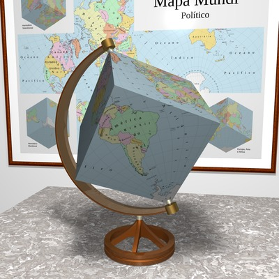
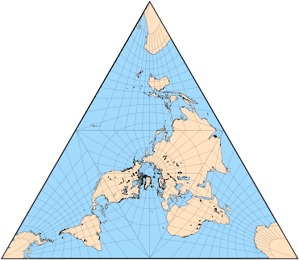
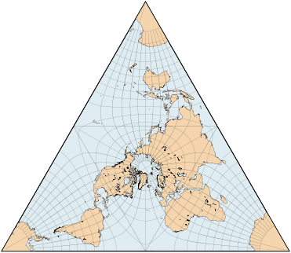
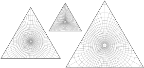

public:: true
上一页:: [[分瓣技巧]]
下一页:: [[立方体和八面体地图]]
Alias:: 多面体地图介绍和四面体地图
原文链接:: [Polyhedral Maps](https://web.archive.org/web/20180629150710/http://progonos.com/furuti/MapProj/Normal/ProjPoly/projPoly.html)

# 介绍
- 在将球面转换为平面图时，已经提出了几种减少失真的方法，包括:
  * 首先将球体映射成一个中间的零高斯曲率表面，如圆柱体或圆锥体，然后将该表面转换为一个平面
  * 对球体进行部分切割，并将每个分割点分别投射到一个间断的地图中。
- 这两种技术在多面体地图中被结合起来。
  * 将球体刻在多面体中，然后将球体的各个区域分别投影到每个多面体面上
  * 可以选择将多面体切割并展开成一个平面地图，通常称为多角形 "网"
- 直观地说，多面体地图中的畸变在顶点和边附近更大，多面体离内接球体更远；此外，增加面的数量可能会减少扭曲(毕竟，一个球体相当于一个有无限多个面的多面体)。但是，过多的面会在展开的地图中产生额外的间隙和方向变化，从而大大降低其有用性。
- 多面体地图与“多面体”投影完全无关，在1900年左右的几个变体中用于大规模制图；本质上，他们把球体映射成小的独立的梯形区域，如果连接起来，就构成了多面体的一部分。
-  
  大多数制图问题将在多面体地球上消失
# 普通多面体和多面体投影
- 如果多面体面覆盖，即并列时平铺或镶嵌平面，地图甚至在其展开形式下也是有用的。任何三角形或四边形都像正六边形一样平铺在平面上，但正五边形不这样。
- 五个正多面体或柏拉图多面体(其面是相同的正多边形，每个角有相同的角度)是多面体地图的自然候选对象，尽管扭曲在四面体中通常是不可接受的。一些半正的和均匀的(其面是正多边形，顶点是全等的)多面体也被考虑用于投影，最显著的是截顶八面体、立方十面体和截顶二十面体。
- 使用立体作为地图的想法至少可以追溯到阿尔布雷特·丢勒，尽管他实际上并没有设计出比空白草图更多的透视图(1525年，1538年修订)。
- 多面体面最常用的投影是日晷投影，其次是共形投影。在日晷多面体地图中，以与所有日晷设计相同的方式，像赤道这样的大圆和所有子午线都被转换成直线，除了在面边缘处断开的地方。
- 与分瓣设计一样，多面体地图的一个重要问题是选择投影面和排列面，以避免切割地图上的重要要素。最近，作为myriahedral投影算法框架的一部分(2008)，范·韦克获得了所有柏拉图立体的最佳面布局，使大陆切割最小化。
-
  |  形状   | 名称  | 面 |
  |  ----  | ----  | ----  |
  |   | 正四面体，正三棱锥 | 4个正三角形 |
  |   | 立方体 | 6个正方形 |
  |    |  正八面体 | 8个正三角形 |
  |   | 正十二面体 | 12个正五边形 |
  |   | 正二十面体 | 20个正三角形 |
  |   | 截断八面体 | 8个六边形,6个正方形 |
  |   | 截断二十面体 | 12个五边形,20个六边形|
  |  | 立方十面体 | 6个正方形,8个三角形 |
  |  | 三十二面体 |12个五边形,20个三角形 |
  |  | 菱方八面体 | 18个正方形,8个三角形|
  |  | 斜方十二面体 | 12个菱形 |
- 所选多面体的基本特征；除斜方十二面体外，所有面都是正多边形。八面体、二十面体和立方八面体已被应用于专利或商业地图，就像截断的八面体的不同形式。直观地说，增加面数使多面体更接近球体，同时减少了展开地图的简单性和实用性。
## 等面积设计
- A.D.Bradley（1946）的一篇论文描述了一个近似的二十面体上的等面积投影（地图边缘与多面体的面孔不完全匹配）；它还提到了经济学家Irving Fisher的一个等面积设计，它完全覆盖了多面体。费希尔以前曾设计过二十面体上的糯米图并申请了专利。
- Fisher的方法，基于Lambert的方位角等面积投影，被John P. Snyder（1992）概括为所有柏拉图实体，加上近乎精确的截断二十面体。它更容易解释，在不损失一般性的情况下，以一个规则的多边形面为中心的极性方面，半径延伸到每个顶点。兰伯特地图的 "自然 "边界是弯曲的，不是缺少就是超过多边形。因此，经线被调整，直到所有的经线都在边缘结束；这打破了面积等值，所以方位角，即经线间距，被修改以进行补偿。最后，沿每个子午线按比例计算距离，以保持面积不变。
- 这种方法的缺点是沿着连接顶点和每个面中心的线引入了尖点--方向的变化，作为光栅尺的断点可见；相对而言，面越大，尖点就越明显。
- 其他等面积的解决方案已经被提出，用于特定的立体，如四边形的球面立方体和立方体形式的HEALPix投影。
## 四面体分瓣投影
- 四面体一般被认为不适合绘图，因为它在顶点附近有夸张的变形。Botley使用了gnomonic投影（1949）。Woolgar（1833）以前的设计是基于立体投影的，并不完全是多面体，因为面的边缘有重叠。
- 为了回应他所认为的Fisher对（可能是日晷的）四面体地图的过度扭曲的批评，L.P.Lee创造了一个正形设计（1965）；与其他展开的多面体相比，他指出，缝隙的数量少，在适当的安排下，大陆的切割数量减少，而且有可能对平面进行镶嵌。除了四面体顶点（这六个奇异点对应于扁平化形式中的角和边的中间），投影在任何地方都是等角的，这也显示出相当大的面积夸张。李将他的地图投影点放在南极，将所有顶点放在海洋地区。
- 贝格豪斯的星形地图的3点变体可以顺便折叠成四面体，尽管其发展与上述任何方法都无关。
- 尽管名字很普通，但巴塞洛缪的四面体投影实际上是一种星状的复合体，与多面体无关。
- M.C.埃舍尔在他充满幻想的雕刻作品《双行星》（1949）和《四面体行星》（1954）中使用了真正的四面体假世界的概念。多面体、倾斜、循环、无限和矛盾的数字是这位多产的荷兰艺术家作品中反复出现的主题。四面体 "地球 "为《以赛亚书》11:12（"他要把分散的犹大人从地球的四面八方聚集起来"）提出了新的含义。
-  
  当日晷投影应用于四面体时，除每个面的中心外，面积和形状的失真都变得极端。
-  
  正四面体中李氏共形投影的北极(类星)面，缩放以匹配地精地图的大小。李的原始地图以南极为中心。六个非共形点的面积畸变很大。
-  
  当应用于四面体时(同样，缩放以匹配地精地图的大小)，费希尔/斯奈德的等面积投影中的尖点沿着每个面的三个辐射线非常明显。
-  
  在相同的比例因子下四面体的单个极面:日晷(左)，费希尔/斯奈德等面积(中心)，李氏共形投影(右)。
-  
  李氏投影在四面体上的平铺。以南极为中心将所有奇点移向海洋。
-