public:: true
上一页:: [[方向]]
下一页:: [[面积]]

# 形状被保留了吗？
- 共形（或正形）投影地图局部保留了角度。因此，地图中的任何两条线都与地球上相应的原线有相同的角度；特别是，投影方里网总是以直角交叉（一个必要但不充分的条件）。  另外，在任何特定点上，比例尺在所有方向上都是一样的。但这并不意味着整个地图的形状总是被保留下来，因为任何保形地图都包括某个地方的比例尺失真（也就是说，比例尺不是到处都一样的）。任何方位立体投影或墨卡托地图都是保形的。
# ((60c2f25e-4c89-4b31-8712-3d4d8780103b)) 与 [[测地线]]
- 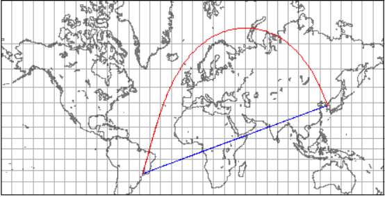 
  墨卡托地图:蓝色为等角航线；红色为测地线
- 墨卡托地图上的一条连接坎皮纳斯和韩国首尔的直线是一条从任何一条子午线以大约79 ° 39’的恒定角度绘制的等角航线。从坎皮纳斯起飞的飞机在整个飞行过程中，沿着这个固定的方向(不考虑诸如交通航线、风向偏差、天气、国家空域和燃料范围等因素，实际的惯常航线是向西飞行，但实际上是相似的)很容易在首尔着陆。
- 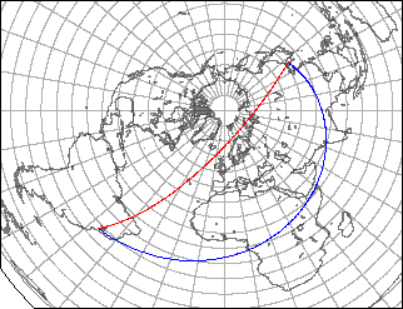
  方位等距离投影:蓝色为等角航线；红色为测地线
- 然而，就距离而言，这条简单的路线并不是最经济的选择，正如测地线所示。这两条路几乎只在短路线上重合。尽管等角航线在墨卡托地图上要短得多，但方位等距投影地图显示了一个相反的情况，即使测地线没有映射到一条直线(因为它没有截取投影中心),也比等角航线要短。
- 因此我们需要权衡：
  * 跟随测地线将意味着方向不断变化（这些变化是当前罗盘方位的变化，并且仅是显而易见的：在球体上，轨迹尽可能笔直）
  * 沿着等角航线会浪费时间和燃料，
- 导航员可以遵循以下混合规则：
  1. 在方位等距投影地图上或日晷投影地图上遵循测地线
  2. 将测地线打断成线段
  3. 将每个线段的端点绘制到墨卡托地图上
  4. 使用量角器，读取每段的方位
  5. 按照相应的恒定方位对每段进行单独导航。
- 同一个大圆(这次覆盖360)和一个“拉格朗日”共形映射中的等角航线
  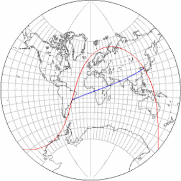
## 在地球仪和地图之间移动圆圈
- 假设一组同心圆，半径以巴西坎皮纳斯为中心，1500km步长递增。这些是地球上真正的圆圈，可以展示无线电波、飞机或导弹的理论范围；它们在这里用蓝色表示，在本表的所有地图中是相同的。在每对蓝色形状的地图中，上面边的是简单的承影面，而下面的对应通常是以坎皮纳斯为中心的倾斜投影面。另一方面，上面地图的橙色区域上直接画成了圆圈；它们在地球仪上的真实形状显示在下面(它们只是每对地图上的相同曲线)。在地球仪和地图上，以下只有一对投影和投影面是圆的大小和形状相同的
- 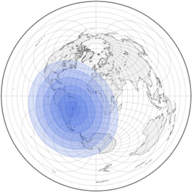 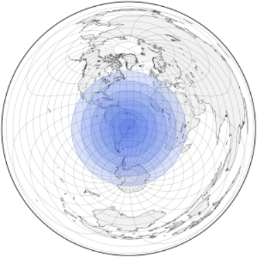 
  像所有的方位投影一样，方位等距投影保留了以地图投影中心为中心的任何圆的形状，但不一定保留了其他圆的形状(上方) ; 然而，对于那些中心与地图重合的投影，比例尺也保留了下来: 在右边的地图上，注意半径是线性间隔的。给定一个恰当的承影面，这种投影是在平面地图上以图形方式寻找范围的唯一正确工具。
- 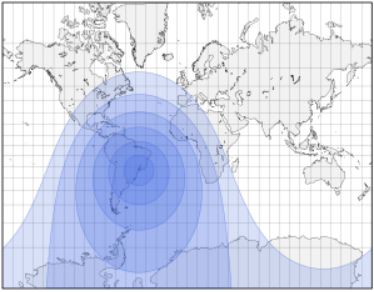{:height 300, :width 374} 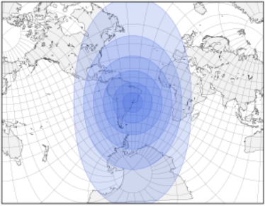 
  墨卡托映射是等角的，因此在局部保持形状，而不是全局保持形状。地图顶部和底部的比例变化很快，尤其是垂直变化。
- 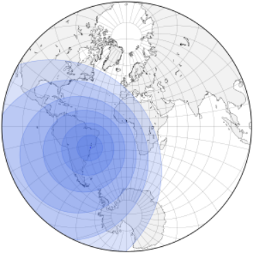 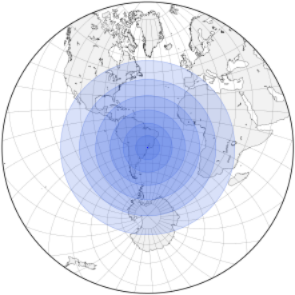 
  同样是等角的方位立体投影保持了所有圆的形状，即使不在地图中心(左)。尽管如此，它们的比例尺并没有被保留下来: 它们不是线性增长的，而且如上图所示，也许令人惊讶的，甚至并不是同心的。
- 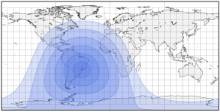 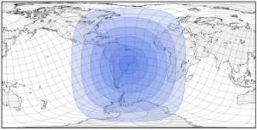 
  PlateCarrée是一个非常简单的设计，是等距圆柱投影的特例。 赤道和所有子午线上的比例尺都是相同的（从赤道方面衡量）。 因此，仅右侧的“圆圈”的宽度和高度相同。
- 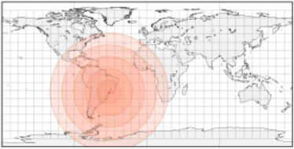 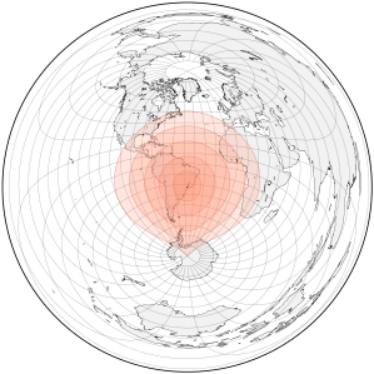 
  由于所有圆柱投影都会放大地图顶部和底部的水平比例，因此，如果在PlateCarrée地图上用圆规直接绘制圆，它们在地球上的正确形状就会被扭曲，如方位角等距对应图所示。
- 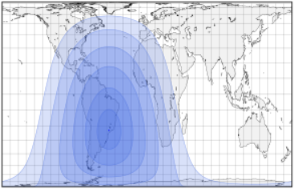{:height 243, :width 367} 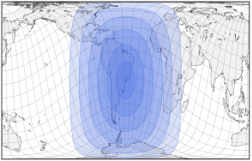 
  兰伯特等面积圆柱投影的一个特殊情况，加尔氏正投影(也称为加尔-彼得斯投影或“彼得斯投影”)保留了面积，但严重扭曲了形状，垂直比例变化非常不均匀。
- 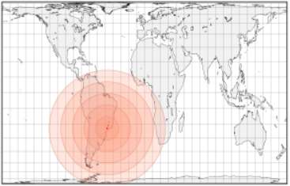{:height 243, :width 367} 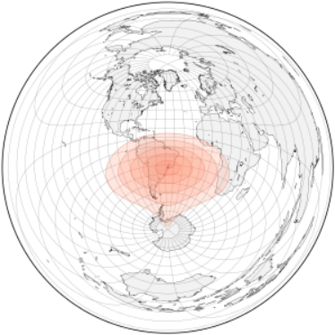 
  将Gall的正视图上绘制的圆圈转移到真实的地球仪上，得到的形状甚至与正确的形状相差甚远。因为北纬45度和南纬45度之间的比例被拉长，而其他地方的比例被压缩，真实的形状在地球上也相应地变形了。
- 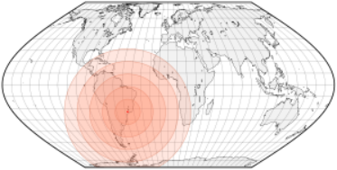 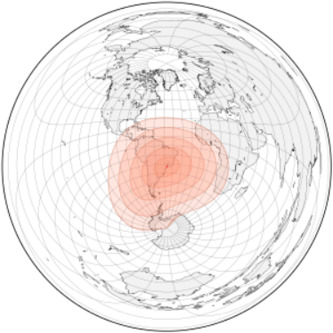 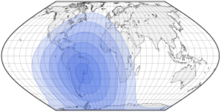 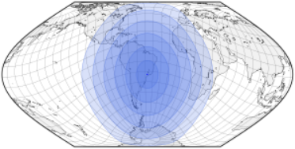 
  Eckert's sixth是等面积伪圆柱投影; 它的极点显示为线，但水平放大率比圆柱状投影要小。 另一方面，水平变形取决于经度。
- 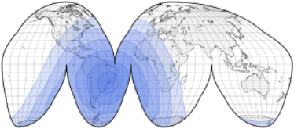 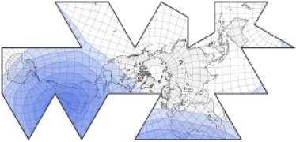{:height 188, :width 374} 
  大多数中断的地图根据地图制作者的优先级被分割成特定的线;因此，改变方面通常要么破坏了地图的目的，要么需要一组全新的中断。以上是正轴的古德地图(左)和Fuller's Dymaxion™图。
## 地球上和地图上的圆圈
- 一个值得研究的形状是圆周(线)，即与中心有固定距离的点的集合，以及圆(面)，即它所包围的点的集合。由于比例尺和形状都经常被扭曲，那么在地球仪上画的圆是如何忠实地转化为地图的？或者反过来说，如果用一副罗盘在地图上画一个圆，它在地球上究竟代表哪种形状？这个圆圈可以代表一个无线电台的范围，或一个车辆的自主权。在测距时，正确使用地图投影可能意味着成功的旅行和求救电话之间的区别。