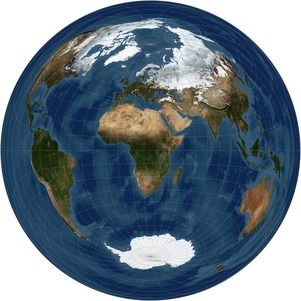
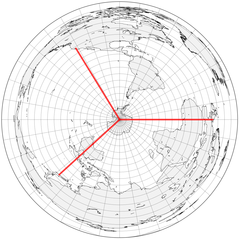
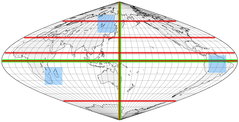
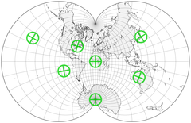
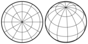
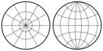
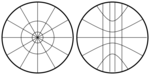
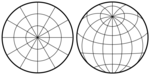

public:: true
上一页:: [[一些非正常的投影]]
下一页:: [[资源和链接]]
原文链接:: [Summary and Table](https://web.archive.org/web/20180227085810/http://www.progonos.com/furuti/MapProj/Normal/ProjTbl/projTbl.html)

# 摘要
- 几种方法试图对投影进行分类。大多数是正交的，因此任何单一的投影可能同时属于不同的类别。在其他领域，像生物学启发的莫勒，应用了分支分类学。
	-  
	  根据兰伯特方位角等面积投影法的赤道方面的世界。美国国家航空航天局（NASA）提供的未经推算的原始卫星数据
- 请注意，为了便于定义和可视化，下面非正式地用纬线和经线描述了一些类别和投影，因此一些属性似乎取决于地图使用的特定方面。例如，柱形地图中的坐标线在赤道上以直角相交，但在极向或斜向地图中则不然，尽管所有其他性质仍然成立；毕竟，方里网只是一组常规的线。
## 根据几何形状划分
-
  | 分类 | 属性 |
  | ---- | ----|
  | 方位投影 | 也叫天顶。显示单个点的真实方向(方位角)；在极面上，所有的纬线都是圆形的，经线是均匀间隔的直线，并在一点上重合；未裁切的世界地图像一张光盘。|
  | 圆柱投影 | 通过类比将圆柱体定义为中间投影面；在赤道方面，所有的纬线和经线都是直线；经线与纬线正交，间距均匀；未裁剪的世界地图是矩形的 |
  | 圆锥投影 | 类似于圆锥形中间投影面；在极地方面，所有的纬线都是同心圆，而经线是垂直于每条纬线的直线，均匀间隔小于地球上的距离；未裁剪的地图是圆形或环形扇形 |
  | 伪圆柱投影 | 在赤道方面，所有的纬线都是直的平行线；经线是任意曲线，沿每条平行线等距分布 |
  | 伪圆锥投影 | 在极面上，所有的纬线都是同心圆弧，而经线是任意曲线 |
  | 任意投影 | 纬线和经线是任意曲线；通常没有定义纯几何结构。一些作者称“任意的”、“传统的”或“妥协的”不是从几何装置中得到的，而是为某个目的定制的任何投影 |
- 从某种意义上说，圆锥包括圆柱(顶点在无穷远处的圆锥)和平面(高度为零的圆锥)这两种极端情况。因此，圆锥群概括了方位角投影和柱面投影，以及广义上的伪柱面投影和伪圆锥投影。此外，一些人认为多谐群包括从圆导出平行线的投影，包括像哈默和艾托夫那样的修正方位角。实际上，许多所谓的“方位角”、“圆锥形”或“圆柱形”投影不是建立在使用实体的纯投影过程上，而是由于映射坐标网格的几何属性而被如此分类。
- 此外，投影、几何或透视投影可以精确地类比于将原始表面连接到地图表面的光线的几何设置来描述。一些作者称其他投影为“数学”。
## 按属性分类
-    
  在方位角投影中，从投影中心（可能与地图中心重合，也可能不重合）辐射出的直线之间的角度与地球上的相应直线相同。在左边的方位角等距地图上，沿这些线的距离也与地球上的距离成正比。
  在等面积正弦地图上（右上方），对于任何两条相同的边界（如蓝色方块），它们在地球上的对应线将包围相同的区域，尽管它们不一定有相同的形状。该伪圆柱形投影仅沿两根轴（绿色）保留了角度；它仅沿这些轴和所有垂直于小轴的线是等距的（红色）。
  与其他几乎所有的保角投影不同，艾森洛尔投影（左下）在每一点上都保留了小角度：绿色线条在地球和地图上都是垂直的。面积和距离失真很大，但比典型的保形地图要小。
-
  | 分类 | 属性 |
  | ----- | -------------|
  | 等面积| 地图上的任何区域的面积都与球面上的相应区域成正比；也称为等值或绝对的。一般来说，对统计比较和教学的目的更有用。|
  | 等距离 | 在地图上有两组点A和B，这样，沿着一组选定的线（不一定是直线），从A中的任何一点到B中的另一点的距离都与球体上相应的点之间的距离成正比，同样是沿着这些相应的线。 换句话说，比例在这些线上是恒定的，这些线被称为标准线。 大多数投影都有这样的集合，但实际上很少有被称为 "等距 "的。|
  | 等角 | 在地图的任何 小区域内，两条并行的线与球面上的对应线具有相同的角度，因此形状被局部保留了。也叫正交或正形,共形,保角。对导航和大规模制图最重要，特别是在椭圆体的情况下;在几乎每一个等角投影中，至少有一个点（经常选择一个极点）要么不能被显示，要么不等角。|
  | 任意 | 既不等角也不等距离 |
## 投影简述
- 下面列举的投影会有进一步的详细说明。这只是所有现有设计的一个小样本，不一定是最重要或最常用的；因此，选择必然是主观的。同样主观的是，改变方面或另一个小细节是否足以证明一个单独的条目是合理的（例如，卡西尼的对等圆柱形，高斯横向对墨卡托和彼得曼对伯格豪斯）。
-
  | 经纬网示例 | 常用名 | 主要属性 |
  | ----------- | ------ | ----------|
  |  | 正交投影,方位正交投影 | 方位,从无限远看地球方位角的现实视角,最多显示一个半球 |
  |  | 方位立体投影,立体投影|方位，保形，保留所有圆；最多显示一个半球|
  | {:height 132, :width 124} | 日晷投影,中心投影,球心投影 | 方位,大圆被映射为直线 远离中心的极端失真；显示少于一个半球 |
  |   |general vertical perspective|方位投影，正交投影、立体投影、日晷的方位投影的一般情况。从空间直接朝向地球中心的最现实的观点。以投影中心的距离为参数；La Hire, Parent, Lowry, Fischer, Gretschel, James, Clarke ("Twilight")等人的特殊案例。|
-