public:: true
上一页:: [[一些投影应用]]
下一页:: [[资源和链接]]
原文链接:: [Summary and Table](https://web.archive.org/web/20180227085810/http://www.progonos.com/furuti/MapProj/Normal/ProjTbl/projTbl.html)

# 摘要
- 几种方法试图对投影进行分类。大多数是正交的，因此任何单一的投影可能同时属于不同的类别。在其他领域，像生物学启发的莫勒，应用了分支分类学。
	-  
	  根据兰伯特方位角等面积投影法的赤道方面的世界。美国国家航空航天局（NASA）提供的未经推算的原始卫星数据
- 请注意，为了便于定义和可视化，下面非正式地用纬线和经线描述了一些类别和投影，因此一些属性似乎取决于地图使用的特定方面。例如，柱形地图中的坐标线在赤道上以直角相交，但在极向或斜向地图中则不然，尽管所有其他性质仍然成立；毕竟，方里网只是一组常规的线。
## 根据几何形状划分
- | 分类 | 属性 |
  | ---- | ----|
  | 方位投影 | 也叫天顶。显示单个点的真实方向(方位角)；在极面上，所有的纬线都是圆形的，经线是均匀间隔的直线，并在一点上重合；未裁切的世界地图像一张光盘。|
  | 圆柱投影 | 通过类比将圆柱体定义为中间投影面；在赤道方面，所有的纬线和经线都是直线；经线与纬线正交，间距均匀；未裁剪的世界地图是矩形的 |
  | 圆锥投影 | 类似于圆锥形中间投影面；在极地方面，所有的纬线都是同心圆，而经线是垂直于每条纬线的直线，均匀间隔小于地球上的距离；未裁剪的地图是圆形或环形扇形 |
  | 伪圆柱投影 | 在赤道方面，所有的纬线都是直的平行线；经线是任意曲线，沿每条平行线等距分布 |
  | 伪圆锥投影 | 在极面上，所有的纬线都是同心圆弧，而经线是任意曲线 |
  | 任意投影 | 纬线和经线是任意曲线；通常没有定义纯几何结构。一些作者称“任意的”、“传统的”或“妥协的”不是从几何装置中得到的，而是为某个目的定制的任何投影 |
- 从某种意义上说，圆锥包括圆柱(顶点在无穷远处的圆锥)和平面(高度为零的圆锥)这两种极端情况。因此，圆锥群概括了方位角投影和柱面投影，以及广义上的伪柱面投影和伪圆锥投影。此外，一些人认为多谐群包括从圆导出平行线的投影，包括像哈默和艾托夫那样的修正方位角。实际上，许多所谓的“方位角”、“圆锥形”或“圆柱形”投影不是建立在使用实体的纯投影过程上，而是由于映射坐标网格的几何属性而被如此分类。
- 此外，投影、几何或透视投影可以精确地类比于将原始表面连接到地图表面的光线的几何设置来描述。一些作者称其他投影为“数学”。
## 按属性分类
-    
  在方位角投影中，从投影中心（可能与地图中心重合，也可能不重合）辐射出的直线之间的角度与地球上的相应直线相同。在左边的方位角等距地图上，沿这些线的距离也与地球上的距离成正比。
  在等面积正弦地图上（右上方），对于任何两条相同的边界（如蓝色方块），它们在地球上的对应线将包围相同的区域，尽管它们不一定有相同的形状。该伪圆柱形投影仅沿两根轴（绿色）保留了角度；它仅沿这些轴和所有垂直于小轴的线是等距的（红色）。
  与其他几乎所有的保角投影不同，艾森洛尔投影（左下）在每一点上都保留了小角度：绿色线条在地球和地图上都是垂直的。面积和距离失真很大，但比典型的保形地图要小。
- | 分类 | 属性 |
  | ----- | -------------|
  | 等面积| 地图上的任何区域的面积都与球面上的相应区域成正比；也称为等值或绝对的。一般来说，对统计比较和教学的目的更有用。|
  | 等距离 | 在地图上有两组点A和B，这样，沿着一组选定的线（不一定是直线），从A中的任何一点到B中的另一点的距离都与球体上相应的点之间的距离成正比，同样是沿着这些相应的线。 换句话说，比例在这些线上是恒定的，这些线被称为标准线。 大多数投影都有这样的集合，但实际上很少有被称为 "等距 "的。|
  | 等角 | 在地图的任何 小区域内，两条并行的线与球面上的对应线具有相同的角度，因此形状被局部保留了。也叫正交或正形,共形,保角。对导航和大规模制图最重要，特别是在椭圆体的情况下;在几乎每一个等角投影中，至少有一个点（经常选择一个极点）要么不能被显示，要么不等角。|
  | 任意 | 既不等角也不等距离 |
## 投影简述
- 下面列举的投影会有进一步的详细说明。这只是所有现有设计的一个小样本，不一定是最重要或最常用的；因此，选择必然是主观的。同样主观的是，改变方面或另一个小细节是否足以证明一个单独的条目是合理的（例如，卡西尼的对等圆柱形，高斯横向对墨卡托和彼得曼对伯格豪斯）。
- | 经纬网示例 | 常用名 | 主要属性 |
  | ----------- | ------ | ----------|
  |  | 正交投影,方位正交投影 | 方位,从无限远看地球方位角的现实视角,最多显示一个半球 |
  |  | 方位立体投影,立体投影|方位，保形，保留所有圆；最多显示一个半球|
  | {:height 132, :width 124} | 日晷投影,中心投影,球心投影 | 方位,大圆被映射为直线 远离中心的极端失真；显示少于一个半球 |
  |   |general vertical perspective|方位投影，正交投影、立体投影、日晷的方位投影的一般情况。从空间直接朝向地球中心的最现实的观点。以投影中心的距离为参数；La Hire, Parent, Lowry, Fischer, Gretschel, James, Clarke ("Twilight")等人的特殊案例。|
  | 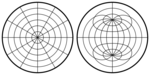 |azimuthal equidistant, zenithal equidistant|非透视方位角，保留沿任何接触地图中心的线的距离|
  | 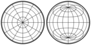 |兰伯特方位等积|非透视。独特的方位等面积投影法|
  |  |Ginzburg's azimuthal I and II|非透视的，既不是等面积的，也不是等角的|
  | 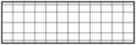 |Lambert's equal-area cylindrical; variations by Behrmann, Trystan Edwards, Gall's (orthographic), Peters, Dyer, Tobler/Chen|唯一可能的圆柱形等面积投影，包括像Gall's ("Peters")和Hobo-Dyer这样的比例变体，它们只在标准纬线上有所不同|
  |  |Gall's stereographic cylindrical|既不是等角，也不等积。变体包括布劳恩的立体圆柱和BSAM圆柱投影|
  | 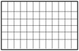 |Braun's stereographic cylindrical|既不等角也不等积,高尔投影的特殊情况|
  | 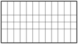 |中心圆柱|既不保形也不等面积；不要和墨卡托的混淆。横向方向为Wetch投影|
  | 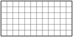 |等长方形、等距圆柱形、普通图、平面图；特殊情况是简单圆柱形（plate carrée）、Gall的等距图和卡西尼图|圆柱形，非常快速和容易计算，既不保形也不等面积；在最常见的情况下，映射成一个长宽比为2：1的矩形（宽为高的两倍）。|
  | 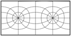 |Cassini|plate carrée横轴情况|
  | 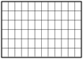 |	Gall's isographic|等距圆柱形的特殊情况，标准纬线45°N和45°S|
  | 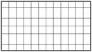 |墨卡托，等角圆柱；横轴椭球体称为高斯等角或高斯-克鲁格|唯一可能的等角圆柱投影；横轴是UTM网格的基础|
  | 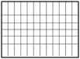 |Miller|Cylindrical, arbitrary compromise to Mercator; neither equal-area nor conformal.|
  | 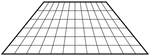 |Trapezoidal, Donis|Pseudocylindrical, meridians are straight lines, sometimes symmetrically broken at the Equator|
  | 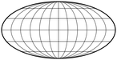 |Mollweide, elliptical, Babinet, homolographic, homalographic|Pseudocylindrical, equal-area,  meridians are ellipses; full map bounded by 2 : 1 ellipse; sometimes interrupted; variations include Atlantis and Bromley's|
  | 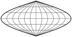 |Sanson-Flamsteed, sinusoidal, Mercator equal-area	|Pseudocylindrical, equal-area, meridians are sinusoids, parallels are equally spaced and standard lines; 2 : 1|
  | 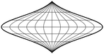 |Foucault's stereographic equivalent|Pseudocylindrical, equal-area, parallels are spaced like in the equatorial aspect of the azimuthal stereographic|
  | 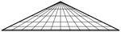 |Collignon|Pseudocylindrical, equal-area, meridians are straight lines. Two main variants, with triangular frame or symmetrical diamond with meridians broken at Equator|
  | 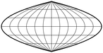 |Craster parabolic|Pseudocylindrical, equal-area, meridians are parabolas. Same as Putniņš's P4|
  | 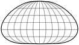 |Loximuthal|Pseudocylindrical, all straight lines passing through intersection of central meridian and a reference parallel are loxodromes with correct scale and azimuth. Usually asymmetrical around the Equator|
  | 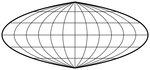 |Quartic authalic|Pseudocylindrical, equal-area, meridians are 4th order polynomials; limiting case of Hammer and Eckert-Greifendorff|
  | 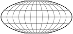 |Flat polar quartic|	Pseudocylindrical, equal-area, poles are 1/3 as long as the Equator|
  | 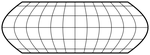 |Nell's pseudocylindrical|Pseudocylindrical, equal-area, polelines|
  | 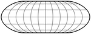 |Nell-Hammer|Pseudocylindrical, equal-area, polelines|
  | 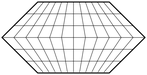 |Eckert I|Pseudocylindrical, 2 : 1, poles are half as long as the Equator, meridians are straight lines broken at Equator. Parallels equally spaced.|
  | 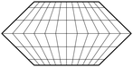 |Eckert II|Pseudocylindrical, equal-area, 2 : 1, poles are half as long as the Equator, meridians are straight lines broken at Equator|
  | 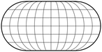 |Eckert III|Pseudocylindrical, 2 : 1, meridians are elliptical arcs (boundary is circular). Parallels are equally spaced.|
  | 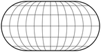 |Eckert IV|Pseudocylindrical, equal-area, 2 : 1, meridians are elliptical arcs, circular at boundary.|
  | 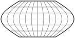 |Eckert V|Pseudocylindrical, 2 : 1, meridians are sinusoids, parallels are equally spaced. Particular case of Winkel's first projection|
  | 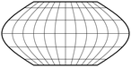 |Eckert VI|Pseudocylindrical, equal-area, 2 : 1, poles are half as long as the Equator, meridians are sinusoids|
  | 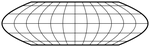 |Rosén's pseudocylindrical|Pseudocylindrical, equal-area, based on sinusoidal: poles are mapped to parallels arcsin(0.8) N and S of base projection|
  | 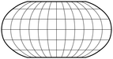 |Robinson, orthophanic|Pseudocylindrical, compromise. Neither conformal nor equal-area|
  | 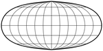 |Kavrayskiy V|Pseudocylindrical, equal-area|
  | 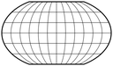 |Kavrayskiy VII|Pseudocylindrical, compromise, elliptical meridians|
  | 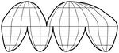 |Goode homolosine|Pseudocylindrical, equal-area, hybrid joining Mollweide at poles, Sanson-Flamsteed at the equatorial band, almost always interrupted|
  | 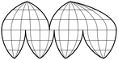 |Boggs eumorphic|Pseudocylindrical, equal-area, arithmetic average of Mollweide and Sanson-Flamsteed projections. Usually interrupted|
  | 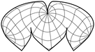 |Sinu-Mollweide|Pseudocylindrical, equal-area, hybrid fusion of Mollweide and (in lower portion) Sanson-Flamsteed projections. Usually oblique and interrupted|
  | 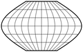 |Winkel I|Pseudocylindrical (generalizes Eckert V), averages Sanson-Flamsteed and equidistant cylindrical, meridians are sinusoids|
  | 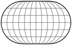 |Winkel II|Pseudocylindrical, averages equidistant cylindrical and a modified elliptical projection|
  | 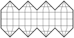 |HEALPix|Pseudocylindrical, equal-area, hybrid of Lambert's equal-area cylindrical and interrupted Collignon's projection; designed for raster processing of astronomical and cosmological data in the FITS grid.|
  |  |Pseudo-Eckert|Pseudocylindrical, equal-area, meridians are partial sinusoids|
  | 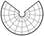 |Perspective (orthographic, stereographic or centrographic) conic	|Conic, true perspective. Used by Murdoch and Colles|
  |  |Equidistant conic|Conic, constant meridian scale; limiting cases are azimuthal equidistant and cylindrical equidistant projections. General case of Schjerning's I projection. Many variations, mostly in choice of standard parallels (Murdock, Euler); others include de l'Isle's coniclike projection.|
  | 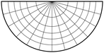 |Braun's stereographic conic|Perspective conic with center of projection at a pole and 30° standard latitude|
  | 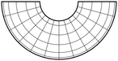 |Albers equal-area conic|Conic, equal-area; limiting cases are Lambert's equal-area conic and cylindrical projections|
  | 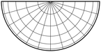 |Lambert's equal-area conic, isospherical stenoteric|Conic, equal-area; limiting case of Albers's conic, with a pole as standard parallel|
  | 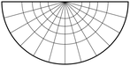 |Lambert's conformal conic, orthomorphic conic|Conic, conformal; limiting cases are azimuthal stereographic and Mercator projections|
  | 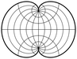 |Polyconic, American Polyconic|	Polyconic, parallels are nonconcentric arcs of circle with correct scale. Neither conformal nor equal-area.|
  | 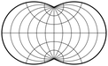 |Rectangular Polyconic, War Office|Polyconic, parallels are nonconcentric circular arcs crossing all meridians at right angles; either the Equator or two parallels have correct length. Neither equal-area nor conformal|
  | 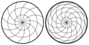 |Wiechel|Pseudoazimuthal; modified azimuthal equal-area projection, no longer azimuthal. Only interesting in polar aspect, where meridians are circular arcs with standard scale. Usually clipped to a single hemisphere|
  | 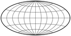 |Aitoff|Stretchhing of modified equatorial azimuthal equidistant map; boundary is 2 : 1 ellipse; neither equal-area nor conformal|
  | 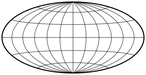 |Hammer, Hammer-Aitoff, Aitoff-Hammer|Modified from azimuthal equal-area equatorial map; equal-area, boundary is 2 : 1 ellipse; variations include Briesemeister, oceanic and Nordic|
  | 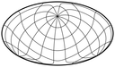 |Briesemeister|Rescaled oblique Hammer projection. Equal-area|
  | 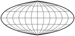 |Eckert-Greifendorff|Similar to Hammer projection, with different rescaling factor and therefore almost straight parallels. Equal-area|
  | 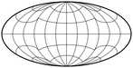 |Schjerning II (original map includes an arbitrary unspecified enlargement)|Azimuthal equidistant inner hemisphere. The outer hemisphere completes a 2:1 ellipse. Distances correct from center of map, azimuth correct only in inner hemisphere. Not conformal or equal-area|
  |  |Schjerning III|Map comprises two circles joined at a point. Distance from the center of the map to every point is correct, but not azimuth. Final map centered on London. Neither conformal nor equal-area|
  |  |Wagner IX, Aitoff-Wagner|Modified Aitoff projection; neither equal-area nor conformal|
  |  |Winkel Tripel|Arithmetic mean of Aitoff and equidistant cylindrical projections. Neither equal-area nor conformal|
  |  |Stabius-Werner I|Pseudoconic, equal-area, parallels are equally spaced circular arcs centered on a pole.|
  |  |Werner, Stabius-Werner II, cordiform|Pseudoconic, equal-area, parallels are equally spaced circular arcs and standard lines, centered on a pole. Schjerning IV is an oblique aspect; Schjerning V has shortened parallels, Schjerning VI is interrupted.|
  |  |Stabius-Werner III|Pseudoconic, equal-area, parallels are equally spaced circular arcs centered on a pole|
  |  |Bonne|Pseudoconic, equal-area, parallels are equally spaced circular arcs and standard lines. Appearance depends on reference parallel. General case of both Werner and sinusoidal|
  |  |	"Lagrange"|Meridians and parallels are circular arcs, except the central meridian and a base parallel which are straight. Conformal except at the poles. The basic case, developed by Lambert, is circular|
  |  |DeLucia/Snyder's orthographic projection of Gilbert's conformal double world sphere|Graticule comprises elliptical arcs. Neither conformal nor equal-area.|
  |  |Peirce Quincuncial|World map in a square, central hemisphere in an inner square. Conformal except at edge midpoints. Other aspects by Guyou and Adams|
  |  |Guyou|World map in 2:1 rectangle. Conformal except at hemisphere corners. Other aspects by Peirce and Adams|
  |  |Adams's hemispheres on squares|Hemispheres in two squares. Conformal except at square corners. Other aspects by Guyou and Peirce|
  |  |Adams's world on a square (1929)|Poles at opposite vertices; Equator along a diagonal. Conformal except at four vertices|
  |  |Adams's world on a square (1936)|Poles at midpoints of opposite edges. Conformal except at poles and four vertices|
  |  |Xarax's world in half a hexagon|Three-lobed rearrangement of Lee's map on a tetrahedron. Conformal except at midpoints of three longest edges|
  |  |Eisenlohr|Fully conformal, no singular points. Scale constant along boundary. Optimal range of scale distortion for a conformal design|
  |  |August, August epicycloidal|Conformal everywhere, with no singular points. Map bounded by a epicycloid. Base for some of Spilhaus's oceanic maps|
  |  |Van der Grinten, Van der Grinten I|Boundary is a circle, meridians and parallels are circular arcs, except central meridian and Equator. Not conformal, large area distortion far from Equator.|
  |  |Van der Grinten II|Boundary is a circle, meridians and parallels are circular arcs intersecting at right angles; straight central meridian and Equator. Neither equal-area nor conformal|
  |  |Van der Grinten III|Boundary is a circle, meridians are circular arcs; straight horizontal parallels intersect straight central meridian at the same points as in Van der Grinten I. Not conformal or equal-area|
  |  |Van der Grinten IV|Bounded by two intersecting circles, meridians are arcs of circle equally spaced along Equator, parallels are arcs of circle. Neither conformal nor equal-area|
  |  |Maurer's full-globular|Meridians along lines of Van der Grinten's IV, outer meridians bounded by half limiting circles. Parallels are arcs of circle, equally spaced on both outer meridians and Equator.|
  |  |Bacon's globular|Single hemisphere bounded by a circle. Circular meridians; straight horizontal parallels equidistant along hemisphere boundaries. Neither conformal nor equal-area.|
  |  |Apian's first globular|Single hemisphere bounded by a circle. Circular meridians; straight horizontal parallels equidistant along central meridian. Neither conformal nor equal-area. Extended by Ortelius and Agnese.|
  |  |Apian's second globular|Single hemisphere bounded by a circle. Elliptical meridians; straight horizontal parallels equidistant along central meridian. Neither conformal nor equal-area.|
  |  |Fournier's first globular|	Single hemisphere bounded by a circle. Elliptical meridians; circular parallels. Neither conformal nor equal-area.|
  |  |Fournier's second globular|Single hemisphere bounded by a circle. Elliptical meridians; straight parallels. Neither conformal nor equal-area|
  |  |Globular, "Nicolosi" globular|Single hemisphere bounded by a circle. Circular parallels and meridians. Neither conformal nor equal-area. Also attributed to La Hire and al-Biruni.|
  |  |Ortelius's oval|Simple extension of Apian's first globular hemisphere. Neither pseudocylindrical, equal-area nor conformal|
  |  |Leonardo da Vinci's octant map|Octant map, bound by circular arcs; graticule uncertain, probably neither conformal nor equal-area|
  |  |Jäger star|Graticule comprising only straight lines. Eight unequal lobes, each symmetrical in core and outer hemisphere. Parallels linearly spaced in each lobe. Neither conformal nor equal-area|
  |  |Petermann star|Parallels are concentric, equally spaced arcs of circle, meridians are straight lines (most broken at the Equator). Neither conformal nor equal-area. Sometimes described with unequal lobes|
  |  |Berghaus star|Five-lobed version of Petermann's projection|
  |  |Maurer's S233|Graticule comprises straight lines, with constant spacing. Neither conformal nor equal-area. Symmetrical case of Jäger's projection|
  |  |Maurer's S231 (equal-area star)|Parallels are concentric arcs of circle; central hemisphere is a Lambert azimuthal map. Lobe meridians are curved. Equal-area|
  |  |William-Olsson|Combines Lambert azimuthal projection in partial inner hemisphere with lobes using rescaled Werner projection. Equal-area|
  |  |Bartholomew's "Tetrahedral"|Core is a partial azimuthal equidistant hemisphere. Lobes are modified Werner maps with expanded parallel scaling. Neither conformal, equal-area nor polyhedral|
  |  |"Flower-petal", Daisy|	Transverse Mercator lobes; central core uses an azimuthal equal-area projection. Part of the USGS's ISIS package.|
  |  |Conoalactic|	Very similar to Berghaus, but the central hemisphere is based on equidistant conic; not to be confused with Cahill's "butterfly" map|
  |  |Armadillo (orthoapsidal on torus)|Intermediate projection surface is a torus with radii 1 and 1; final map is projected orthographically; neither equal-area nor conformal|
  |  |Orthoapsidal on ellipsoid|Intermediate projection surface is an ellipsoid; poles may be points or lines, and meridians may optionally have constant scale; the final map is projected orthographically|
  |  |Arden-Close|Arithmetical mean of equal-area cylindrical map and its transverse aspect; neither equal-area nor conformal.|
  |  |Tobler's projection for local maps|Fast rendering for small regions. Neither equal-area nor conformal. Parameterized by reference parallel.|
  |  |Gringorten's projection|Equal-area on a square.|
  |  |Lee's map on a regular tetrahedron|Conformal except at tetrahedral vertices|
  |  |COBE Quadrilaterized Spherical Cube|Cubic, approximately equal-area. Intended for cosmological charts of the universe, not earthly geography|
  |  |Quadrilaterized Spherical Cube|Cubic, equal-area. Modification of COBE QSC|
  |  |Fuller's Dymaxion™ projection on cuboctahedron|Scale preserved along face edges. Neither equal-area nor conformal. Several possible face arrangements|
  |  |Fuller's Dymaxion™ Air-Ocean World Map on an icosahedron|Scale preserved along face edges. Neither equal-area nor conformal. Several possible face arrangements|
  |  |Gnomonic projection on polyhedra; adopted by several authors, notably Irving Fisher on the icosahedron and Cahill on octahedra|Identical to ordinary gnomonic, with advantages and shortcomings of interruptions, plus arbitrary face arrangements|
  |  |Fisher's equal-area projection on the icosahedron.|Equal-area. Generalized by Snyder for other regular polyhedra|
  |  |Cahill's Butterfly|Developed on the regular (usually truncated) octahedron. Basic projection is gnomonic; variants are equal-area or conformal. Further refined by Gene Keyes|
  |  |Steve Waterman's projection system|Based on a truncated octahedron defined by the centers of packed spheres. Graticule comprises broken straight lines. Neither conformal nor equal-area.|
  |  |Kent Halstead's equidistant projection|Equidistant along all meridians and parallels, which are broken and interrupted to reduce shearing. Neither conformal nor equal-area.|
  |  |Kent Halstead's Composite World projection|Interrupted, based on Lambert's azimuthal projection. Mostly equal-area, except at lobe boundaries.|
-