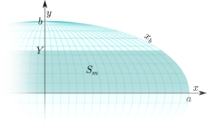

public:: true

# 摩尔维特投影推导
- 虽然面积相等，数学上非常简单，并保持平行间距，但由于过度剪切和子午线拥挤，以前的正弦/桑松-弗拉姆斯蒂德投影在高纬度地区并不完全令人满意。卡斯特的抛物线投影，经线稍微圆一点，但是极点还是尖的。稍微复杂一点的分析就引出了摩尔维特投影。
- 
- 假设等面积投影的赤道投影面具有以下性质:
  * 世界地图的边界是一个两倍于高度的椭圆。
  * 纬线变成具有统一比例的平行直线
  * 中央子午线是一条笔直的标准线；所有其他的子午线都是半椭圆形的弧线，围绕赤道和中央子午线对称。
- 由于投影是具有预定子午线形状的伪圆柱投影，让我们重复确定抛物线设计方程的方法:对于任何纬线，找到一个坐标，使地图和地球上的相应区域相等。
- 考虑一个以原点为中心的椭圆，长轴在x轴上:
-
  $$\frac{x^2}{a^2}+\frac{y^2}{b^2}=1$$
  $$x^2=a^2\Big(1-\frac{y^2}{b^2} BIg)$$
- 当$$-b \leq y \leq b, x = \frac{a}{b}\sqrt{b^2-y^2}$$时,x轴和纬线之间映射成$$y=Y$$的面积为:
-
  $$S_m=2\int_0^Y xdy =2\frac{a}{b}\int_0^Y \sqrt{b^2-y^2}dy$$
- 当 $$0 \leq y \leq b $$ 时,设 $$y=b\sin\theta 0\leq \theta \leq \frac{\pi}{2} , dy = b \cos \theta d\theta$$
-
  $$\begin{aligned}
  \int \sqrt{b^2-y^2}dy & = \int \sqrt{b^2(1-\sin^2\theta)}dy \\
  & = \int b\cos\theta b \cos\theta d \theta \\
  &=b^2\int \cos^2\theta d\theta
  \end{aligned}$$
- 因此:
-
  $$\begin{cases}
  \cos^2\alpha &= \frac{1+\cos 2\alpha}{2} \\
  \int \cos n \beta d \beta &= \frac{1}{n} \sin n \beta + C
  \end{cases}$$
  $$\begin{aligned}
  b^2 \int \cos^2\theta d\theta &=\frac{b^2}{2}\Big( \int d \theta + \int \cos 2\theta d \theta \Big) \\
  &= \frac{b^2}{2}\Big( \theta +\frac{\sin 2 \theta}{2} \Big)+C
  \end{aligned}$$
- 然后
-
  $$S_m=\frac{2ab}{2}\frac{2\theta+\sin 2 \theta}{2}+C=\frac{2ab}{2}(2\theta+\sin 2 \theta)$$
- 当$$0 \leq \theta \leq \frac{\pi}{2}$$
- 因为$$a=2b$$,整个椭圆的面积是$$ab\pi=\frac{a^2\pi}{2}$$
- 球体的面积公式是$$4\pi R^2$$,因此:
-
  $$a=R\sqrt{8}$$
  $$y=\frac{\sqrt{8}}{2}R\sin\theta$$
  $$S_m=2R^2(2\theta+\sin 2 \theta)$$
- 从正弦投影的推导中，我们知道，在球体上以赤道和纬线φ为界的区域是一个球形区域，其面积为
-
  $$S_s=2\pi R^2 \sin\varphi$$
-  
  赤道和另一条纬线圈围起来的面积
- 令$$S_m=S_s$$,则:
-
  $$2\theta+\sin 2 \theta =\pi \sin \varphi$$
- 不幸的是，与克拉斯特不同，没有直接将$$\varphi$$(通过$$\theta$$)转换为y的接近代数解。我们必须求助于数值根求解，这实质上包括重复“猜测”$$\theta$$的近似值，并评估连续的差异，直到达到所需的精度。这项任务非常适合电子计算机；以前，人类的“计算机”(这个词的原始含义)通过费力地计算选定纬度的值来组成插值表。尽管如此，如果最初的猜测是关于$$\varphi$$本身，像割线和牛顿-拉夫森方法这样的迭代数值算法会相对较快地收敛，除了在极点附近——但不是在极点。
- 最后，根据椭圆方程，东边界子午线的横坐标$$x_b$$由下式给出
-
  $$x_b=2\sqrt{2R^2-y^2}=2\sqrt{2R^2-2R^2\sin^2\theta}=2\sqrt{2}R\sqrt{1-\sin^2\theta}$$
- 像所有的伪圆柱投影一样，$$x=\frac{\lambda}{\pi}x_b$$,因此,摩尔维德投影的方程是
-
  $$x=2\sqrt{2}R\frac{\lambda}{\pi}\cos\theta$$
  $$y=\sqrt{2}R\sin\theta$$