public:: true
上一页:: [[倾斜和弯曲投影_斜轴投影]] 
下一页:: [[星形投影]]
原文链接:: [Interrupted Maps](https://web.archive.org/web/20180220050732/http://www.progonos.com/furuti/MapProj/Normal/ProjInt/projInt.html)

# 介绍
- 没有哪种地图投影能够同时保持形状和大小，绘图面积越大，总的失真就越明显。矩形的世界地图容易出现面积和距离的过度拉伸，而使用圆形和椭圆形投影的地图通常在外围出现过多的形状失真。
- 分瓣地图寻求一种妥协，沿着一些任意选择的线切割地表，然后分别投影每个部分或瓣(或块，以防中断沿着相关的线(如经线)周期性重复)，整体变形较低。通常，瓣边界被设计成落在不太重要的区域(关于地图的目的)，比如海洋。
- 尽管地球表面是一个连续的、无边界的区域，但任何平面地图都有一个明确的边界，这必然会带来一种比例尺的变形：在地球上相邻的两个点可以在地图的两端将它们的对应点大大分开。因此，任何额外的中断都是有实际限制的，到了一定程度，不连续就会否定额外分瓣的好处（但见下面的心形地图）。有时，地球上的一个点在地图的边界上用线条表示--例如，在满世界方位角、大多数圆柱形和所有平极假圆柱形投影中--具有无限的比例因子。而且很明显，边界上至少有两个点实际上代表了地球上的同一个点。这种变形几乎总是被忽视的，在这里我只指非微不足道的 "内部 "中断。
- Martin Waldseemüller（1507年，12瓣）、Henricus Glareanus（1527年，12瓣）和Leonardo da Vinci（约1514年，8瓣）等人都使用了分瓣投影法。另一个早期的例子是墨卡托（1538年）对维尔纳投影的变体。一些现代设计，如HEALPix投影，明确地考虑到了分瓣的问题。
	- 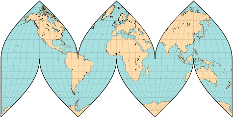 
	  分瓣正弦投影，每个半球有三个完整的瓣
## 包裹在地球仪上的地图显示了所选投影的优点和局限性
- 比较与地球相切的相同比例的地图是一项有趣的工作。特别是，
  * 哪张地图可以更整齐地粘在地球表面？
  * 为什么南美洲在第二张和第五张地图中如此相似，而在第四张(使用与第五张相同的投影)中却不相似？
  * 为什么非洲和西欧在第二、第四和第五张地图上几乎完全相同？
  * 哪个是格陵兰岛的“最佳”版本(查看全球)？
-   
  兰伯特圆柱形：等面积，在两极附近有严重的水平拉伸和垂直压缩（格陵兰岛和南极洲几乎不可见，但完整地呈现了出来
-   
  等距圆柱形：有正确的垂直比例（总高度等于圆周的一半），但在两极附近有严重的面积夸张，水平比例变得无限大。
-   
  墨卡托投影（此处部分透明）通过拉伸子午线来补偿水平比例；为了保留局部角度，两极被移到无限远处。
- 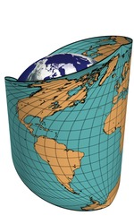 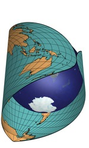 
  普通正弦投影：伪圆柱,等面积；沿中央子午线的总高度和比例是正确的，但远离中央子午线的形状则严重偏斜
- 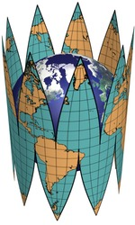 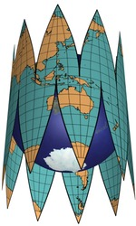 
  一个对称分瓣的正弦投影,仍然是伪圆柱和等面积的；它沿每瓣的中央子午线有正确的刻度，但有许多不连续的地方
## 简单分瓣投影
- 正弦投影（也称为Sanson-Flamsteed）具有简单的结构和有趣的特点：伪圆柱、等面积和恒定的垂直比例尺（即纬线的间距是均匀的）。在整个世界的正轴正弦投影地图上，极端经度的极地地区会遭受强烈的形状扭曲（剪切）。沿子午线中断地图以较小的剪切保留其更好的特征。
- 显然，这也是一种权衡：增加分瓣的数量可以进一步减少形状的失真，因为每片都是以自己不同的子午线为中心，直到不连续的情况使地图成为一种奇特的东西，而不是有用的平面形式。然而，如果将分瓣地图印在一张柔性材料上，并在边界处进行切割和拼接，就可以组成一个相当不错的地球仪；有趣的是，古代的戈尔地图也有这样的用途，尽管它的几何形状比正弦投影的更原始。大多数早期地图仅以粗糙的副本或粗略的描述形式留存下来；例如，只有Glareanus的戈尔图的形状和大小是确定的，但不包括方里网细节；Waldseemüller的地图也是模糊的。
	- 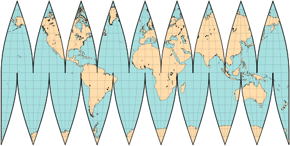
	  分瓣正弦投影地图，每个半球分成九瓣
- 沿着赤道一字排开的分瓣的地图清楚地表明了为什么圆柱形投影必然会扭曲极地地区：它们必须水平拉伸并固定在一起，以便强制形成矩形地图。
- 最后，像往常一样，设计一个分瓣地图反映了作者的特殊观点。分片边界的不对称排列可以避免切割三大海洋而不是陆地。在像正弦投影那样的伪圆柱投影的情况下，所有其他属性仍然成立，包括绘图的面积。在约翰-P-古德、塞缪尔-W-博格斯/奥斯卡-S-亚当斯和费利克斯-W-麦克布莱德/保罗-D-托马斯的经典分瓣地图中，都有不对称的分瓣。正弦投影本身是由Goode（约1916年）和Charles H.Deetz和O.S.Adams（1934年，在北纬80度和南纬70度以外被剪掉)，在1978年美国地质调查局的出版物中被完整的使用。
	- 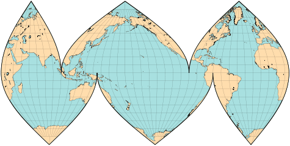 
	  分瓣正弦地图，不对称的分瓣边界强调海洋高于陆地。
	- 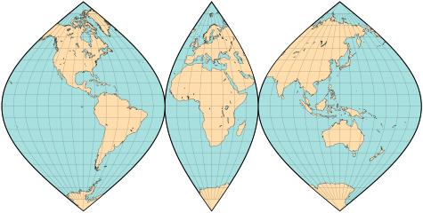 
	  以瑞典地图集、迪茨和亚当斯(包括极地地区)为蓝本，分瓣正弦地图，不对称的分瓣边界强调陆地高于海洋。
	- 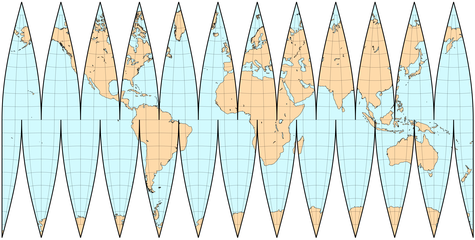
	  另一个分瓣地图,因为基于多圆锥投影,它并不是等面积的,纬线是曲线;但是它的最大的面积变形要比原投影小得多
	- 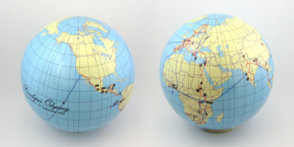 
	  显示珀涅罗珀环游世界的地球仪。直径10厘米，有12个分瓣的多圆锥投影。
	- 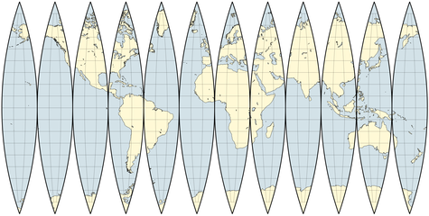 
	  Apian第一投影的分瓣形式,它跟正弦投影一样不是等面积的,形状变形也比多圆锥投影大,但是几何形状简单,更容易用尺子和罗盘构建
	- 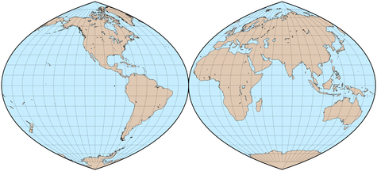 
	  O.S.Adams, quartic authalic投影的作者之一,设计的分成两个半球的分瓣地图
## Myriahedral 地图
- 传统上，分瓣地图试图将面积、形状或两者的失真降到最低，同时将不连续性保持在最低水平。通过放弃这最后一个要求，J.J.van Wijk的[myriahedral](https://www.win.tue.nl/~vanwijk/myriahedral/)地图（2008年）实际上是等面积和保形的，但有一些分片接近于无穷大。
- Myriahedral地图是通过一种灵活的算法生成的，该算法首先用一个多面体来近似地球，然后创建一个覆盖地球所有面的树形图。边缘被分割，多面体被展平，每片树叶变成一片树叶的末端。通过给需要切割的地方分配适当的权重，结果可能类似于传统设计(例如，仅沿子午线切割产生方位角或圆柱投影，这取决于对准约束；仅沿纬线切割会产生多曲面地图)-或者可以选择完全任意的标准，例如，不规则的波瓣使大陆或海洋不中断。借助数字计算机和数值优化方法的力量，一系列令人惊讶的地图成为可能。
- 由于它们不同寻常的性质和最近的历史，仍然很难找到作为普通地图的米利亚赫尔投影的实际应用。除此之外，作者建议使用它们作为失真的定性度量。例如，为了保持共形纵横比，同时避免区域拉伸，波瓣变得越来越薄；因此，从远处看，失真较大的区域显得越来越透明。
## 地图的边缘从何而来？
- O.M.Miller提出了一个按不连续点的起源划分的投影分类，不管是琐碎的还是其他的，共分为七类。这里用传统上以赤道和本初子午线的交点为中心的地图来说明。
-
  1. 单点，如方位等面积和方位等距离
  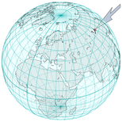 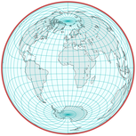
-
  2. 两点，像大多数圆柱(兰伯特的图)和圆锥投影；与平面地图的类别4相同，因为投影面必须展开
  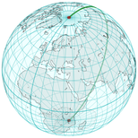 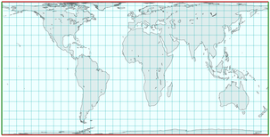
-
  3. 两个纬线圈,如墨卡托（图）和中央圆柱形投影，不能显示整个世界
  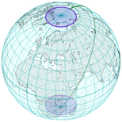 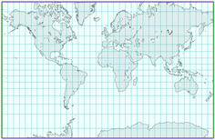
-
  4. 半个大圆,如同所有不间断的伪圆柱形投影（图中的平极四边形）
   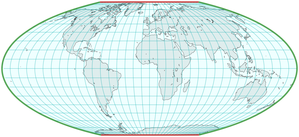
- 5.整个大圆,就像方位正交投影,只显示半球
  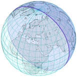{:height 162, :width 154} 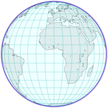
- 6.大圆段的组合,像星形投影和大部分的分瓣伪圆柱投影(图中为Goode's 分瓣投影)
  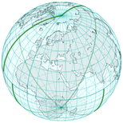 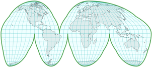
- 7.其他曲线,如方位立体投影和gnomonic，等角圆锥投（如图），Raisz的Orthoapsidals和许多其他曲线
  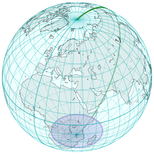{:height 162, :width 154} 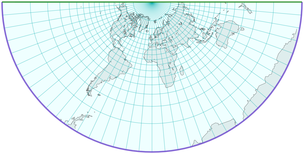
- 正轴投影时，所涉及的小圆通常是纬线，大圆是对相对的经线。