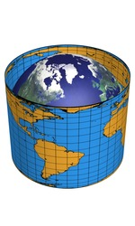
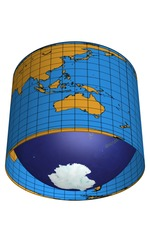
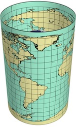
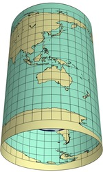
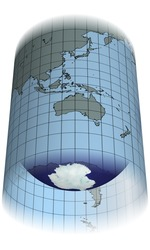

public:: true
上一页:: [[倾斜和弯曲投影_斜轴投影]] 
下一页:: [[分瓣投影介绍]]
原文链接:: [Interrupted Maps](https://web.archive.org/web/20180220050732/http://www.progonos.com/furuti/MapProj/Normal/ProjInt/projInt.html)

# 介绍
- 没有哪种地图投影能够同时保持形状和大小，绘图面积越大，总的失真就越明显。矩形的世界地图容易出现面积和距离的过度拉伸，而使用圆形和椭圆形投影的地图通常在外围出现过多的形状失真。
- 分瓣地图寻求一种妥协，沿着一些任意选择的线切割地表，然后分别投影每个部分或瓣(或块，以防中断沿着相关的线(如经线)周期性重复)，整体变形较低。通常，瓣边界被设计成落在不太重要的区域(关于地图的目的)，比如海洋。
- 尽管地球表面是一个连续的、无边界的区域，但任何平面地图都有一个明确的边界，这必然会带来一种比例尺的变形：在地球上相邻的两个点可以在地图的两端将它们的对应点大大分开。因此，任何额外的中断都是有实际限制的，到了一定程度，不连续就会否定额外分瓣的好处（但见下面的心形地图）。有时，地球上的一个点在地图的边界上用线条表示--例如，在满世界方位角、大多数圆柱形和所有平极假圆柱形投影中--具有无限的比例因子。而且很明显，边界上至少有两个点实际上代表了地球上的同一个点。这种变形几乎总是被忽视的，在这里我只指非微不足道的 "内部 "中断。
- Martin Waldseemüller（1507年，12瓣）、Henricus Glareanus（1527年，12瓣）和Leonardo da Vinci（约1514年，8瓣）等人都使用了分瓣投影法。另一个早期的例子是墨卡托（1538年）对维尔纳投影的变体。一些现代设计，如HEALPix投影，明确地考虑到了分瓣的问题。
## 包裹在地球仪上的地图显示了所选投影的优点和局限性
- 比较与地球相切的相同比例的地图是一项有趣的工作。特别是，
  * 哪张地图可以更整齐地粘在地球表面？
  * 为什么南美洲在第二张和第五张地图中如此相似，而在第四张(使用与第五张相同的投影)中却不相似？
  * 为什么非洲和西欧在第二、第四和第五张地图上几乎完全相同？
  * 哪个是格陵兰岛的“最佳”版本(查看全球)？
-   
  兰伯特圆柱形：等面积，在两极附近有严重的水平拉伸和垂直压缩（格陵兰岛和南极洲几乎不可见，但完整地呈现了出来
-   
  等距圆柱形：有正确的垂直比例（总高度等于圆周的一半），但在两极附近有严重的面积夸张，水平比例变得无限大。
-  