public:: true
下一页:: [[圆柱投影]]
上一页:: [[埃托夫/汉莫尔/温克尔三重投影]]
原链接:: [projAz](https://web.archive.org/web/20180702154259/http://progonos.com/furuti/MapProj/Normal/ProjAz/projAz.html)

-
# 简介
- 给定表面上的一个参考点A和另外两个点B和C，从B到C的方位角是由最小距离线AB和AC(在球面上是测地线或大圆弧)形成的角度。换句话说，它代表一个人坐在A上看B为了看C必须转的角度，A到C的方位是把一个极点作为参考B的方位。
	- 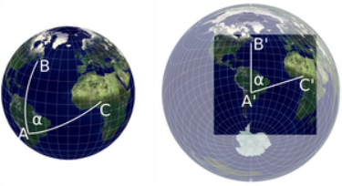 
	  给定一个参考点A，从球体上的B和C点到以A'为中心的方位角投影上的相应B'和C'，方位角α保持不变。由于裁剪和重新定位，地图的中心不一定与投影的中心重合。
	- 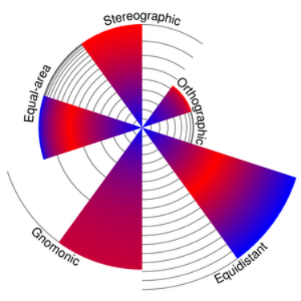 
	  对选定的方位角投影的极地投影面进行比较，比例相同，纬线相隔10°。正射影法止于赤道，立体投影和日晷投影在0°和20°任意剪切。赤道区为红色，极地帽为蓝色。
- 所有的方位角投影都保留了从一个参考点（地图的概念中心）开始的方位角，从而呈现出到其他任何点的真实方向（但不一定是距离）。它们也被称为平面图，因为其中有几个是通过直接透视投影到一个平面上而直接得到的。这个术语有点误导性，因为所有的地图投影都会产生一个平面地图，不管是不是方位角，不管是不是透视。
- 方位投影很容易建立两极投影面地图；其中一个极点是中心点，使得经纬网变得很简单:
  * 纬线是直线，从中心点有规律地辐射开来。
  * 经线是以中心点为中心的完整圆圈 
  * 投影的区别仅在于经线的间距
	- **透视方位投影中的光路**
		- 选定透视方位投影的示意横截面。红色光线(以15条纬线间隔相切)将可见的地球淡蓝色表面“涂”到蓝色投影平面上
		- 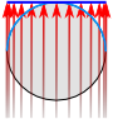 正射投影
		-  立体投影
		- 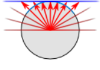 日晷投影
		- 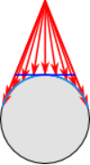 垂直透视，近侧
		- 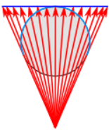 垂直透视,远侧
		- 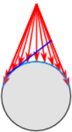 倾斜透视(非方位角)
	- 在任何投影面，所有接触中心点的直线都是测地线，而变形只取决于与该点的距离，在该点变形为零。
	- 在少数两点方位投影中，正确的角度是从两个特定地点而不是一个地点呈现的。
	- 方位地图可以迅速告诉人们从中心点到任何地方的方向，而逆向方位投影则具有相反的特性，显示从任何地方转到中心点的正确方向。
# 经典方位投影
-
  alias:: 透视方位投影
- 在最古老的投影中，有三种方位投影设计是由纯几何透视结构定义的。它们中间没有一个能呈现整个地球，通常展示一个半球或更小的半球。
	- **各个投影面的正射投影**
	- 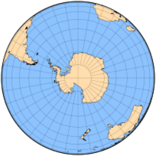 南极投影面
	- 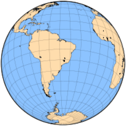 巴西坎皮纳斯为中心的斜轴投影面
	- 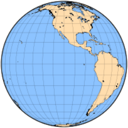 赤道投影面，中央子午线110°W
	- 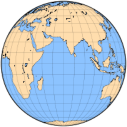 赤道投影面，中央子午线70°E
## 正交方位投影
	- 希腊人Hipparchus在公元前2世纪提到，但可能更早，正交方位投影（通常简单地称为正交投影）被托勒密称为analemma，其现代名称来自d'Aiguillon（1613）。
	- 正交投影主要用于——有时是引人注目的——说明目的，因为它清楚地显示了从无限远的空间看到的地球，因此与学生的地球视图非常匹配(更好的匹配是由近侧一般垂直透视投影提供的)。地图边界附近严重的形状和面积失真妨碍了它在世界地图中的广泛使用:径向比例急剧下降，使要素无法识别。另一方面，任何圆心与投影中心重合的圆的比例都是准确的，就像极面上的纬线一样。
	- 在现代地图册中，正交投影地图的使用主要限于插页。然而，太空时代提供了从轨道上看到的月球、其他行星和地球的高质量图像，使人们最近对这种投影法重新产生了兴趣。
	- 正交投影地图的几何结构方便解释，也便于与其他方位投影进行比较。
## 方位立体投影
- 可能是使用最广泛的方位投影，从古典时代起就在极地方面被人所知，通常归功于Hipparchus；它被托勒密命名为Planisphaerum，被d'Aiguillon（1613）命名为赤平图。然而，它的使用长期以来仅限于星图；世界地图从现代开始就为人所知。当然，不能将立体摄影投影与为立体影像设计的“立体”投影技术相混淆，即合成两张图片以模拟三维视觉的深度——这是与高空照片的绘图和分析相关的一个重要特征。
	- **立体半球地图**
	- 方位立体投影的不同投影面证明了它的一致性:随着方向的变化，远离中心的部分增长，但局部角度保持不变:经纬线总是以直角相交的圆。
	- 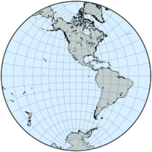 赤道，中央子午线110°W
	- 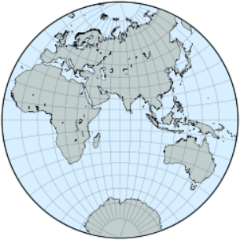 赤道,中央子午线70°E
	- 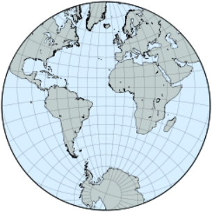 一个斜轴投影面
	- 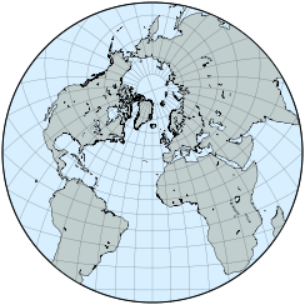 另一个斜轴投影面
- 在方位投影中，立体投影是唯一的共形投影:在一个小区域内，地图上的角度与地球表面的相应角度相同。它还保留了圆，不管有多大(通过中心点的大圆被映射成直线)，尽管球面上的同心圆在地图上通常不会保持同心。另一方面，等角航线 被绘制成对数螺线。
- 方位立体地图有一个简单的几何解释:从一个点发出的光线穿透地球表面，击中与该点对极相切的平面。结果就是地图背面，覆盖了整个平面；源点附近的区域位于无穷远处，并且该点本身不能被映射。
- 因为--与方位正交图相反--比例尺在远离地图中心的地方被大大拉长，方位立体投影通常被限制在源点对面的半球，或更小的区域。
- 其中一个“经典的”共形投影，方位立体投影也被修改为椭球面的情况；保形性得以保持，但结果不再是精确的方位或保圆。在这种形式下，它也是UTM经纬网的一个辅助部分。
## 日晷投影
	- **日晷投影地图，从地图中心剪去70度**
	- 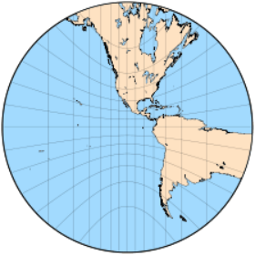 赤道投影面
	- 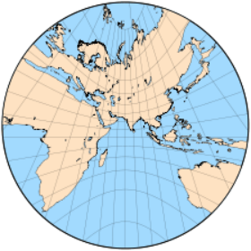 一个斜轴投影面,赤道和所有的经线依然是直线
- 日晷投影(也称为中心投影、方位中心投影或很少称为日晷投影)的构造很像方位立体投影，但射线源正好位于球体的中心；因此，它一次只能呈现不到一个半球。除了在切点附近，距离和形状变形都很明显。
  这种独特的投影最重要的属性是，每条测地线，包括赤道和所有子午线，都被映射到一条直线上，从而可以轻松地找到任意两点之间的最短路径，尽管不是要遵循的方向。
# 一般垂直透视投影
- 一般的垂直透视投影是一种方位投影，它可以由在穿过地球中心并垂直于投影平面的直线上的任意顶点会聚的直线来定义，投影平面通常与行星表面相切。因为它是一个透视投影，对于地球上的每个点，穿过它的线定义了前者与平面相交的投影。投影由会聚点到地球中心的距离参数化；这是方位正交投影、立体投影和日晷投影的一般情况，它本身是斜(或倾斜)透视投影的极限情况，不要求投影平面垂直于会聚线，也不一定是方位投影。
	- **近侧透视地图模拟太空中的景色**
	- 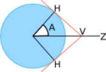 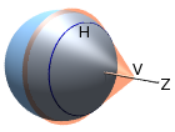
	- 地球的曲率和观察者V在表面上方朝向天顶Z的高度决定了可见的角度范围A和地平线H的圆，超过这个范围，表面就被隐藏起来看不见了。
	- 下面的垂直近侧透视图是由一架假想火箭上的后视相机拍摄的，该火箭从赤道上靠近亚马逊河河口的一个假想基地起飞。在这万里无云的一天，不知何故，整个轨道在发射点保持垂直。下面的图是来自美国宇航局[the Blue Marble New Generation项目](https://earthobservatory.nasa.gov/features/BlueMarble)的原始未投影卫星图像
	- 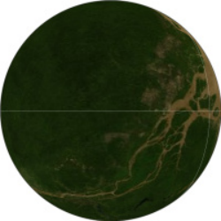
	  在10公里处，也就是喷气式客机的典型高度，地平线将视野限制在离天顶3°12'。乘客在任何方向都只能看到大约357公里。
	- 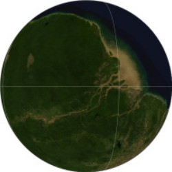 
	  在离地面100公里处，视野扩大到10°5'或1,122公里，但天际线附近的任何东西都很难辨认，看起来相当压抑。
	- 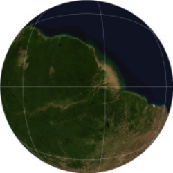 
	  火箭到达国际空间站，在地球上空约330公里处运行。这里的宇航员看到的距离不超过18°3'，即各个方向的2009公里。
	- 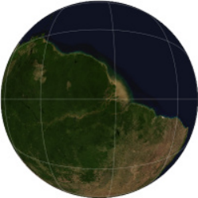 
	  在590公里的平均轨道上，哈勃太空望远镜永远不会看向地球，但如果它可以，它的可见角度范围大约是23°45'，或大约2640公里
	- 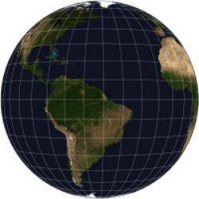 
	  在35,786公里处，我们到达了地球同步轨道，这是 GOES 系列气象卫星的高度，可见角度为81 ° 18’
	- 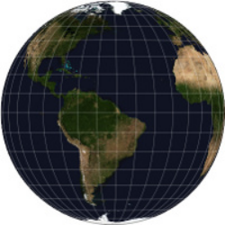 
	  在月球37.8万公里的平均轨道附近，可见范围为89°3'，从正视图中几乎无法分辨出来。
- 正如方位投影通常发生的那样，形状和面积失真远离中心点变大，对于相切投影平面，仅在中心为零。地图既不是共形的(除了特殊的立体情况)，也不是等面积的。
- 一般的透视投影有两种，当会聚点在映射表面的上方时是近侧的，当在它的下方时是远侧的。第一种是从空中或空间直接向下复制一个视图，以圆形地平线为界，圆形地平线受地球曲率的限制；在无穷远处，可视角度范围最大为天顶的90 °(整个半球),这是典型的正投影。
- 相比之下，远侧型通常显示不止一个半球。可视角度范围随距离缩小；无穷远处的极限情况也是正交的。而且，像立体投影一样，投影线首先“看到”地球的内表面。
	- **远端垂直透视地图**
	- 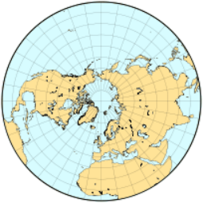 
	  La Hire's North hemisphere
	  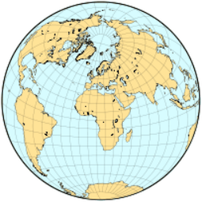 
	  H.James's projection (1857)
	  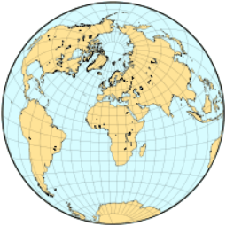 
	  James and Clarke's projection (1862)
	  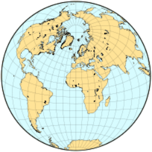 
	  Alexander R.Clarke's “Twilight” general vertical perspective projection
	- 尽管近侧的一般垂直透视地图仅限于模仿太空中的景色，但一些作者采用了远侧变体，他们根据任意标准选择不同的投影距离，以尽量减少全局失真。
	- 最著名的远端透视投影是由 Philippe de La Hire (1701)提出的，他把收敛点放在地球半径的1+0.50.5（约1.707）倍，Henry James（1857年）为1.5，Alexander R. Clarke（1862年，与James共同提出）为1.368，后来（1879年）为1.4，为他更著名的 "暮光 "投影。
	- 在La Hire的极地地图中，沿经线的比例尺是非线性的，但45°N平行线的半径正好是赤道的一半。不久之后（1702年），Antoine Parent提出了三种不同的距离，以最小化距离或面积误差。
	- James和Clarke都倾向于采用正切投影平面和斜面来呈现大多数大陆。两人都将角度范围缩小到比实际显示的范围小。詹姆斯为113°30'，"黄昏 "为108°；113°30'在90°（从天顶到可见地平线）的基础上增加了23°30'，即黄道角；108°增加了18°，即可见地平线以下的角度，定义了天文上的黄昏。
# 非透视方位投影
- 与“经典”正交投影、立体投影和日晷投影设计不同，方位投影(如等距和等面积投影)是在没有真实透视过程的情况下数学推导出来的。两者都可以映射一个完整的球体，一个“内”半球被一个环形“外”半球包围。然而，对于较小的整体失真，后者可以在以对跖点为中心的单独地图中呈现。
	- 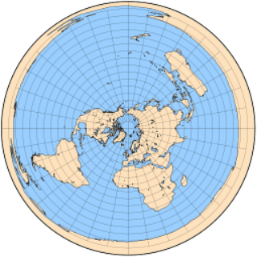 
	  北极投影面,方位等距投影
	- 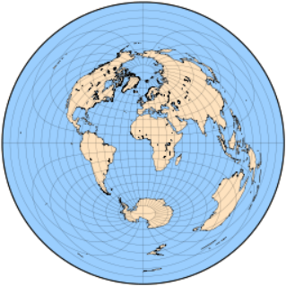 
	  方位等距投影，赤道方向
## 等距方位投影
- 方位等距投影能够在一张地图上呈现整个地球，并且具有恒定的径向比例（距离从投影中心线性增加），由于其重要的特点，我们在其他地方进一步讨论。
- 以北极为投影点，方位等距作为联合国组织的旗帜和会徽的一部分而为人们所熟悉，橄榄枝代替了南极洲。这里的南极洲被 "内翻"，说明了这种投影对远离中心的形状和区域的极端扭曲。
- 这种投影结构简单，有时被裁切成单一的半球，而且常常被限制在极冠的插图上。
	- **等距方位投影地图**
	- 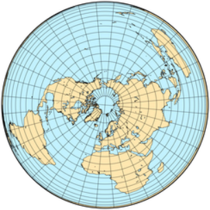 
	  北极投影点
	- 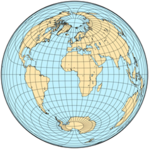 
	  赤道投影面
	-  
	  西半球,中央经线110°W
	- 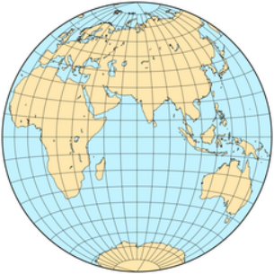 
	  东半球,中央经线70°E
## 兰伯特方位角等面积投影
- 像表面上相似的方位等距投影一样，约翰·兰伯特在1772年发表的方位角投影严重扭曲了世界地图边界的形状。然而，径向尺度不是恒定的:在极地方面，纬线越来越靠近边界，刚好足以保护区域。
  构造相对简单，这种投影在各方面都频繁使用。
  极地为投影面的兰伯特方位投影是由安东-马里奥·洛尼亚(1789年)独立设计的，并在短时间内以他的名字命名。
### 金兹堡修正方位投影
- 1949年，俄罗斯人Georgiy A.Ginzburg为学校地图中的半球提出了两种方位角投影。由于兰伯特的等面积投影压缩了从地图中心开始的距离，在边界附近造成了相当大的形状失真，Ginzburg在兰伯特的方程中加入了一个幂项，稍微扩大了地图的范围。其结果既不等角也不等面积。
	- 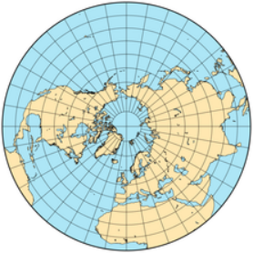 
	  Ginzburg I, north polar 
	  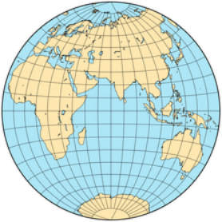 
	  Ginzburg I, eastern equatorial (central meridian 70°E) 
	  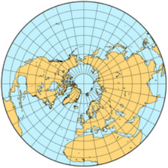 
	  Ginzburg II, north polar 
	  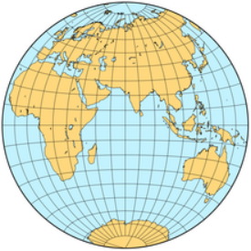 
	  Ginzburg's II, eastern equatorial
- 比较金兹堡和兰伯特的等面积投影在相同比例尺下绘制在一个半球的变形椭圆。
  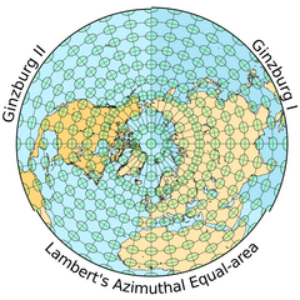