public:: true
上一页:: [[测地线]]
下一页:: [[形状]]

- 一架飞机在巴西坎皮纳斯上空飞行，它的航向H被解读为与当地子午线M的夹角，即罗盘指针指向的南北向线(曾补偿过磁偏角):这里是292.5°，也称为西北偏西。在没有侧风的情况下，航向与行驶方向或方位一致。
  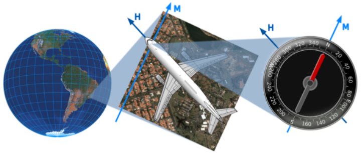
# 什么是方向？
- 当一个人计划从地球上的一个点移动到另一个远到看不见的地方，或者在海上或云上没有标记路径的地方，就会出现一些非常相关的问题:
  * 为了建立一条 "直线 "路线，初始航向，即转弯的方向是什么？
  * 如果不纠正路线，沿途将访问哪些地点？
- 地面上的方向是以方位来表示的，也就是说，从一条参考线出发的角度。在地球上，这条线是通过当前位置的子午线，方位通常以度为单位，从0°向北，顺时针增加到360°再向北--在地球上这个角度通常被称为方位角。当前子午线的方向可以从一个普通的罗盘上得到，它的指针总是与南北磁力方向一致，但必须考虑到磁偏角，即磁北与真正的地理北方的偏差。磁偏角在世界各地并不统一，而且随着时间的推移而缓慢变化（在几百万年中，磁 "极 "甚至多次交换半球），因此，海图必须定期更新，并加上偏角的参考校正标记。陀螺罗盘和天文罗盘不受磁偏角影响；但是，陀螺罗盘依赖电源来保持其轮子的旋转，而操作天文罗盘则需要一个精确的时钟和最新的星表。
- **等角航线**
  id:: 60c2f25e-4c89-4b31-8712-3d4d8780103b
  如果它的角度相对于当前的每一条子午线保持不变，那么路径就是一条等角航线或恒向线。这个概念可能是根据葡萄牙学者佩德罗·努內斯(或努涅斯)的建议而发明的。1533年，尽管精确的数学细节直到很久以后才被理解。
- 纬线与所有子午线成直角相交，因此所有平行线在东西方向上都是闭合的等角航线。所有经线在南北方向都明显是微不足道的斜交。对于所有其他方向，斜向螺旋是一种开放的(即有两个不同的末端)三维曲线，称为球形螺旋或斜向螺旋:每一端在无数次越来越紧的旋转后到达极点。
- 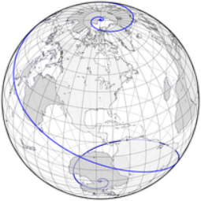 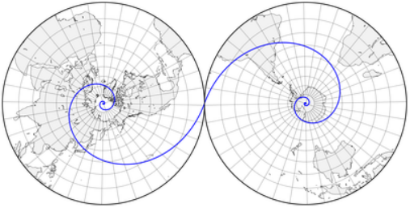 
  经过巴西坎皮纳斯的方位为292.5°的等角航线，在半透明斜轴方位正交投影和两半球极地方位立体投影地图上的展示。
  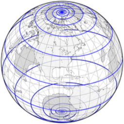 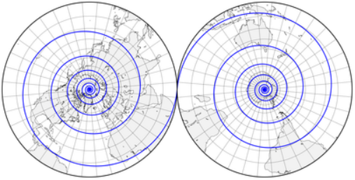 
  将方位改为275°会使路径变长，但终点是一样的。请注意，在多转了一圈之后，仍然可以到达夏威夷的南裙。
- 不在同一纬线或子午线上的两个点可以由无限多条等角航线连接，但我们几乎总是对最短的、“更陡的”点感兴趣，它穿过不到一半的子午线；其他恒向线绕地球做一个或多个额外的旋转
- 显然，在一般情况下，等角航线并不是通往两点间的最直接路线。事实上，仅赤道和经线不仅是等角航线，而且是大圆，包含了两点之间最短路径的测地线。另一方面，在没有参考点的情况下，等角航线是最容易遵循的路径：一旦确定了适当的方位，只需保持其正确性--即罗盘的针尖对准同一个方向--就能确保到达目的地。对于水上和空中交通工具来说，现实情况要复杂一些：横风、海浪和水流会导致方位偏离方向，除非得到补偿。
- 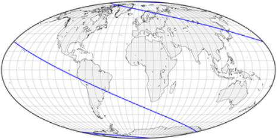 
  292.5°方位的恒向线，如使用摩尔维德等面积投影的赤道地图所示。每个极点附近的螺旋太靠近地图的边界而看不见。
  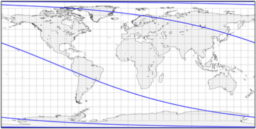 
  赤道等距圆柱投影地图上的同一个恒向线。同样，这条曲线从一极到另一极绕着地球转了几次。将这张地图上恒定的平行间距与下面墨卡托投影的拉伸进行比较，这将使恒向线变直。
# 投影和等角航线
- 投影如何决定等角航线在平面地图上的绘制方式？方位正交投影清楚地显示了球形螺旋的形状，但它对于测量方位是无用的，除非起点位于投影的中心。在方位立体地图的极面上，等角航线显示为对数螺线；这是投影一致性的直接结果:对数螺线是一条平面曲线，它以相同的角度与所有半径相交；它也是自相似的，无论放大多少看都是一样的。
- 大多数其他投影不太适合呈现或计算等角航线，等角航线被映射到复杂的曲线。唯一的例外是格哈德斯·墨卡托最著名的共形投影:在赤道方面，所有的经线都是垂直线，所有的纬线都是直线。因此，为了确定两个点之间的方位，在赤道墨卡托图上连接它们并从垂直方向测量其角度或斜率就足够了:直尺和量角器就足够了。
- 墨卡托的设计和另一种常见的圆柱投影，等距圆柱投影相比如何？在后一种情况下，平行线间隔相等，等角航线向赤道弯曲。墨卡托逐渐将纬线隔开，与纬度的三角割线成比例；当时还没有精确的数学数据，所以墨卡托可能采用了几何近似法。不幸的是，由于割线在极点是无限的，这些位于无穷远处，不能包含在真实的地图中:这样做，同时保持正确的角度将在两点连接子午线，这在圆柱形地图中是不可能的。
- 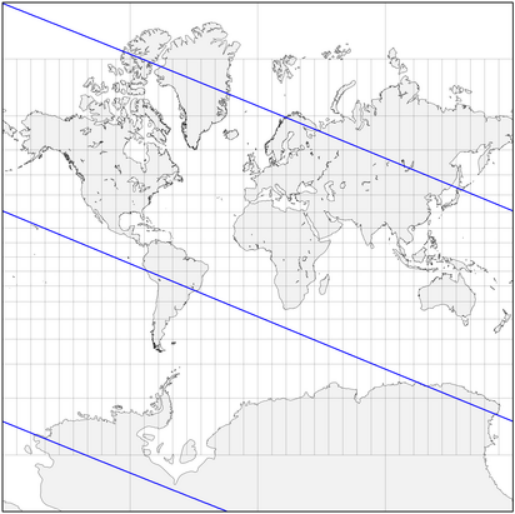 
  赤道墨卡托地图中的同一个loxodrome显示为一系列平行的直线。如果地图没有在北纬85度和南纬85度之间任意剪裁，这种理发师柱图案将在上下无限延伸；大多数墨卡托地图的纬度范围要窄得多。
- 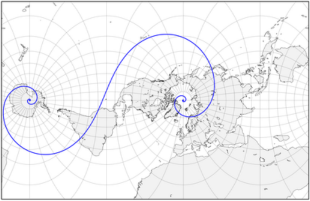 
  横轴墨卡托图可以显示两极，但相反，必须从远离中央子午线的地方截取。完全相同的等角航线保留其与每个子午线的角度；然而，由于经纬网是弯曲的，地图不适合直接评估方向。
- 事实上，在更高的纬度上，平行间距被夸大了，以至于赤道墨卡托地图经常被裁剪成南北70-80度。这与航海并不太相关(在极地附近，磁偏角无论如何都太重要了，所以在这些相对较小的区域，使用了其他工具)，墨卡托的投影忠实地为路线规划者服务了几个世纪。
- 另一个值得注意的投影，即由K.Siemon和W.Tobler独立设计的Loximuthal 投影，将所有相交于中央子午线上一个特殊点的等角航线显示为比例尺和方向不变的直线。遗憾的是，与方位等距不同，与通用赤道墨卡托不同，Loximuthal 投影地图必须为每个兴趣点量身定做。
- 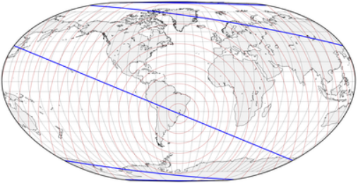 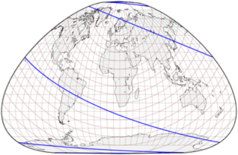 
  两张洛Loximuthal 地图，中央子午线在坎皮纳斯(上)和挪威特罗姆瑟(下)附近与参考平行线相交。相同的292.5 等角航线连接这两个位置，但仅在通过交叉点的部分是直的，用红色圆圈表示均匀的比例，间隔10度。