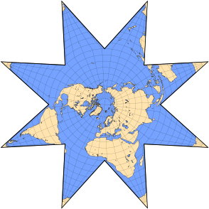
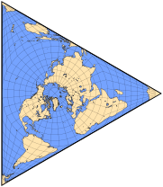
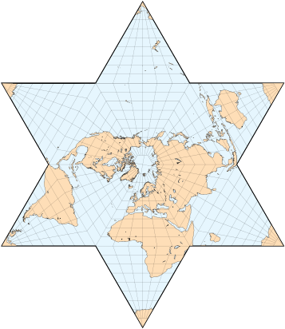
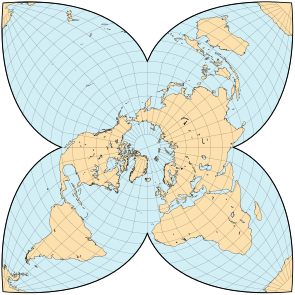
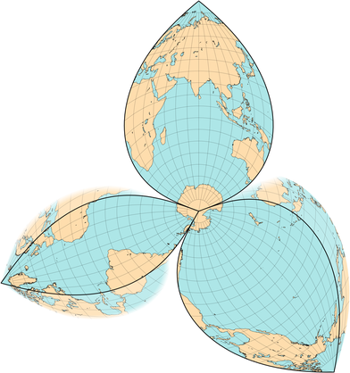
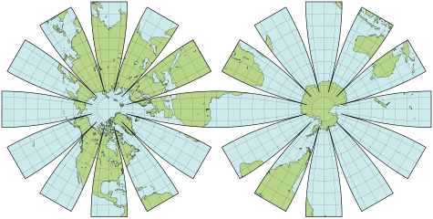
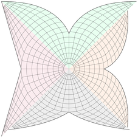
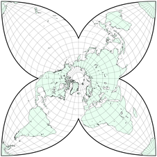
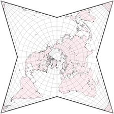

public:: true
上一页:: [[撕开地球的皮肤_分瓣投影]] 
下一页:: [[分瓣和复合圆锥投影]]
原文链接:: [Star Projections](https://web.archive.org/web/20180225200949/http://www.progonos.com/furuti/MapProj/Normal/ProjInt/ProjStar/projStar.html)

# 介绍
- 在地球北半球，大陆地区聚集在极点周围，而赤道以南广阔的海洋斑块分隔着稀疏的大陆；此外，非洲和美洲向南方缩小。这种特殊的陆地分布是一组以北极为中心的中断的星形地图投影的基础，北极有一个或多或少的圆形核心(通常是一个半球)，被分瓣包围，不太重要的南极分裂在它们的两端。一些星形投影颠倒了这种模式，南极圈倾向于海洋。非极性方面是可能的，但实际上是未知的，至少通过人工计算是如此。
- 作为一项规则，星体投影是复合设计；极地方位投影由于其圆形纬线而成为核心的自然候选。投影的创造者必须决定这些分瓣的大小和形状是否统一，以及它们在多大程度上保留了核心的特征，如形状和平行线的间距。
- 星形投影不应该被误认为是用于表示天球的投影；这种投影至少和地理图表一样古老。
# 早期 Jäger 和Petermann的投影
- 尽管在达芬奇（八角形地图，1514年）和纪尧姆-勒-特斯图（1556年）的作品之前，可以将其布置成圆形的裂片排列，但第一个现代星体投影是由G.Jäger在1865年出版。在极地方面，内半球是一个不规则的八角形，其顶点通过相同比例的直半轴连接到极地；所有格线都是直线比例的直线，纬线在边界经线上断开，经线在赤道上。外半球的每个叶子都是一个三角形，完全反映了核心区之一。
- 紧接着（1865年），德国制图师和探索（尤其是极地）爱好者August H.Petermann提出了一个更具影响力的设计，但其内半球与极地方位等值线的相同。在每个分瓣上，纬线仍然是以极点为中心的圆弧，间隔与核心部分相同，但比例可变；所有的半准线都是直线。关于八瓣的大小是否统一，资料来源不同。
- Jäger和Petermann的投影都不是保角或等面积的，但后者在内半球当然是方位投影。
-   
  Jäger（左）和Petermann投影的重建
# Berghaus的投影
- 作为彼得曼地图的变种，赫尔曼-伯格豪斯的星形投影（1879年）将附属物的数量减少到五个统一的角，边界经线分别位于160°W、88°W、16°W、56°E和128°E。在所有主要陆块中，澳大利亚和南极洲被打断。这种设计比彼得曼的设计更受欢迎，出现在地图集和美国地理学家协会的标志中。
- 与原版一样，只有核心部分是方位角，整个地图既不保留面积也不保留形状。可以很容易地做进一步的变化，有任何数量的分片大于两个，虽然在设计上不是多面体的投影，但可以组装成金字塔；有三个对称的裂片，地图是一个等边三角形，可以折叠成一个规则的四面体。
-  
  Berghaus设计的星形投影
-  
  Berghaus设计的变体
# Maurer的星形地图
- 1935年，汉斯-毛雷尔提出了一份全面的地图投影目录，按等级标准组织。他的分类法包括空的类别，即实际的、现有的投影没有满足的特征组合；为了说明问题，他用自己的设计填补了其中的一些空白，包括星形的S231和S233。
- 毛勒命名为S233的投影是耶格尔地图的一个常规版本，有六个相同的分片。在极地方面，所有的纬线和经线都是直线，纬线在边界经线处断开，并沿其均匀间隔；所有经线在赤道处断开，并沿其均匀间隔。每个三角叶在内半球都有一个完全对应的镜像。
- 对于更有趣的S231提案，内半球选择了Lambert的方位角等面积投影法。在每片中，只有中央子午线是直的，纬线是以北极为中心的圆弧。沿中央子午线的比例尺在两个半球是相同的，但在赤道上是镜像的；沿每条纬线的比例尺是恒定的，在单个分瓣上的比例尺和在核心区的相应比例尺是相同的。因此，整个地图是等面积的。
- 投影S231和S233被描述为具有六个均匀的瓣，但是可以扩展到大于一(S231)或二(S233)的任何数量。
-  
  毛勒的S233投影，从20°W中断。
-  
  毛勒的S231投影在北极形式的可能重建，波瓣划分从21 °W开始。
# William-Olsson的投影
- William-Olsson（1968年）设计了一个基于Lambert等面积方位的较新的星形投影；但是它的核心是以20°N纬线为界，而不是赤道。整个地图是等面积的，但与Maurer的S231不同的是，四个裂片是由Bonne/Werner假象投影得出的：每条纬线是以北极为中心的圆弧，比例尺不变，每条中央子午线是一条直线，比例尺与核心的20°N相同。不幸的是，在原始的兰伯特投影和波恩/沃纳投影上，纬线的长度在边界纬度处并不重合。匹配交界处的长度需要增加叶状平行线的比例，即边界纬度（与北极的角度距离）的一半的正弦；对于William-Olsson的选择，大约是22.077%。通过压缩各叶的中央经线，保留了面积。
-  
  威廉-奥尔森的等面积星形投影，从20°W中断。
# Tetrahedral 投影
- 另一个混合方位/伪星形投影是约翰-巴塞洛缪在1942年提出的 "Tetrahedral "投影，他是同名同姓的地图出版商中的第四位，也是斜向亚特兰蒂斯和复合 "莲花"、"风筝 "及 "Regional "地图的作者。
- Tetrahedral 投影地图将由北纬20°30 "纬线（而不是贝格豪斯采用的赤道）限制的北极方位角等距核心与使用保持相同平行间距的等面积维尔纳投影的三个相同的分瓣相结合。同样，除了两极之外，两个基础投影中的平行尺度是不一样的，因此纬线必须在裂片中被延长约26.6%。由于与William-Olsson的设计不同，纬线间距没有相互减少，甚至连分瓣也不是等面积的。
-  
  北极Tetrahedral 投影的重建，在150°W、30°W和90°E处中断
- 这种投影在南、北两极都有出版，它的名字显然是由于其分瓣的排列与展开的四面体的常见布局有偶然的相似性；它与真正的多面体地图没有关系。
# 维尔纳分瓣投影
- 除了像威廉-奥尔森和巴塞洛缪的四面体这样的复合地图的分瓣和附属物外，维尔纳投影还被单独用于以一个极点为中心的星形投影中。
- 1904年Schjerning的第六个也是最后一个投影（第一个是普通的圆锥投影，第二个和第三个是方位等距的修改，第四个和第五个是不间断的Werner的简单变化）是一个南极星形设计，有三个不等宽的纯Werner分瓣，每个都延伸到对极，围绕其直线中心经线对称。0°E、150°E和70°W处的中断强调了大西洋、印度洋和太平洋，每个都在自己的分瓣里。Schjerning增加了重复的部分，延长了裂片，以便完成大西洋和太平洋周围的海岸线。
-  
  分瓣沃纳地图的重建，被称为施杰宁第六投影。
- 相比之下，J.P.Goode的极地等面积投影享有大陆的特权，因此以北极为中心；虽然Werner的投影又是唯一的基础投影，但不规则的裂片和中心经线的频繁变化使极地等面积的构造比Schjerning VI的复杂得多。
- 在要求一个具有 "真正空间关系 "的等面积设计，适合于绘制一种显然起源于北极附近的全球分布的陆生鸟类的种群图之后，古德--因其中断的正弦、莫尔维德，特别是同位素投影的版本而更加出名--由于其等距离的平行线而选择了极地韦尔纳。美洲叶，范围从170°W到30°W（加上格陵兰岛的延伸），在大约10°N以南的100°W处被分割。欧亚叶在约30°N以南的60°E处分裂。在约30°S以南，新西兰在160°E处与澳大利亚进一步分割，南极洲的所有部分都被省略了（Goode提到了一个方位等面积的插图）。平行线仍然是正确比例的圆弧；为了减少形状失真，在几个地方，每个分瓣的中心经度被移位--因此所有经线都是断线。
- 古德在1929年发表了他的极地等面积投影，并附有世界地图的轮廓，但缺乏对中断和中央经度的详细描述。提到了一个可能的以南方为中心的海洋版本，但没有印刷。
# 美国地质调查局的雏菊地图
- 与本节中的其他投影相比，这里所说的 "Daisy "并不是为了减少中断的海岸线数量。事实上，它的目的根本就不是为了呈现地球，甚至可能不是为了制作平面地图。
- 为了存储、分析、处理和渲染美国宇航局的行星和其他物体的数字图像，美国地质调查局(USGS)创建了长期运行的成像仪和光谱仪集成软件(ISIS)，至今仍在维护。早期的行星图像采集系统的一个组成部分，“雏菊”软件包——归功于黛比·库克——于2000年被移植到ISIS其目的是将栅格数据渲染为“花瓣”地图。
- 雏菊地图由独立的星形半球组成。每个中心核都是一个半径为15°的极方位等面积投影，使用横向墨卡托投影被12个相同的波瓣包围。不幸的是，因为后者中的平行线不是完美的圆弧，所以在每个波瓣与核心的连接处，要么有重叠，要么有两个间隙，这取决于实现方式(ISIS的菊花文档没有提到不匹配或如何处理)。
- 美国地质勘探局公开发布了火星、金星和几颗木星卫星的雏菊地图，旨在组装成网球大小的球体；在这个尺度上，间隙/重叠可以忽略不计。
-  
  具有相连半球的雏菊地图的重建
# 比较选定的星形投影
- 对星形投影的公平评估需要标准化版本，具有相同的比例因子和瓣数。右边是Bartholomew的“四面体”(绿色)，William-Olsson的(琥珀色)，Petermann/Berghaus的(粉色)，还有Maurer的S231(灰色)，四瓣，中央经线一致。
  通过构造，四面体和彼得曼/伯格豪斯地图共享整体尺寸和等距纬线间距。比较两个等面积投影的纬线间距，内芯相同。彼得曼/伯格豪斯和S231的波瓣在赤道处分开。
-     
-