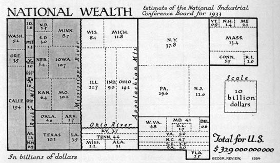
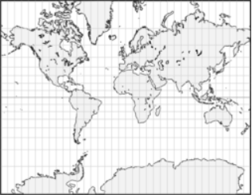
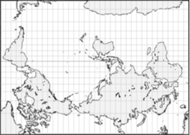
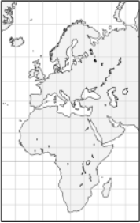
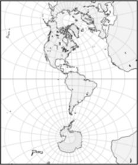
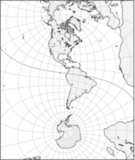
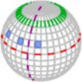
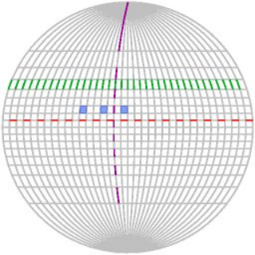

public:: true
上一页:: [[制图学基础知识和投影选择]] 
下一页:: [[距离和比例尺]] 
原文链接:: [Useful Map Properties](https://web.archive.org/web/20180310221837/http://www.progonos.com/furuti/MapProj/Normal/CartDef/MapDef/mapDef.html)

# 根据任务选择投影
- 没有一个地图投影能适应所有任务。在选择投影之前，我们必须仔细权衡利弊，以及它们如何影响
  预期地图的目的。下一节将概述地图的有用属性，并提到了如何使用或滥用投影。
  
  对于任何地图，最重要的精度参数可以表示为：
      * 可以准确测量距离吗？
      * 获得两点之间的最短路径容易么？
      * 保留了方向吗？
      * 保留了形状吗？
      * 保留了面积比例吗？
      * 哪些区域的变形程度最大，哪种变形程度最严重？
## 地球仪
- 只有地球仪能为任何点和区域提供上述属性的准确描述。由于制作地球仪只是一个缩小尺寸的问题(不涉及投影)，每个表面特征都可以精确复制，只受实际尺寸的限制，没有形状或距离比的损失。另一个好处是，地球仪是一个真正的三维物体，其表面可以浮雕，以呈现主要的地形特征。但是地球仪也有很多缺点，比如: 
  * 体大,笨重易碎，不易运输和储存；
  * 成本高，特别是大尺寸的地球仪，不适合显示细节；
  * 不直观，测量或选择方向很麻烦；
  * 一次只能显示一个半球；
  * 不能通过印刷或电子媒体广泛复制(译注:现在网络可视化技术在网上显示的三维地球,有些也是通过投影实现的)
- 和真实的地球一样，这个地球仪的地轴倾斜了23°27'30″。
  
## 地图
- 因为以上原因,尽管平面地图有缺陷，但通常比地球仪更为重要和有用。 特别要注意，没有平面地图可以在每个点上同时保持形状和面积属性。然而，一个相当小的球形图斑可以用一个具有可接受变形的平面来近似。在大多数投影中，至少有一个特定的区域——通常是地图的中心——变形很小或者没有。如果所表示的区域足够小（并且在必要时在倾斜地图中进行适当平移），则选择投影可能并不重要。
- 另一方面,虽然平面地图无法通过投影准确的描绘整个地球,但是通过有意进行变形和处理,可以将地球仪中不直观的要素属性一目了然的展现出来.而且变形夸张也是一种实用强大的可视化工具,例如使用
  [面积图](https://www.gislounge.com/area-cartograms-explored/) 制图时,填色和点的位置,不仅取决于其地理位置,还取决于此地的区域属性,例如一个县的人口,或者一个国家的经济情况.
	- 1934年欧文瑞斯绘制的美国国富图
	   
- 1934年， [欧文·瑞斯](http://wiki.gis.com/wiki/index.php/Erwin_Raisz) 绘制的美国国富图,是比较原始的面积图制图,使用矩形表示目标,面积与目标属性成正比,与真实地理形状毫无关系.高产的 [沃尔多·托布勒](http://wiki.gis.com/wiki/index.php/Waldo_R._Tobler) (译注:托布勒第一地理定律发明者)
  发展了现代制图概念，使用可识别的变形形状表示属性要素；制图所涉及的海量重复计算使电子计算机成为不可或缺的工具。
- 投影本质上没有好坏之分，适用于特定问题的投影如果应用于其他地方，很可能是无用的或有误导性的。
## 主要属性和次要属性
- 对于任何投影来说,即使它们的方里网和地理要素形状看起来完全不同,它们的主要属性:距离,面积,角度的变形程度基本上独立于比例尺,朝向,投影区域的变化(投影区域与中央子午线的选择以及任何最终的投影后旋转和裁剪密切相关)
- 有时，出于历史或方便的原因，某些投影有特定的投影名称。例如，高斯克吕格投影是一种横轴椭圆柱墨卡托投影；Briesemeister 投影和 Nordic 投影是斜轴的汉默尔投影( Briesemeister 投影将宽高比改为了7:4)；兰伯特等面积圆柱投影有很多的调整版本。还有很多中断、平均和复合设计的投影都如此命名。
### 修改次要地图属性
- 以下展示了一些使用墨卡托投影的地图,显示了基本投影属性如何不受次要特征的变化，如比例尺、朝向和映射区域的选择的影响。在所有的墨卡托地图中，各相邻纬线间隔由赤道向两极增大。一点上任何方向的长度比均相等，即没有角度变形，而面积变形显著，随远离基准纬线而增大；
	-
	  1. 墨卡托投影经常在世界地图中使用（也是最常被滥用的）。任何墨卡托地图都必须裁剪顶部和底部,因为一张完整的墨卡托地图将是无限高的。图4 5 6中的裁剪、横向和斜向是这种投影更适合的用途。
	  
	-
	  2. 基于地图的主题,变换中央经线是一个常见的小修改。这里的变化是用来避免断开太平洋的。变形模式仍然与上述相同，在顶部和底部的区域大幅增大。
	  
	-
	  3. 与传统不同，这张地图半开玩笑地将澳大利亚和欧洲南部的国家显示“在世界之巅”。这张地图中，南极洲被裁剪了大半。当然，无论是投影还是朝向都与上述地图一致。墨卡托的投影会将高纬度的国家放大，甚至有时候会“降低”赤道来扩大高纬度的国家面积，但一张没裁剪的的墨卡托地图在在赤道两边是完全对称的,南极洲在地图上的大小由地图作者决定 
	  
	-
	  4. 缩放-这张地图放大了100%，裁剪地图是常见的方法，不会改变投影属性。
	   
	  
	-
	  5. 仍然是一张墨卡托图，但横向放大了25%，旋转了90°。方里网似乎不同，可以看到两极，但变形模式仍然存在：距离是垂直不变的，而不是水平不变的，即距离左右变形，而不是上下变形。中央子午线代替了赤道，以恒定的尺度完美地表示，而非洲，变形太大，似乎一分为两半，几乎无法辨认。 
	  
	-
	  6. 这张斜的墨卡托地图（扩大了25%并旋转）更好的覆盖了美洲,降低中心的变形程度。赤道不再是直线了。
	  
## 变形的指标-方里网
- 对于正轴投影的地图,方里网可以快速的可视化检查变形,例如如果方里网沿坐标轴均匀分割(如,每十度一格),它的方里网表示为: 
  1. 沿着任何子午线，地图上平行线之间的距离应该是恒定的
  2. 沿着任何一个纬线圈，子午线之间的距离应该是恒定的；对于不同的纬线圈，应该向两极方向降为零
  3. 因此，任何两个平行的两个网格“单元格”都应该包围相同的区域
  4. 赤道和所有子午线应该是直线，因为它们不会改变地球表面的方向
  5. 任何一条子午线都应该以直角交叉所有的纬线圈
- 同样，对于任何特定的投影，违反任何或所有这些属性并不一定会使它设计不良或无用；相反，它建议（并限制）了它适合的应用范围，以及对于每个应用，地图上失真显著的区域。
	- 上述两图是用正射法（表示原始的地球）和范德格林格恩III投影的经纬网,可以看到范德格林特的投影违反了所有上述五条特性
	   
	      1. 紫色线在两极附近非常拉伸；绿线远离垂直轴（平行之间的垂直间距有欺骗性）
	      2. 红线也稍微靠近地图边缘
	      3. 蓝色的细胞在边缘附近也被增大，这在高纬度地区更明显。
	      4. 在所有的子午线中，只有中心的仍然是直的。
	      5. 平行线和子午线只在赤道和中子午线成直角；在其他地方，有剪切，围绕垂直轴对称：角度在中心子午线东西的相反方向被压缩