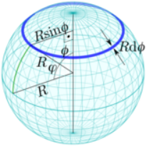

public:: true

# 一般的极地方位投影
- 
- 
- 一般情况下，方位角投影主要由一个函数来定义，该函数对来自投影中心T的距离进行转换。
- 方位正射投影的数学发展纯粹是几何学的。 尽管有几个方位角投影——就像这里解释的两个——不遵循这样的透视过程，但都可以简化为一般模式。
- 在一个球体上，两个角度决定了任何点P相对于投影中心T的距离和位置:对于北极方面，μ等于经度λ，而ψ等于余纬度$$\phi$$，或$$\frac{\pi}{2}-\varphi$$。
- 在地图上，由于方位属性，
-
  $$\theta=\mu$$
- 方位投影的基本特征是一个转换到地图中心的距离的函数，因此决定了极面纬线的间距:
-
  $$\rho=f(R\psi)$$
- 然后
-
  $$x=\rho\cos\theta$$
  $$y=\rho\sin\theta$$
- 某些方位投影的定义距离函数
  
# 方位等距投影
- 方位等距投影是导航应用的重要投影，从地图中心到任何其他点的距离与其到投影中心的真实径向距离成正比。在北极投影面:
-
  $$\rho=\Big( \frac{\phi}{2} - \varphi \Big)R$$
- 南极投影面也很容易推算:
-
  $$\rho=\Big( \frac{\pi}{2}+\varphi\Big)R$$
  $$\theta=-\lambda$$
# 兰伯特方位等面积投影
- 在兰伯特创建的唯一一个适用于世界地图的方位角投影和等面积投影中，点与地图中心的相对距离逐渐减小，以保持面积相等。公式来源于基本的积分学；首先，我们在地球和地图上定义一个面积元素。
	- 
	- 将一圈很薄的区域作为一个元素,给定余纬度$$\phi$$
	-
	  $$ds=2\pi R\sin \phi Rd\phi =2\pi R^2 \sin \phi d \phi$$
	- 极方位地图上对应的元素是一个环，其面积为:
	-
	  $$ds=2\pi\rho d \rho$$
	- 
- 对于任何给定的余纬度$$\phi_1$$，我们希望$$\rho_1$$使得地图上以$$\phi_1$$为界的球冠和以$$\phi_1$$为界的圆盘具有相同的面积。这对于面积保存来说已经足够了，因为带和环上沿圆周的尺度虽然不同，但仍然是恒定的，这也是由于方位投影的特性。
-
  $$\int_0^{\phi_1}2\pi R^2 \sin \phi d \phi = \int_0^{\rho_1}2\pi\rho d \rho$$
  $$2\pi R^2\int_0^{\phi_1}\sin\phi d \phi = 2\pi \int_0^{\rho_1}\rho d \rho $$
  $$-R^2\cos\phi \Big| _0^{\phi_1} = \frac{\rho^2}{2} \Big| _0^{\rho_1}$$
  $$-2R^2(\cos \phi_1 -1)=\rho_1^2$$
  $$\rho-1=R\sqrt{2}\sqrt{1-\cos\phi_1}=2R\sqrt{\frac{1-\cos\phi_1}{2}}=2R\sin\frac{\phi_1}{2}$$
  $$\rho = 2R\sin\frac{\frac{\pi}{2}-\phi}{2}$$
- 类似的符号变化也适用于南极投影面。
- 组合图显示了在北纬 60°以北的两个投影几乎相同（如图所示：$$\phi$$ = 0.534）。 除此之外，平行线在兰伯特的一半中越来越靠近，而在方位角等距部分保持等距。 由此产生的面积差异在南极洲清晰可见。
  
# 一般的赤道投影面的方位投影
- 通过引入坐标变换和空间旋转，可以计算方位投影地图的其他投影面。然而，重要的赤道投影面可以通过更直接的方式获得，使用球面上三角形的两个属性。
-
  ****
## 球面三角形的正弦和余弦定律
	- 
	- 给定球面三角形顶点上的角 A、B、C，以及连接三角形顶点和球心 O 的边之间的相应角 $$\alpha  ,\beta,\gamma$$
	- 正弦定律: $$\frac{\sin A}{\alpha}=\frac{\sin B}{\beta}=\frac{\sin C}{\gamma}$$
	- 余弦定律:$$\cos\gamma=\cos\alpha\cos\beta+\sin\alpha\sin\beta\sin C$$
-
  ****
- 在赤道投影面上，投影的中心位于赤道和任意中央子午线的交点上。它是球面三角形的一个顶点；第二个点是投影点，第三个点位于赤道上，与点在同一经度上。球体中心的相应角度是φ、λ和α，我们想要θ，即对应于第一个图中μ的θ角。
  
-
  $$\frac{\sin\theta}{\sin\varphi}=\frac{\sin\frac{\pi}{2}}{\sin\alpha}$$
  $$\cos\alpha=\cos\varphi\cos\lambda+\sin\varphi\sin\lambda\cos\frac{\pi}{2}$$
  $$\alpha=\arccos(\cos\varphi\cos\lambda)$$
  $$\cos\varphi=\cos\alpha\cos\lambda+\sin\alpha\sin\lambda\cos\theta$$
  $$cos\theta=\frac{\cos\varphi-cos\alpha\cos\lambda}{\sin\alpha\sin\lambda}=\frac{\cos\varphi(1-\cos^2\lambda)}{\sin\alpha\sin\lambda}$$
-
  $$\sin\theta=\frac{\sin\varphi}{\sin\alpha}$$
  $$\cos\theta=\frac{\cos\varphi\sin\lambda}{\sin\alpha}$$
## 赤道方位等距投影
- 只要把$$\cos\theta$$和$$\sin\theta$$的表达式代入，加入限制条件$$\rho=r=\alpha R$$。
-
  $$\alpha=\arccos(\cos\varphi\cos\lambda)$$
  $$x=\frac{\alpha R\cos\varphi\sin\lambda}{\sin\alpha}$$
  $$y=\frac{\alpha R\sin\varphi}{\sin\alpha}$$
- 如果$$\lambda=\varphi=0,\sin\alpha=0$$,但是$$x=y=0$$,即为赤道方位等积投影
## 赤道方位等积投影
- 在兰伯特等面积方位投影方程中，用 $$\alpha$$替换 $$\phi_1$$：
-
  $$x=\rho\cos\theta = \frac{\rho}{\sin\alpha}\cos\varphi\sin\lambda$$
  $$y=\rho\sin\theta=\frac{\rho}{\sin\alpha}\sin\varphi$$
- 现在使用两个三角恒等式，
-
  $$\sin(a+b)=\sin a \cos b + \cos a \sin b$$
  $$ \sin 2a = 2\sin a \cos a$$
  $$\cos(a+b) = \cos a \cos b - \sin a \sin b$$
  $$\cos 2a = \cos^2 a -\sin^2 a = 2\cos^2 a -1$$
  $$\frac{\cos 2a +1}{2}= \cos^2 a$$
- 公因数可以扩展:
-
  $$\frac{\rho}{\sin\alpha}
  =\frac{2R\sin\frac{\alpha}{2}}{\sin\alpha}
  =\frac{2R\sin\frac{\alpha}{2}}{2\sin\frac{\alpha}{2}\cos\frac{\alpha}{2}}
  =\frac{R}{\cos\frac{\alpha}{2}}
  =\frac{R}{\sqrt{\frac{\cos\alpha+1}{2}}}
  =\frac{R\sqrt{2}}{\sqrt{\cos\varphi\cos\lambda+1}}$$
- 最终:
-
  $$x = \sqrt{\frac{2}{1+\cos\varphi\cos\lambda}}R\cos\varphi\sin\lambda$$
  $$y= \sqrt{\frac{2}{1+\cos\varphi\cos\lambda}}R\sin\varphi$$
- 同样，两个投影在投影中心附近非常相似:非洲的北部和南部几乎天衣无缝地连接在一起。
- 
  组合横轴方位等距(顶部)和等面积(底部)图。
-