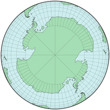

public:: true
上一页:: [[修正方位投影]]
下一页:: [[其他有趣的投影]]
Alias:: 等角投影
原文链接:: [Conformal Projections](https://web.archive.org/web/20180629152240/http://progonos.com/furuti/MapProj/Normal/ProjConf/projConf.html)

# 介绍
- 忠实地再现原始球体所有特征的假想地图投影将是完全等距的，即每两点之间的距离在地图和球体上都将保持相同的比例；因此，所有形状也将被保留下来。在一张平坦的地图上，这种特性是根本不可能的，这一点在地图边缘的点上很容易看到。
- 对于许多地图应用，如地形图和某些类型的导航图，一个较严格的约束，即形状的一致性或保真度，是最基本的要求：在地图上任何两条线的交汇处，它们之间的角度与球面上的对应物之间的角度相同；特别是，每条纬线必须以直角穿过每个子午线。另外，在任何一点上，比例尺失真，无论是压缩还是夸张，在所有方向上都必须是相同的。保形性是一个严格的局部属性：角度，因此形状，预计不会在交汇点以外的地方被保留下来；事实上，球体上的直线通常是沿平面弯曲的，反之亦然。
- 正形地图投影经常用于大比例尺地图，很少用于大陆或世界地图(此处显示的地图仅供比较)，尽管分瓣地图可能会缓解这个问题。由于任何正形地图都不可能是等面积的——事实上大多数都严重扭曲了远离地图中心的维度——正形投影几乎从未应用于专题和统计制图，在专题和统计制图中，基于大小的比较是常见的。
- 尽管有一个非常重要的等角投影是仍在使用的最古老的地图投影之一，但对保角的必要条件和特性的系统性理解不得不等待18和19世纪微分和复杂分析等复杂数学工具的发展。相反，保角制图发展成为现代数学的一个重要分支。它也是一个了不起的工程工具：例如，由于一些流动问题在圆形或方形等规则形状下更容易解决，一个复杂的区域可以被保形映射到简单的形状，问题可以被解决，然后通过逆保形映射将解决方案转换回原始环境。
	- ## 等角特性失效点:奇异点
	- 在几乎所有归类为“正形”的全球地图中，至少有一个点是奇异点，实际上并未等角的表示，因为：
	  * 它可能被映射到无穷远，因此不能被包括在内
	  * 线路在那里以不同于地球上的角度汇聚
	  * 沿着环绕该点的封闭曲线，其角度之和不是地球上的360°。
	- 
	- 考虑一下左边的极地圆锥等角投影；它的中心极是不保形的，因为围绕它的曲线（绿色）完成了一个254°33′的循环，而不是像地球上的360°，这是由右边的部分透明的斜方位正交地图表示。对极（紫色）是第二个单点，在地图上必然没有。在其他地方，经纬线都以直角相交，这是符合要求的必要条件，但不是充分条件。
	- 注意
	  * 这张地图的边界上的点（例如，在蓝色圆盘处）在技术上是保形的，尽管相对于它在对面边界附近的邻居来说有不可避免的严重距离扭曲。
	  * 在保形投影中，比例尺在所有方向上都是均匀变形的，因此 "小 "圆圈被保留下来。彩色圆盘的直径在地球上是相同的，但在地图上却有很大的不同，这是等角投影的典型特征。
# 经典等角投影
- 对于三个主要投影组中的每一个，都有一个单一的等角设计，在其他地方有更完善的介绍。
  * 古老的方位立体投影，它具有独特的附加属性，可以保留球体上任何圆的形状，无论多大。
  * 墨卡托投影，这是一种圆柱形投影，在正常情况下，它有笔直的垂直经线，因此可以直接测量方位。
  * 兰伯特的正形圆锥投影，是其他两个投影的一般情况
- 像大多数正形投影一样，这三种投影都有奇异点；特别是(描述适用于法线方向)，方位立体地图不能包括与投影中心相反的点；墨卡托投影不包括两极，等角圆锥显示一个单极，这是非共形的，因为所有子午线的角度之和小于360°。
# 拉格朗日投影
- 在他1772年的手稿中，有一个简短的章节描述了另外两个开创性的保角投影，即圆锥正形投影和横向墨卡托投影，兰伯特描述了一个相对简单但非常有趣的方法。
  * 在球面上，通过将每条经线的经度乘以一个恒定系数来压缩（通常是扩大）每条经线
  * 还是在球面上，沿纬线移动以恢复一致性
  * 在赤道投影面应用方位立体投影。
- 结果是一类正形投影--因为连续的共形映射的组成本身就是正形--投影，其网格由圆弧组成；唯一的直线是中央子午线和一条标准纬线，它总是位于两极之间的中间位置（下面指出有两个特殊情况）。两极附近的比例失真很大，这是不符合要求的。
- Lambert用一张使用系数为0.5、以赤道为直线纬线的地图来说明他的论文；这将整个地球映射成一个圆盘，当然，这与原来的赤道方位立体投影的内半球相吻合，两极的总经角为180°而不是360°。他强调了改变因子和标准纬线的效果，但指出其他替代方案是低劣的，除了两种特殊情况：因子1产生原始立体投影，0产生正轴墨卡托投影。
- 这类投影，甚至是Lambert喜欢的基本情况，通常被称为 "拉格朗日 "投影，这是以一个著名的推动者，即有成就的数学家Joseph Lagrange为名，他开发了椭圆体的情况，并彻底研究了其特性（1779年）。例如，他提出了一些参数，这些参数可以使任何给定地点附近的比例尺变化率最小化，他用一张柏林的地图说明了他的观点。
- 今天，"拉格朗日 "投影本身几乎从未被使用过，但它成为投影数学发展的一个基本步骤，因为球体与单位圆盘的保形映射是进一步转换的便利基础。Lambert压缩经度的方法后来被Aitoff和Hammer分别应用于方位角等距投影和方位角等面积投影。在有限基数投影上比较经度系数是有启发性的，也许比方位立体投影更直观。
## 拉格朗日对兰伯特投影的改造
-  
  {:height 312, :width 304} 
   
  
- 几张使用等角 "拉格朗日 "投影的球面情况的地图，网格由圆弧组成 - 从上到下依次为:
  * J.Lambert在1772年出版的基本投影，赤道是一条直线，1/2系数将赤道方位立体投影从一个无限大的平面收缩到一个圆形框架中。
  * 同样的地图，1/2系数，但南纬65°的直线平行，减少了北方有人居住的土地的面积失真范围
  * 重建拉格朗日的欧洲地图，将其参数化，以减少柏林附近的比例尺变化率：南纬18°30'的直线，系数1.17，中央经线在柏林。
  * 直线赤道和系数2/3的地图，其中一个半半球以圆为界。
# Eisenlohr 和 August 的正形投影
- 避免奇异点是德国的两个表面上非常相似的设计的一个必要条件。两者都是为赤道投影面开发的；赤道和中央子午线是直线，而两极是突出的尖顶。在边界经线附近，面积失真很明显，但独特的是，这两个投影在每一个点上都是保形的，甚至是两极。
- Friedrich Eisenlohr在1870年发表的设计有两个额外的特点：沿着边界经线的比例是恒定的；更值得注意的是，比例范围是所有保形投影中最窄的，$$1:3+\sqrt{8}$$--与三个经典投影的$$1:\infty$$范围相比。相对复杂的计算最初限制了它的使用，甚至今天它也很少被采用。
- 由Friedrich August设计、Bellermann共同开发的投影于1874年出版，作为Eisenlohr设计的替代方案：比例尺失真范围更广（1：8），在边界经线上也不恒定，但其构造略为简单。世界地图的边界是一个环状线，这个形状是由一个圆上的一个点在另一个固定的圆上滚动而定义的。
- 艾森洛尔和奥古斯特的投影都不应该与类似的设计相混淆，如广义的 "拉格朗日 "和非共形的美国多圆锥、矩形多圆锥和范德格林顿 IV投影。
	-  
	  Eisenlohr's conformal map
	-  
	  August's epicycloidal conformal map
# 正方形的正形投影
- 随着复数分析的成熟,等角投影现在的通用技术是把平面上的点作为复数平面上的数字来处理。特别是三位著名制图师开发了适用于各种投影面的在正方形上的正形投影的半球地图（经过适当重排后可以应用于整个世界），三种方法都要求计算第一类椭圆积分。
## 皮尔斯的梅花投影
- 在美国海岸和大地测量局工作时，美国哲学家和学者查尔斯·桑德斯·皮尔士在1879年公开了他的共形投影。在正常方面，它以正方形呈现北半球；另一个半球被分成围绕正方形对称的四个直角三角形，类似于星形投影。实际上，整个地图是一个更大的正方形，这启发了皮尔斯将他的投影称为梅花形，在十字中排列了五个。
-  
  正方形的皮尔斯梅花投影
- 除了内半球的角落--也就是整张地图的边缘中点--赤道突然中断外，Peirce的投影在任何地方都是保角的。在这四点附近，比例尺被高度拉伸；反之，极地地区则相当压缩。赤道和四条经线是笔直但断裂的线；所有其他格线是复杂的曲线。
- 五角形地图的八个三角形显然可以被重新安排成一个矩形，或者以南极的方式。另外，地图对平面进行了镶嵌；也就是说，通过一个微不足道的旋转，重复的副本可以完全覆盖（即镶嵌）一个任意的区域，每个副本的特征与相邻的副本完全匹配。然而，奇异点附近的点在镶嵌图上出现了两次；由于Peirce所选择的投影面，它们都落在海面上，所以几乎不引人注目。
	-  
	  平铺的Peirce Quincuncial地图。你能挑选出正常的正方形、南极的正方形以及八个三角形的几种可能排列吗？你能挑选出奇点吗？
	-  
	  赤道投影面的Peirce投影
## Guyou的正形投影
- 仅仅在Peirce之后几年，法国的Émile Guyou提出了他的保形投影（1886-1887）。在其最初的形式中，它包括西半球和东半球，每个半球都是一个正方形；赤道和四条经线是直线，其中两条后来沿着正方形的边缘断开。其他经线和纬线是复杂的曲线。
- 同样，在每个正方形的角落，即平行线45°N/S与直线子午线相交的地方，有很大范围的比例失真，而且没有等角性。
- 实际上，Peirce的投影和Guyou的投影是彼此的横向情况，分别强调极地和赤道投影。通过简单的旋转，Guyou地图的相同副本也可以在平面上铺设。
	-  
	  经典的Guyou地图，中央经线20°E，两极位于半球边缘的中点
	-  
	  倾斜投影面的Guyou地图，极点位于方形顶点，或两个Adams半球；中央经线25°W
	-  
	  另一个斜轴投影的Guyou地图,最大限度地减少了大陆的中断（不幸的是，像日本、伊比利亚和新西兰这样人口稠密的地区被中断或靠近较大区域扭曲的角落）。
	-  
	  平铺的Guyou投影
## O.S.Adams的方形半球
- 然而，正方形主题的另一个发展是旋转90度，即把两极放在正方形的两个角上。Oscar S. Adams，也是美国海岸和大地测量局的多产成员，于1925年提出了他的两个正方形半球的保形世界地图。
- 与Peirce和Guyou的其他方面完全一样，在正方形的四角，即保角失败的地方，比例尺失真很严重。只有赤道和中央子午线是直线；边界子午线也是直线，但在赤道处断开。
- 尽管由于其数学发展而引起兴趣，但Peirce、Guyou和Adams的正方形等角投影很少被使用。
# 其他形状的等角世界地图
## 新的复数工具
- 等角投影的进一步发展依赖于复数分析的发展
	- 黎曼的共形映射定理（1851年），该定理指出了在两个相连的平面区域之间进行共形转换的必要条件，但并没有描述如何实现这种映射
	- 赫尔曼-A-施瓦茨在复平面上将一个半径为1的圆（称为单位盘）映射到任何规则多边形的积分
	- Schwarz-Christoffel变换，是由Elwin B. Christoffel在1867年和Schwarz在1869年独立证明的另一个复数积分；它表达了如何在半个平面（或单位盘）和任何简单连接（即不自相交）的多边形之间进行映射。
- 尽管Schwarz和Christoffel的作品实现了对黎曼定理的建设性证明，但他们在制图方面的应用（除了简单的、特殊的例子）在近一个世纪里仍然是不切实际的；对于大多数情况，他们没有得出封闭的公式，需要解决一个非线性方程系统。实际制图涉及到通过连续的近似来进行冗长的数字评估。
- 即使在数字计算机普遍可用之后，结果也远非统一。许多Schwarz-Christoffel映射的算法都存在效率低下、精度有限、不稳定等问题，即不能收敛到一个结果，或者对奇异点（通常存在于多边形顶点）处理不力。
## O.S.Adams的世界地图
- 在提出了他的方形等角半球后，Oscar S.Adams提出了两个投影，世界地图在一个方形中。
- 第一个版本（1929年）的极点在相对的角落里；每个角落的比例失真都很严重，缺乏保形性。第二个版本（1936年）的极点在相对的边缘的中点；同样，在顶点有强烈的比例失真。这种投影在每个角和边缘中点处都不符合保形。
- 亚当斯的其他不太知名的保角投影是基于一个椭圆和其他几个多边形。
	-  
	  1929年版O.S.Adams's的等角正方形世界地图
	-  
	  1936年版O.S.Adams's的等角正方形世界地图
## Lee等角投影
- 劳伦斯-P-李（Laurence P. Lee），杰出的制图师和新西兰国家测绘机构的高级官员，进一步概括并改进了任意保形制图的方法的准确性。他的投影包括在矩形、椭圆、等边三角形、正四面体（1965）和其他正多面体（1976）上的世界地图。
- 与亚当斯一样，李的设计吸引了学术界的兴趣，并为新的数学成就铺平了道路，但在普通地图中的应用有限。
# 新的正形投影地图
- 来自希腊的Constant Xarax受到Lee在多边形和多面体上的保形地图、Briesemeister的斜投影和蝴蝶式排列的多面体地图的影响，提出了一个半正六边形的世界保形地图（2004）。从本质上讲，李的四面体保形投影是按原来的南极投影面绘制的，然后分成三个裂片，围绕北极重新排列；其结果是平衡了可读性、低中断数和容易识别的形状。与最初的设计一样，保形性在北极和地图边缘三条直线经线断裂的四个点上失效。
- 
  Xarax的世界地图是正六边形的一半。在Xarax之后重新绘制。
- Edgar N. Gilbert（约1970年）使用Lambert压缩赤道方位立体图的方法，该方法是 "Lagrange "投影的起源，他缩小了球体本身的经度，乘数为0.5，然后移动纬度以恢复符合性。整个地球被重新映射成一个半球，在最终的 "地图 "上可以复制。吉尔伯特至少有一个这种 "双球体 "的实际组装实例，地球上的每个点都被代表了两次。除了两极之外，整个球体都是保真的。
- 与Raisz的正交投影有点类似，Alan DeLucia和John Snyder对Gilbert的 "两个世界 "球体进行了正交转换（1986年），创造了一个以5°N 5°E为中心的平面地图。作为典型的正视图，地图的东部和西部边界被大大压缩；北冰洋的一个薄片出现了两次，而南极洲的一个相应片断被省略了。从视觉上看，其结果类似于拉格朗日和范德格林顿投影的球状外观，极地区域的夸张让人想起墨卡托地图。像其他的球体经纬网一样，网格由椭圆弧组成，地图既不是保形的也不是等面积的。
## 吉尔伯特的双重世界投影的各种正视图
-  
  赤道投影面可以呈现整个世界
-  
  倾斜投影面展示了地球上的每个点是如何被复制的。
-  
  如南极投影面所示,两个极点没有等角性质
-  
  DeLucia/Snyder的轻微倾斜的投影面
- 吉尔伯特投影显示在半球上时,在球面上是保形的，在平面地图上不是保形的
## 这个地球仪有什么问题--说真的？
-   
  “双地球仪”，子午线间距减半(表面上类似于吉尔伯特，但没有共形校正):图一，托布勒提出的正交正轴投影；图二，倾斜正交视图。
- 在《科学美国人》杂志的数学游戏专栏中，马丁-加德纳引用吉尔伯特的话说，很少有人注意到他办公室里的重复地球仪有什么奇怪的地方。制图师Waldo Tobler在一篇关于不寻常地图的轻松演讲中提出，几乎没有人反对地球的赤道正交面只有简单的子午线压缩而没有保形校正。
- 这种无视的提法是否反映了某种忽视地理细节的先天倾向、对地球仪的普遍不熟悉，或者只是作者的面子问题？2015年，吉尔伯特的实验被艺术家大卫-斯沃特用他自己的[双球体](http://gallery.bridgesmathart.org/exhibitions/2015-bridges-conference/dmswartrt)进行了实验，结果类似。