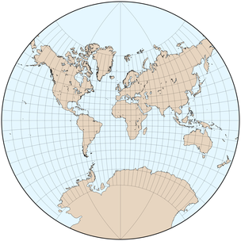

public:: true
上一页:: [[修正方位投影]]
下一页:: [[其他有趣的投影]]
Alias:: 等角投影
原文链接:: [Conformal Projections](https://web.archive.org/web/20180629152240/http://progonos.com/furuti/MapProj/Normal/ProjConf/projConf.html)

# 介绍
- 忠实地再现原始球体所有特征的假想地图投影将是完全等距的，即每两点之间的距离在地图和球体上都将保持相同的比例；因此，所有形状也将被保留下来。在一张平坦的地图上，这种特性是根本不可能的，这一点在地图边缘的点上很容易看到。
- 对于许多地图应用，如地形图和某些类型的导航图，一个较严格的约束，即形状的一致性或保真度，是最基本的要求：在地图上任何两条线的交汇处，它们之间的角度与球面上的对应物之间的角度相同；特别是，每条纬线必须以直角穿过每个子午线。另外，在任何一点上，比例尺失真，无论是压缩还是夸张，在所有方向上都必须是相同的。保形性是一个严格的局部属性：角度，因此形状，预计不会在交汇点以外的地方被保留下来；事实上，球体上的直线通常是沿平面弯曲的，反之亦然。
- 正形地图投影经常用于大比例尺地图，很少用于大陆或世界地图(此处显示的地图仅供比较)，尽管分瓣地图可能会缓解这个问题。由于任何正形地图都不可能是等面积的——事实上大多数都严重扭曲了远离地图中心的维度——正形投影几乎从未应用于专题和统计制图，在专题和统计制图中，基于大小的比较是常见的。
- 尽管有一个非常重要的等角投影是仍在使用的最古老的地图投影之一，但对保角的必要条件和特性的系统性理解不得不等待18和19世纪微分和复杂分析等复杂数学工具的发展。相反，保角制图发展成为现代数学的一个重要分支。它也是一个了不起的工程工具：例如，由于一些流动问题在圆形或方形等规则形状下更容易解决，一个复杂的区域可以被保形映射到简单的形状，问题可以被解决，然后通过逆保形映射将解决方案转换回原始环境。
	- ## 等角特性失效点:奇异点
	- 在几乎所有归类为“正形”的全球地图中，至少有一个点是奇异点，实际上并未等角的表示，因为：
	  * 它可能被映射到无穷远，因此不能被包括在内
	  * 线路在那里以不同于地球上的角度汇聚
	  * 沿着环绕该点的封闭曲线，其角度之和不是地球上的360°。
	- 
	- 考虑一下左边的极地圆锥等角投影；它的中心极是不保形的，因为围绕它的曲线（绿色）完成了一个254°33′的循环，而不是像地球上的360°，这是由右边的部分透明的斜方位正交地图表示。对极（紫色）是第二个单点，在地图上必然没有。在其他地方，经纬线都以直角相交，这是符合要求的必要条件，但不是充分条件。
	- 注意
	  * 这张地图的边界上的点（例如，在蓝色圆盘处）在技术上是保形的，尽管相对于它在对面边界附近的邻居来说有不可避免的严重距离扭曲。
	  * 在保形投影中，比例尺在所有方向上都是均匀变形的，因此 "小 "圆圈被保留下来。彩色圆盘的直径在地球上是相同的，但在地图上却有很大的不同，这是等角投影的典型特征。
# 经典等角投影
- 对于三个主要投影组中的每一个，都有一个单一的等角设计，在其他地方有更完善的介绍。
  * 古老的方位立体投影，它具有独特的附加属性，可以保留球体上任何圆的形状，无论多大。
  * 墨卡托投影，这是一种圆柱形投影，在正常情况下，它有笔直的垂直经线，因此可以直接测量方位。
  * 兰伯特的正形圆锥投影，是其他两个投影的一般情况
- 像大多数正形投影一样，这三种投影都有奇异点；特别是(描述适用于法线方向)，方位立体地图不能包括与投影中心相反的点；墨卡托投影不包括两极，等角圆锥显示一个单极，这是非共形的，因为所有子午线的角度之和小于360°。
# 拉格朗日投影
- 在他1772年的手稿中，有一个简短的章节描述了另外两个开创性的保角投影，即圆锥正形投影和横向墨卡托投影，兰伯特描述了一个相对简单但非常有趣的方法。
  * 在球面上，通过将每条经线的经度乘以一个恒定系数来压缩（通常是扩大）每条经线
  * 还是在球面上，沿纬线移动以恢复一致性
  * 在赤道投影面应用方位立体投影。
- 结果是一类正形投影--因为连续的共形映射的组成本身就是正形--投影，其网格由圆弧组成；唯一的直线是中央子午线和一条标准纬线，它总是位于两极之间的中间位置（下面指出有两个特殊情况）。两极附近的比例失真很大，这是不符合要求的。
- Lambert用一张使用系数为0.5、以赤道为直线纬线的地图来说明他的论文；这将整个地球映射成一个圆盘，当然，这与原来的赤道方位立体投影的内半球相吻合，两极的总经角为180°而不是360°。他强调了改变因子和标准纬线的效果，但指出其他替代方案是低劣的，除了两种特殊情况：因子1产生原始立体投影，0产生正轴墨卡托投影。
- 这类投影，甚至是Lambert喜欢的基本情况，通常被称为 "拉格朗日 "投影，这是以一个著名的推动者，即有成就的数学家Joseph Lagrange为名，他开发了椭圆体的情况，并彻底研究了其特性（1779年）。例如，他提出了一些参数，这些参数可以使任何给定地点附近的比例尺变化率最小化，他用一张柏林的地图说明了他的观点。
- 今天，"拉格朗日 "投影本身几乎从未被使用过，但它成为投影数学发展的一个基本步骤，因为球体与单位圆盘的保形映射是进一步转换的便利基础。Lambert压缩经度的方法后来被Aitoff和Hammer分别应用于方位角等距投影和方位角等面积投影。在有限基数投影上比较经度系数是有启发性的，也许比方位立体投影更直观。
## 拉格朗日对兰伯特投影的改造
-  
  {:height 312, :width 304} 
   
  
- 几张使用等角 "拉格朗日 "投影的球面情况的地图，网格由圆弧组成 - 从上到下依次为:
  * J.Lambert在1772年出版的基本投影，赤道是一条直线，1/2系数将赤道方位立体投影从一个无限大的平面收缩到一个圆形框架中。
  * 同样的地图，1/2系数，但南纬65°的直线平行，减少了北方有人居住的土地的面积失真范围
  * 重建拉格朗日的欧洲地图，将其参数化，以减少柏林附近的比例尺变化率：南纬18°30'的直线，系数1.17，中央经线在柏林。
  * 直线赤道和系数2/3的地图，其中一个半半球以圆为界。
# Eisenlohr 和 August 的正形投影
-