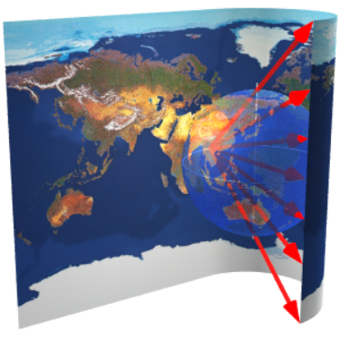
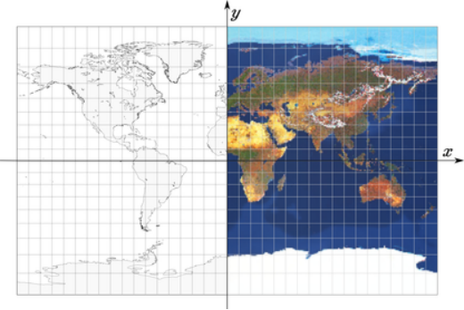
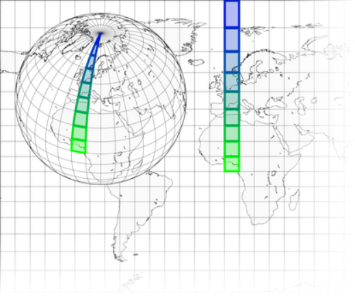

public:: true
上一页:: [[正轴方位投影]]
下一页:: [[Kavrayskiy's VII投影]]

# Braun和其他立体圆柱投影的推导
## Braun的投影
-  
  布劳恩的立体圆柱投影地图的展开，左边的东半球已经展开了。光线穿透半透明的地球，绘制出地图的右边缘。赤道上的光源围绕极轴转动。
- C.Braun设计的立体圆柱投影可以用几何学的方法来观察，但它比之前的方位正交投影的例子稍微复杂一些。  这里的投影面不是直接产生投影地图的平坦投影面，而是紧贴赤道滚动的圆柱片。每条子午线都是通过从正对的子午线上的一个赤道点发出的光线在这个管子上绘制的。然后沿任意一条子午线切割切线管并展开。
- 创建一些圆柱形投影也有类似的过程，尽管不是所有的投影都使用这样一个简单的模型。事实上，像墨卡托投影和等距圆柱投影这样的著名投影是由任意约束定义的，而不是透视过程。
- 
  布劳恩立体圆柱形投影的地图
-  
  球体和切线投影面示意图。这张地图的高度是地球直径的两倍。
- 法线方向的直接映射方程很简单。考虑将地球上的点_P_投影到地图上的点_P’_上。首先，像在所有的圆柱形设计中一样，这方面的经线被投影为垂直直线，其间距仅与经度成正比，因此$$x = R\lambda $$。
- 由$$\varphi$$确定的纬线被投影为一条水平直线，其y坐标可以通过简单的比例从图上导出:
  $$\frac{h}{w+R}=\frac{y}{R+R}$$
  因此:
  $$h=R\sin\varphi$$ 
  $$w=R\cos\varphi $$
  $$y=\frac{2R\sin\varphi}{1+\cos\varphi}$$
- 令$$\theta =\frac{\varphi }{2}$$,使用三角恒等式推导
-
  $$\sin 2\theta  = 2\sin\theta\cos\theta$$
  $$\cos 2\theta = 1- 2\sin^{2}{\theta}$$
- 当$$-\frac{\pi }{2}\leq \varphi \leq \frac{\pi }{2}$$时,纵坐标可以化简为:
  $$y=\frac{2R2\sin\theta \cos\theta}{1+1-2\sin^{2}{\theta}}=\frac{4R\sin\theta \cos\theta}{2(1-\sin^{2}{\theta})}=\frac{2R\sin\theta \cos\theta}{\cos^{2}{\theta}}$$
- 因此:
  $$x=R\lambda $$
  $$y=2R\tan \frac{\varphi }{2}$$
## 高尔和其他的立体圆柱投影
- 在布劳恩的投影上，圆柱面是切线，赤道是标准纬线。上面的推导可以立即推广到不同的标准纬线$$\varphi _{0}$$，只需将圆柱体的半径减少到$$R\cos{\varphi _{0}}$$即可。对于一个正切面，第一个公式按比例变为
-
  $$\frac{R\sin\varphi}{R(1+\cos\varphi)}=\frac{y}{R(1+\cos{\varphi _{0}})}$$
- 因此，像Gall的立体圆柱投影（$$\varphi _{0}$$=45°）和BSAM的圆柱投影（$$\varphi _{0}$$=30°）的方程式为
-
  $$x=R\cos\varphi _{0}\lambda $$
  $$y=R(1+\cos\varphi _{0})\tan \frac{\varphi }{2}$$
## 进一步推广:伪墨卡托和中心圆柱投影
- 最后，可以将光源从赤道上的某一点，即与极轴的距离$$R$$，转移到距离$$kR$$。如果没有上面的三角函数替换，方程就变成了
-
  $$x=R\cos\varphi _{0}\lambda $$
  $$y=R(k+\cos\varphi _{0}) \frac{\sin\varphi }{k+\cos\varphi}$$
- 两个特殊情况是布劳恩的伪墨卡托投影（$$k=0.4$$）和中心圆柱投影（$$k=0$$）（都使用$$\varphi _{0}$$=0°）。
### 用形状换取面积：永恒的制图学妥协
-  
  斜轴方位投影叠加在部分布劳恩的立体圆柱赤道图上，以相同的比例尺绘制。选定的10°宽的格子单元突出了大多数圆柱形地图是如何在两极夸大高度（因此是面积），以便更好地保持形状。布劳恩的夸张是明显的，但与墨卡托的夸张相比，就显得微不足道了。
- 在所有的圆柱形投影中，唯一的本质区别是垂直比例，在赤道方面转化为平行线之间的间距。大多数这样的投影，如Braun和Gall的立体图，都是为了增加向两极的间距。为什么呢？
- 考虑一系列具有统一“宽度”和“高度”的网格“单元”(比如10度)；在地球上，它们在赤道上近似正方形，但是随着纬度的增加，它们逐渐变窄，在两极变成非常薄的球形三角形。根据定义，圆柱形投影不能缩小它们的单元，只能近似地垂直拉伸它们。特别是，在墨卡托的计算中，拉伸是为了准确地保留局部角度；这需要将两极投影到无限远。
- 当然，垂直拉伸加剧了圆柱形地图中高纬度地区的夸张。相比之下，兰伯特的等面积圆柱投影及其变体通过压缩而不是拉伸纬度来保留面积，但形状会相应地受到影响。这种妥协是地图投影反复出现的主题。