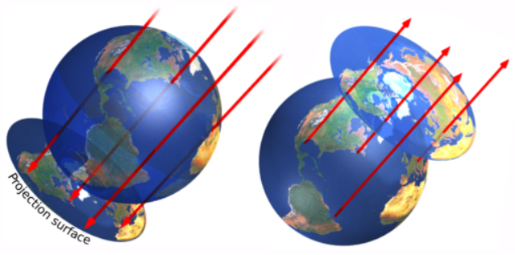

public:: true
上一页:: [[如何创建投影]]
下一页:: [[正轴圆柱投影]]
原文链接:: [Deducing the Azimuthal Orthographic Projection](https://web.archive.org/web/20180721074746/http://www.progonos.com/furuti/MapProj/Normal/CartHow/HowOrtho/howOrtho.html)

# 正轴方位投影推导
- 纯几何方位正交投影可以完全可视化为物理模型。最简单的情况，一个极地投影面，在这里呈现为北半球。
-  
  方位正交投影几何的两个完全等效的可视化
- 假设地球位于平行于赤道的平面上。从南北极轴上无限远的一点发出的光线穿透半透明的北半球，并将其特征“描绘”到平面上，南半球完全透明。
- 或者，想象一个在该轴上无限远的观察者。从地球表面发出的平行光线打在一个与光线垂直的中间平面上，在那里形成了图像。由于所有的光线都是平行的，也就是说，透视是 "圆柱形 "的，该平面可以与球体相切，也可以不相切，但不影响结果。总之，在任何时候都只能看到一个半球。
- 其他透视方位投影可以通过改变光源的位置来创建。为了进行实际演示，制图员可以将海岸线和其他地理特征绘制在玻璃地球仪或玻璃碗上，并在方便的距离内使用反射阳光或强光手电筒，将地球仪的阴影投射在墙上，从而创建各种方位投影，如正交投影和立体投影。
-   
  位于75°E 55°N的点P由方位投影的极点投影面映射：地球停留在投影平面上，而该点已被投影。
- 几何上，方位投影可以想象为将极坐标转换为三维笛卡尔空间中的一个点，然后将其展平，即忽略一个坐标。很容易推导出其极坐标:
  $$\omega = R \cos \left (\varphi \right ) = \rho $$
  $$\theta = \lambda $$
- 只有当$$\varphi\geq0$$(投影点为北极)或$$\varphi\leq0$$(投影点为南极)的点才可见。
  转换到笛卡尔坐标，
  $$x = \rho \cos \theta  = R \cos \varphi \cos \lambda $$
  $$y = \rho \sin \theta  = R \cos \varphi \sin\lambda $$
- 正向方程到逆映射的转换很简单
-  
  生成的地图
- 通过首先在三维空间中旋转地球坐标，然后应用极坐标方程，可以得到一个更普遍的承影面,无论是赤道还是斜轴的都适用。在数字计算机编的普遍可用之前，制图师起草一般的正交地图时，首先绘制极地地图的经纬网，然后用它来放置赤道投影面的纬线；最后，通过定位标有几组纬线的关键经纬网交点来创建斜轴版本的投影