public:: true
上一页:: [[距离和比例尺]]
下一页:: [[方向]] 
原文链接:: [Useful Map Properties: the Geodesic](https://web.archive.org/web/20180313143727/http://www.progonos.com/furuti/MapProj/Normal/CartProp/Geodesic/geodesic.html)

# 两点之间最短的路径是什么？
- 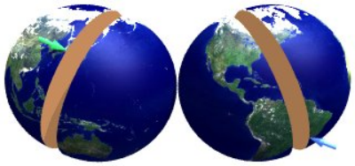 
  id:: 60c2f25e-1c07-4473-8718-da724c9d1e04
  包含地球中心和两个表面点的平面（这里，绿色箭头指向日本东京；蓝色箭头（巴西坎皮纳斯）将地球分成两个半球，这里是一个一般的垂直透视投影图；平面/球体交点是一个大圆，其中一部分是定义两个曲面点之间最短路径的测地线
## 圆圈越大，路径越短
- 假设我们准备计算两个遥远的地方的距离，如坎皮纳斯市（巴西东南部)和东京(日本）之间的行程。假设我们可以乘飞机旅行，简化条件，比如不考虑恶劣的天气和受限制的空域。显然，我们想通过选择最短的路线来减少时间和成本，这在平面上永远是一条简单的直线。这对于评估在海洋、沙漠或其他类似的不适宜居住的地方进行长距离的飞行的风险是很有用的。
  
  那么，我们如何确定我们的道路呢？拿起一把尺子和一张地图，然后画一条线连接我们旅程的终点？没有那么简单，如果我们想要有意义的结果，选择正确的投影是必不可少的。
  
  给定两个点A和B，比如东京和坎皮纳斯，加上地球的中心，一个唯一的平面（除非A和B和圆心是一条线）被定义。这个平面和行星表面的交点是大圆或正交场，也是唯一的，包含A和B；它是最大的，因为它的半径和周长与地球相同；这里我们假设行星是一个完美的球体。由包含行星中心的平面形成的任何表面圆都是一个大圆，没有这样做的任何表面圆都是一个小圆。因此，每个子午线都是一个大圆，而除了赤道以外的所有纬线圈都是小圆
  
  点A和B将它们的大圆分成两个弧，其中一个弧（除反峰A和B外）比另一个弧短。短弧，称为大圆距离、测地线，实际上是A和B之间最短的曲面路径；真正最短的三维路径是地下的，当然以我们目前的技术不可能直接这么走。
- **测地线和大圆航线**
  测地线又称大地线或短程线，可以定义为空间中两点的局域最短或最长路径。测地线(Geodesic)的名字来自于对于地球尺寸与形状的大地测量学(Geodesy)。地球上两点间的测地线距离即大圆距离，大圆航线是近似将地球看成正圆计算的测地线。
## 投影和测地线
- 因此，理想情况下，我们的地图应该将大圆显示为直线，以便绘制和测量测地线。不幸的是，只有少数投影可以做到这一点，而且通常只有在特殊情况下，这限制了它们的普遍使用。当然，没有地图投影能将任意两点之间的测地线显示为直线。在世界地图中常用的罗宾逊、墨卡托和莫尔维德投影上，大圆被画成复杂的曲线。圆柱投影在挂图中仍然很普遍，尽管它们在水平比例尺特别拉伸的两极附近存在特殊问题。遗憾的是，许多圆柱投影的选择可能是因为它们整齐的矩形形状，而不是任何突出的制图特性。
- 使用罗宾逊投影绘制的地图，红色大圆穿过坎皮纳斯和东京。这条复杂的曲线根本不代表地球表面原来的圆。中央子午线0°.
  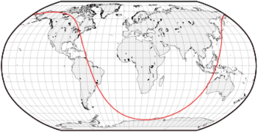
- 这张莫维德地图是旋转过的（中央子午线是150）°E） 为了移动主要感兴趣的区域，东京和坎皮纳斯之间的较短路径，远离地图边界扭曲较大的地方。即便如此，大圆也远不是圆的。
  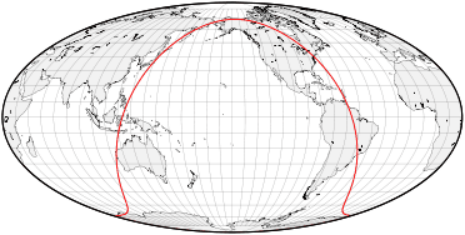
- 等距圆柱地图上的大圆形状是卫星地面控制室中常见的景象。它也通常出现在动态的桌面日历上，显示地球上被照亮/黑暗的地方：由于太阳光线几乎是平行的，所以昼夜边界大约是一个大圆。
  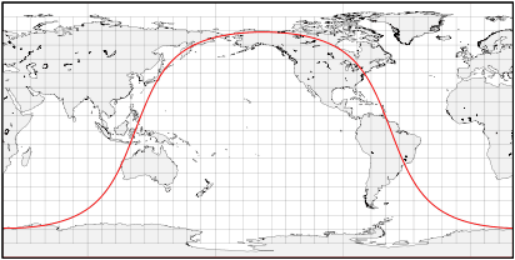
- 方位类投影从选定的中心点(方位角)呈现真实方向，方位角通常与地图的中心重合。特别是所有跨越方位角的大圆都画成了直线。方位立体投影是保圆的，因为球面上的任何圆（每个测地线、纬线和子午线）仍然映射成一个圆；穿过中心点映射到无限直径圆的测地线，即直线。可惜它一次只能显示一个半球。另一个非常重要的方位投影，著名的日晷投影地图成直线所有大圆，即使那些没有通过中心点，也只能呈现不到一个半球。它是直接测定大圆的最佳工具，但由于远离方位角的极端形状和比例放大，它的实用性受到限制。方位等距投影可以覆盖整个世界，并呈现从中心到任何点的真实方向和距离，同时在地图边缘附近保持较小的变形。
- 方位立体投影：圆，包括大圆，投影依然是圆；通过投影中心的圆变成直线
  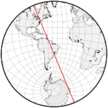
- 日晷地图：即使没有通过中心，大圆是也直的，但地图边缘变形非常大
  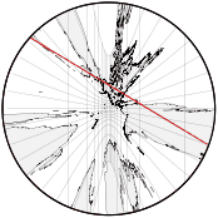
- 方位等距投影的地图可以展示整个世界
  
- 投影变形和不熟悉的形状使得人们很难意识到地图上的大圆和它们在球面上是一样直的。方位正交投影清楚地显示了从太空的有利位置看到的地球的弧度。这很好地反映了通过在地球仪上应用一条绷紧的线来寻找测地线的实用方法。
- 同一个大圆在三个不同的斜方位正交投影中不是直的，因为它不接触中心点。
  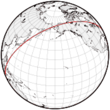 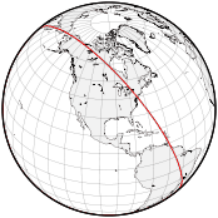 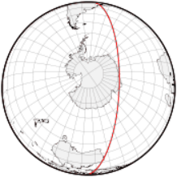
- 如果你想从坎皮纳斯到东京，实际的商业航班通常会从附近的圣保罗起飞，然后在秘鲁的利马、旧金山或洛杉矶停留。简单地在等距的圆柱形地图上用一条绿直线连接坎皮纳斯和东京，可能会得出一个幼稚的结论，即夏威夷是一个比加州更合乎逻辑的选择。
  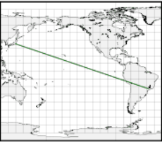 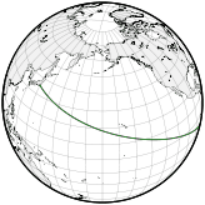 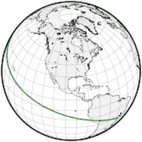