public:: true
上一页:: [[多面体地图]]
下一页:: [[二十面体/十二面体/其他地图]]
原文链接:: [Cubic Globes And Octahedral Maps](https://web.archive.org/web/20180304143647/http://www.progonos.com/furuti/MapProj/Normal/ProjPoly/projPoly2.html)

# 立方体地图
- 虽然映射到正六面体（一个普通的立方体）中容易出现明显的扭曲，但 "盒中地球 "这一无厘头的概念长期以来一直让我着迷。有一次，我独自用手绘制并折叠了这样一张地图，使用的是圆柱形和科利尼翁式投影的任意复合体。幸运的是，现在我拥有一台电脑... 现代广告商也经常采用这个概念。
- Christian G. Reichard（1803年）和其他制图师在世界和天体地图集中使用了六个gnomonic方形面的不同安排（通常是赤道方面的四个和极地方面的两个）。C.A. Schott（1882年）使用了一个斜面版本。这些都不是等面积的或保形的。
	- 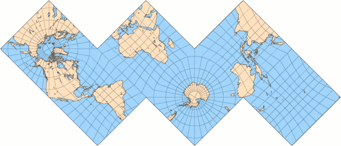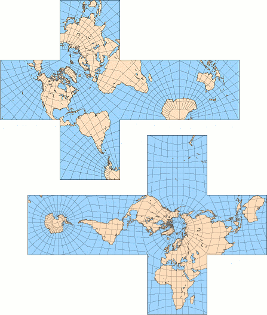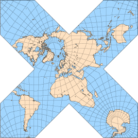
	  各类展开的日晷立方体地图，格子间距为10°。从上到下：Reichard使用的以面为中心的极点和面的布局（中心经线的选择是猜想的）；极点在角上（可打印版本）；极点从面的中心稍微移开，以减少陆地切割；再次，用一个面分割成四个三角形来减少切割（根据Chris Maynard的建议）。
	  在面的边缘，特别是角落，面积夸张得很厉害；除了边缘，赤道和所有经线都是直的。
- 最近，立方体地球仪被重新用于天文学和宇宙学研究。COBE（宇宙背景探测器），一个1989年发射的卫星探测器，高度详细地测量了来自整个天空的入射微波辐射--概念上的天球。COBE任务引发了相当大的科学兴趣，因为其结果有望揭示宇宙起源时的结构。这里重要的是为有效存储返回地球的大量数据而选择的模式（最近的任务中不断改进的仪器提供了更加详细和大量的信息）。由于辐射密度是分析栅格数据时的一个重要因素，所选择的投影应该强调面积的保存；另一方面，形状不应该过于扭曲--否则不同的区域就不容易被比较。
- 所选择的折中设计，即COBE四边形球面立方体（Chan和O'Neill，1975年）或 "天空立方体"，是基于gnomonic投影，但每个面的中心都被扩大，以形成一个近似等面积的地图。所有六个面的变形模式都是相同的，按照惯例，这六个面呈 "T "型排列，四个赤道面在一排，两个极地面在最右边的上方和下方。
	- 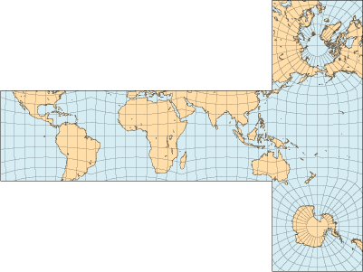 
	  COBE四边形球面立方体的面按惯例排列成T字形。虽然不是为世界地图准备的，但将其变形模式与Reichard的布局中的gnomonic地图的变形模式进行比较是很有意思的。
- 一个相关的设计，四边形的球面立方体（O'Neill和Laubscher，1976），涉及更复杂的计算，但完全是等面积的。
	- 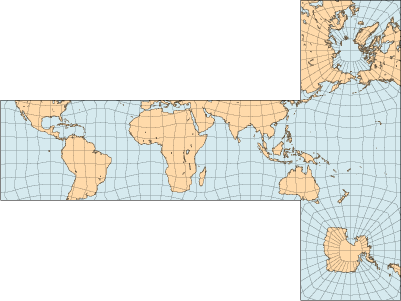 
	  四维球面立方体也是为天体数据设计的，在此仅作比较。
- 同样与宇宙学光栅数据的分析有关，HEALPix投影的目的不是多面体，但它的一些形式可以简单地重新排列：H=4的情况下产生一个立方体；重新缩放的H=6是一个六边形棱柱，而重新缩放的H=3是一个由两个正四面体覆盖的三角形棱柱。
	- 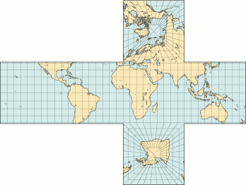 
	  H=4的HEALPix地图，三角面重新排列成一个立方体；比例尺比gnomonic地图大20%。
	  该地图完全是等面积的，但与之前的投影不同，其赤道面和极地面的变形模式完全不同。
# 八面体地图
## Cahill的蝴蝶地图
- 从1909年开始，伯纳德-卡希尔为几种基于八面体的地图申请了专利，使用了糯米、共形或任意投影。所有这些都是基于八个等边三角形，可以以多种方式排列，最常见的称为 "蝴蝶图"。 在这里，它以直角形式呈现，极点在相对的顶点，每隔90°切割经线。其他的变体是保形或等面积的，但包括额外的中断或稍微弯曲的边缘。
- 显然，没有任何一张卡希尔地图是大受欢迎的，即使在作者宣传了30年之后。最近，Gene Keyes通过修订版和不同的陆地安排，恢复了人们对这种投影的兴趣。
- 蝴蝶式的布局，表面上类似于锥形投影，与星形投影一样得益于大陆分布。
	- 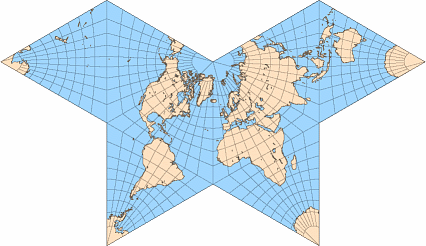
	  Gnomonic地图采用Cahill的 "蝴蝶 "布局，中央经线为20°W；可打印版本
## 修改后的科里尼翁地图
- 科里尼翁的奇特投影可以通过三个简单的步骤修改为八面体的 "蝴蝶 "变体。
  * 沿着三条经线中断菱形版本，形成八个三角形的片
  * 改变水平和垂直尺度，以便在保持面积不变的情况下使各片成为等边的。
  * 在北极周围重新安排各分片。
- 第二步可以省略，产生一个略微不同的地图，折叠成一个拉长的不规则八面体。无论哪种地图都是等面积的，但当然只是在每片上是伪圆柱投影。
	- 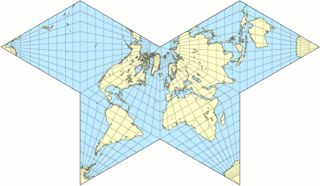 
	  使用科里尼翁投影的地图很容易被修改为适合正八面体的面；中央经线20°W
## 使用半球形截断八面体
- 在所有的规则多面体中，在八面体上使用日晷投影映射世界是最简单的任务，因为所有的经线和赤道都被映射成了直线；因此八面体的边界可以很容易地从地图坐标中推导出来。
- 同样的投影应用于截断的八面体，可以减少部分地图的面积失真，因为六个原始顶点被剪掉了，或者更恰当的说法是被 "压扁 "成更接近内嵌球面的方形面。与原来的蝴蝶地图相比，将每个新面分割成四个直角三角形，引入了极少的额外中断的地块，除了北美和亚洲北部。卡希尔的几幅蝴蝶地图都是基于这种实体，将方形面进一步细分为三角形，沿着地图分布，以获得更对称的外观和更少的地块分割。
	- 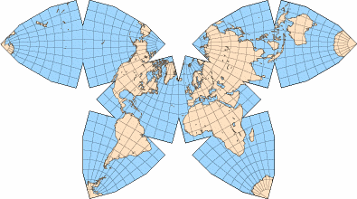 
	  半角截断八面体上的日晷投影地图，中央子午线为20°W，每个正方形面被分成四块（每个八面体是一个由三个直角等腰三角形包围的正六边形）；可打印的版本
## Waterman投影
- 最近，史蒂夫-沃特曼设计了一个多面体投影，解决了陆地的扭曲和分割问题，而且也是基于截断的八面体。
- 沃特曼研究了球体包装--将相同的球体并列在尽可能小的体积内的古老数学问题--并编制了一个多面体列表，其顶点由一组包装球体的中心定义。其中一个被称为W5的多面体（松散地定义为立方紧密堆积的单位球体群的凸壳，其中心离原点的距离不超过51/2）是这个投影的基础。它类似于阿基米德截断八面体，但其方形面的边缘只有六面体长边的一半：因此，在类似于卡希尔蝴蝶地图的大陆排列中，北部海岸线的切口并不深。所有的正方形面都按惯例被分割成四个直角三角形，除了有南极的那张，它还借用了相邻六边形面的狭窄切片，从而使南极洲几乎保持完整。
- 与其他多面体地图一样，各片可以根据地图的用途重新排列。例如，地图的左右两半可以在南大西洋的边缘连接起来，也可以将它们换成南、北太平洋的夹层。与卡希尔的地图类似，蝴蝶式布局结合了可读性和低失真。
- 正如商业地图所采用的那样，沃特曼的投影既不是保角也不是等面积的。赤道比例尺是恒定的；所有经线都是断裂的直线，沿每条经线的比例尺都是线性的，但以赤道为参考，只有每瓣的中央经线东西45°处的四条边界经线是标准线。
	- 图1：沃特曼投影的5°方里网，其中有一个南极洲的插图；图片由Steve Waterman提供。
	  图2。沃特曼投影，中央子午线20°W。世界全彩挂图可在市场上购买。
	  图3：适应沃特曼多面体的日晷投影。
	- 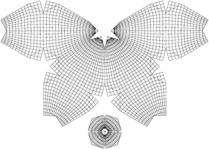 
	  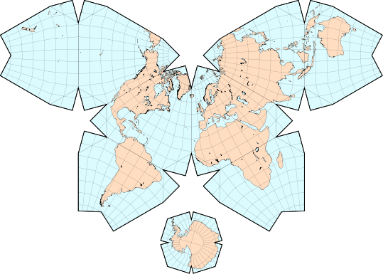 
	  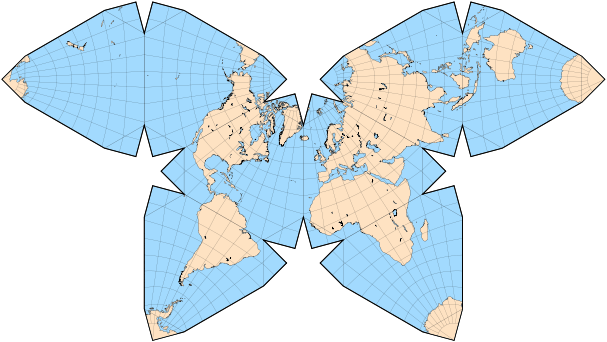
	-