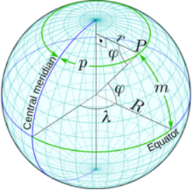
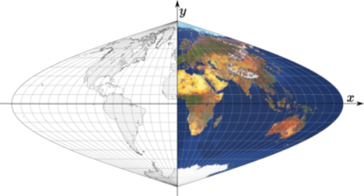
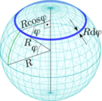
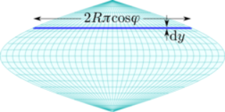

public:: true
上一页:: [[Kavrayskiy's VII投影]]
下一页:: [[克拉斯特抛物线投影]]

# 推导等积正弦投影
- 想象一下投影的赤道面,与 [[Kavrayskiy's VII投影]] 有一些相似之处，但具有更严格的属性：
-  
  与正弦投影的几何形状有关的球面尺寸。
  * 伪圆柱形
  * 所有纬线都是标准线
  * 中央子午线是一条直线标准线
- 考虑地球上的一个点P。它到赤道的距离是$$m=\varphi R$$（这个简单的表达方式是用弧度表示坐标角的优点之一），这是映射点的纵坐标。通过的平行线的半径为$r=R\cos{\varphi}$，圆周长为$p=2\pi r$。由于伪圆柱的特性，横坐标与该值的一半成正比，系数为$\frac{\lambda}{\pi}$。因此:
-
  $$x=R\lambda \cos{\varphi}$$
  $$y=R \varphi$$
- 
  赤道投影面的正弦等积投影
- 结果是一个经典的投影，历史上被认为是几个作者，最著名的是墨卡托、桑森和弗拉姆斯蒂德。今天，它更为人所知的是正弦曲线投影，以它的经线形状命名，而经线的形状是$$x=k \sin{(y+\frac{\pi}{2})}$$,$$k$$的值域为$$-1\leq k \leq 1$$
- 尽管正弦投影很古老，但它是等面积的这一事实似乎长期被忽视或忽视。这是令人惊讶的，因为正弦曲线与球体的面积对应关系可以由卡瓦列里原理直观地确定，或者通过类比一堆等距的圆柱形地图来确定。让我们给出一个基于微积分的非正式证明。
-  
  沿球面和正弦映射纬线对应的无穷小面积元素。
  
- 让我们定义一个球体上的面积元素，由纬度$$\varphi$$处的一个薄环给出。我们知道环的半径$$R\cos{\varphi}$$；它的厚度，同样因为角度是用弧度表示的，是 $$Rd\varphi$$，因此它的面积是$$2\pi R^{2}\cos{\varphi  d \varphi}$$。设$$S _{s}$$是赤道和纬线$$\Phi$$之间的面积。
-
  $$
  \begin{aligned}
  S _{s} & = \int_{0}^{\Phi}2\pi R^{2}\cos{\varphi d\varphi} \\
         & =  2\pi R^{2}\sin{\varphi} \big|_0^\Phi \\
         & =  2\pi R^2 \sin\Phi
  \end{aligned}$$
- 在地图上，相应的区域元素是一个水平带，其宽度由$$\lambda=\pi:2R \pi \cos \varphi$$决定。其高度是$$dy=Rd\varphi$$,面积是$$2R^2 \pi \cos \varphi d\varphi$$,设$$S_m$$是赤道和纬线$$\Phi$$之间的面积
-
  $$S_m=\int_{0}^{\Phi}2R^2 \pi \cos \varphi d \varphi = 2 \pi R^2 \sin \Phi = S_s$$
- 任何两条平行线之间的“切片”面积可以简单地通过改变积分极限来计算，并且在地球和地图上保持相同。此外，给定一个切片，它在地球和地图上任意两条经线之间的面积是相同的，因为沿着所有纬线的比例是恒定的。因此，由两对纬线和经线定义的任何相应的“细胞”中的面积都是相同的。最后，通过合成，地球和地图上任何对应的区域都有相等的面积。