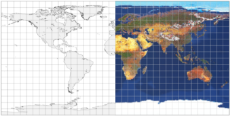
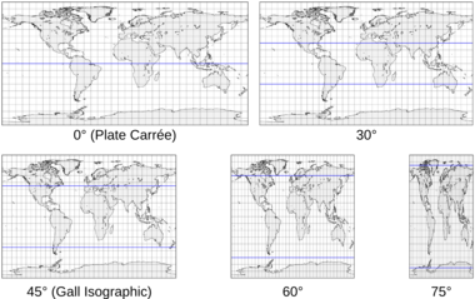
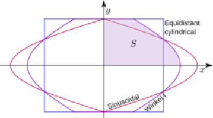
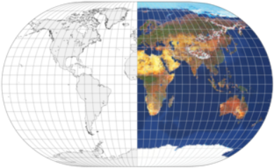

public:: true
上一页:: [[极/赤道方位等距等面积投影]]
下一页:: [[埃托夫/汉莫尔/温克尔三重投影]]
原文链接:: [A Simple Projection plus Two Derived Works](https://web.archive.org/web/20180630041352/http://progonos.com/furuti/MapProj/Normal/CartHow/HowER_W12/howER_W12.html)

-
# 一个简单的投影加两个衍生作品
## 等距圆柱投影的推导
-  
  等距圆柱形投影（Plate Carrée案例）
-  
  改变等距圆柱地图的标准纬度(突出显示的纬线)的效果
- 假设一个任意投影,其投影面为赤道面:
  * 所有经线都是等距的垂直标准线
  * 所有纬线都是水平、等距、等长的线
- 这样的一个矩形的结果是非常简单的圆柱等距投影（"等距 "只沿经线和一两条选定的纬线），有许多其他的名称。它既不是保角，也不是等面积，尽管与立体圆柱投影相似，但它并不是真正由透视法创建的。
- 由于沿所有经线的比例是恒定的，所以y就是$$R\varphi$$；两标准纬线在$$\pm \varphi_0$$处，周长为$$R\cos \varphi_0$$。 沿任何一条纬线的恒定比例意味着
	-
	  $$x = R\lambda \cos \varphi_0$$
	  $$y=R\varphi$$
- 不同的标准纬线仅影响地图的宽高比,对于标准赤道的常见特殊情况(通常称为Plate carrée，法语表示平坦的正方形表面),$$\cos\varphi_0=1$$，经度和纬度分别线性的映射到x和y坐标，这将使世界地图渲染为2:1的矩形。尽管细节密度和形状失真的范围在两极比赤道附近高得多，但这种异常便捷的计算已经使这种格式成为存储图像的首选，这些图像旨在用于计算机图形学中的球体纹理化和数字摄影中的全景场景。
## Winkel I 和 Eckert V 投影推导
-  
  温克尔的第一个提案的边界经线及其基础投影
- 圆柱等距投影可以快速计算，并呈现出一些有趣的特性，如立即确定两点的角距离和线距离。然而，它存在着沿两极无限水平拉伸的问题。另一方面，正弦投影在极地地区由于高剪切力而难以阅读。在这两者中，沿每条平行线的比例是恒定的，所有平行线的间距都是均匀的。
- Winkel I 投影是正弦投影和等距圆柱投影的算术平均值。它既不是等面积的，也不是保形的，它被定义为：
	-
	  $$x=R\lambda\frac{\cos\varphi_0+\cos\varphi}{2}$$
	  $$y=R_\varphi$$
- Eckert V 投影是Winkel I 投影中当$$\varphi_0=0$$时的特例,而温克尔选择了一个标准的纬线，产生了一张总面积与宽度成比例的地图。
- 考虑到地图的右上象限；边界子午线由以下公式给出
-
  $$x=\pi R\frac{\cos\varphi_0+\cos\varphi}{2}$$
- 该象限的面积为
-
  $$S=\int_0^{\frac{\pi R}{2}} \frac{\pi R}{2}(\cos\varphi_0+\cos\varphi)dy$$
- 因为:
-
  $$y=\varphi R,0\leq y\leq \frac{\pi R}{2}$$
  $$dy=Rd\varphi , 0 \leq \varphi \leq \frac{\pi}{2}$$
  $$\begin{aligned}
  S&=\frac{\pi R}{2}\int_0^{\frac{\pi}{2}}(\cos\varphi_0+\cos\varphi)Rd\varphi\\
  &=\frac{\pi R^2}{2}\Big(\ \cos\varphi_0 \int_0^{\frac{\pi}{2}} d\varphi + \int_0^{\frac{\pi}{2}} \cos\varphi d\varphi\Big)\\
  &=\frac{\pi R^2}{2}\Big( \frac{\pi}{2}\cos\varphi_0+1 \Big)
  \end{aligned}$$
- 如果球形地球的面积是 $$4\pi R^2 =4S$$，那么
-
  $$\pi R^2 = \frac{\pi R^2}{2}\Big( \frac{\pi}{2}\cos\varphi_0+1 \Big)$$
  $$1=\frac{\pi}{2}\cos\varphi_0$$
  $$\varphi_0 = \arccos{\frac{2}{\pi}}$$
- 因此标准纬线大概为:$$\pm 50^\circ 27^\prime35 ^{\prime \prime}$$
## 推导Apian's Extended Globular和 Winkel II 投影
- 作为他第二个建议的基础，Winkel在其赤道投影面上使用了另一个辅助性的伪圆柱形投影
  * 纬线是等间距的水平线
  * 子午线是等间距的椭圆弧
  * 整个地图适合2:1的椭圆
- 这个中间的椭圆投影与摩尔维德的相似，但面积不相等，本质上是阿皮安第二个球形设计向全球地图的延伸。考虑以水平长轴a和短轴a/2为原点的椭圆方程:
-
  $$\frac{x^2}{a^2}+\frac{4y^2}{a^2}=1$$
- 在东北象限，边界子午线为
-
  $$x_b=\sqrt{a^2-4y^2}$$
- 等距纬线意味着
-
  $$y=R\varphi$$
- 因此 $$a=\pi R$$。由于经线也是等间距的，水平比例是常数，所以$$x= \frac{\lambda}{\pi}x_b$$，辅助投影由下式给出
  $$x=\frac{R}{\pi}\lambda\sqrt{\pi^2-4\varphi^2}$$
  $$y=R\varphi$$
- Winkel II 投影是椭圆投影和圆柱等距投影的简单算术平均值:
-
  $$x=\frac{R}{2}\lambda\Big( \cos \varphi_0 + \frac{\sqrt{\pi^2-4\varphi^2}}{\pi} \Big)$$
  $$y=R\varphi$$
- 同样，结果既不是共形的，也不是等面积的，作者更喜欢北纬50° 27′35″和南纬50° 27′35″作为标准纬度。
-  
  Winkel II map