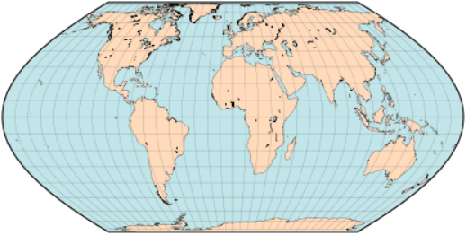

public:: true
下一页:: [[制图学基础知识和投影选择]] 
上一页:: [[地图投影介绍]]
原文链接:: [Introduction](https://web.archive.org/web/20180227085810/http://www.progonos.com/furuti/MapProj/Normal/CartIntro/cartIntro.html)

- 一个广义横向多锥形投影的渲染
   
### 有趣的地图投影
- 地图投影是从地球表面到平面的系统转换（也称为映射）。因为有一些有趣的或有用的属性特征需要被满足,所以我们设计出了很多不同的投影。例如，最好尽可能保持形状、距离和面积关系。不幸的是，没有也永远不会有完美的投影：每种投影的部分区域都会存在一定的变形。 
  
  因此，制图学是一门用于设计和选择最合适的投影的艺术和科学。
### 我的投影
- 我一直喜欢世界地图，想知道如何用计算机绘制地图。我花了很多时间推算了将半径、纬度和经度投影到笛卡尔x和y中的公式。当然，我只能绘制经纬网，直到某天我得到了 一个公共领域的地理坐标数据库(起初，我的PC-XT电脑花了一个多小时来绘制一张 粗略的地图)。
  
  过了一段时间，我开始设计我的“自己的”投影（实际上我几乎没有访问地图参考书目， 所以我都是重新发明轮子）。我最喜欢的设计是一个等面积的平面投影，灵感来自于桑森、 弗拉姆斯蒂德和埃克特的作品。它非常类似于埃克特的V和VI，也类似于瓦格纳的一些投影。 这个投影的数学推导发布在Uma Projeção Cartográfica Equivalente上， 有葡萄牙语PostScript和葡萄牙语PDF版本。
  
  我写了一个简单的应用程序来绘制地图；它有些限制，但很有效（幸运的是，现在它需要 几秒钟，而不是几个小时）。
-  
  我的伪埃克特投影
### 你能在这里学到什么
- 下一章 [[制图学基础知识和投影选择]] 中将介绍基本的投影概念，哪些属性对每个地图应用都很重要，地图多样性的原因，如何设计投影，地图是怎么产生变形的，以及如何为世界地图选择一个好的投影。
- 本文不仅仅是一个投影综述，我试图在上下文中呈现制图概念；一些重要的投影会将不可避免的在多个地方被讨论（例如，在解释其数学基础和列出具有相似特征的投影时）。