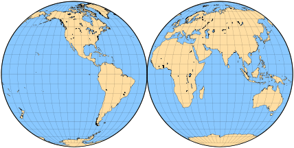
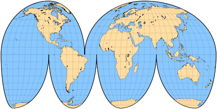
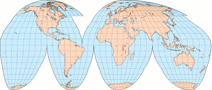
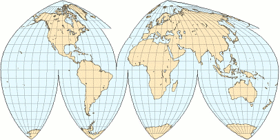
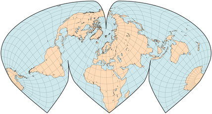

public:: true
上一页:: [[分瓣和复合圆锥投影]] 
下一页:: [[任意分瓣投影]]
原文链接:: [Classic Interrupted Maps](https://web.archive.org/web/20180302051001/http://www.progonos.com/furuti/MapProj/Normal/ProjInt/ProjIntC/projIntC.html)

# Mollweide分瓣投影
- 由于其沿每条纬线的比例尺不变，伪圆柱形投影特别适合于沿经线的中断，其分片从赤道开始。例如，在分瓣的莫尔维德地图上，面积仍然保留，经线仍然映射为椭圆弧线，那些在（任何斜向旋转之后）90°W和90°E的经线是圆形的。因此，具有对称的中央经线的简单形式包括两个完美的圆。比较完全相同地区的方位正交投影和立体投影。
- 大约在1916年，在设计他最著名的投影之前，约翰-保罗-古德试验了分割纯正弦投影和莫尔维德投影。在一个比这里显示的稍微复杂的排列中，其结果变得很受欢迎，但最终被真正的等面积投影所取代。
- 
  分瓣的莫尔维德半球，中央经线110°W和70°E
-  
  分瓣的莫尔维德地图，简化的任意分瓣
# 分瓣古德等面积投影
- 这是J.P. Goode的等面积投影的一种常见形式，由于其方里网断裂而易于识别。这里显示的分瓣排列与古德(1923-1925)最初发表的相似。一些这类地图包括重复几个部分的延伸，以显示格陵兰岛和俄罗斯东部不间断。
-  
  分瓣古德等面积投影,冰岛和格陵兰岛的部分地区以及东亚出现了两次。
# Boggs分瓣正形地图
- Bogge更中意自己的分瓣混合正形投影，类似于Goode的分瓣等面积投影。由于它将正弦投影和莫尔维德投影平均化，而不是将单独投影的带子连接起来，因此，除了（任意地）在欧亚大陆的分瓣之外，均质地图中的经线是不间断的。Boggs通常在北纬40°以北采用不同的中央经线。
-  
  带有重复格陵兰岛和白令海区域的扩展的间断的地貌地图。欧亚经线的断裂清晰可见。
# 分瓣正弦-摩尔韦德投影
- 与古德一样，艾伦-菲尔布里克更喜欢他的西努-莫尔维德投影，采用分瓣的格式，将陆地作为优先考虑对象。与等面积和其他伪圆柱投影相比，Philbrick的中断没有从两极到赤道进行切割，除了沿融合纬线的方向外，还产生了额外的方向中断。在上半部分，两个裂片从旋转的极点向上分割；在下半部分，三个裂片从原10°S平行线附近开始分割。
- 菲尔布里克的原始地图的边界是沿着方里网一字形排列的；他还重复了阿拉斯加的部分，以保持其不分裂，有时还遗漏了南极洲。
-  
  分瓣的正弦-莫尔韦德投影的近似重建