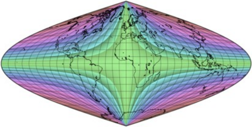
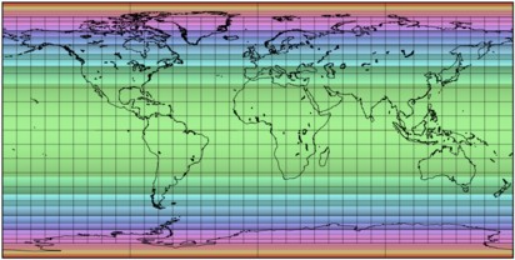

public:: true

# 变形模式
- Tissot的方程描述了在两个主要方向上，即沿子午线和沿与之相交的平行线，各点的比例系数如何受到影响。在地球上，这些方向当然是正交的；在投影地图上，转换后的比例系数提供。
  * 面积缩放系数，表示尺寸被拉伸或压缩的情况；对于等面积投影，它在任何地方都是1。
  * 最大角度变形，表示方向的偏离，对于保角投影来说，它在任何地方都是空的。它被方便地计算为一个从0°到180°的加倍角度。例如，在赤道世界莫尔维德地图中，最高的最大角度变形发生在两极，那里的边界经线正好是水平的，而不是正确的垂直的。
- 角度变形有一个方向，顺时针或逆时针，尽管在实践中它被省略了，因为绝对大小更相关。确定面积和角度变形对于选择一个投影，以及一旦选择了一个投影，将变形的影响降到最低是非常重要的。
- 对于一些受约束的投影组，如正常的方位角投影、圆柱投影和圆锥投影，这两种变形几乎可以直接从投影方程中计算出来。在一般情况下，它们必须通过部分微分进行数值计算。无论哪种方式，它们的值都可以用地图上的颜色来表示，直接显示失真较大和较小的地方。
- **相同比例尺的投影，用颜色表示最大角度变形值**
   
   
  正弦(桑松-弗拉姆斯蒂德)投影地图:面积相等，但只有赤道和中央子午线没有角度变形
   
  莫尔维德投影：正弦波的低变形 "十字架 "被两个椭圆形的 "岛屿 "所取代。
   
  莫尔韦德的投影，斜轴投影面将巴西东南部和北半球的相应区域的失真降到最低。
   
  莫尔维德的投影，打断成四个对称的分瓣。每瓣大小限制了变形范围，代价是距离的不连续性
   
  布罗姆利对莫尔维德投影的重新调整版本：低变形程度的 "岛屿 "向赤道移动、合并并沿赤道扩散
   
  古德分瓣投影（在一个简化的叶状排列中，没有重复区域）。注意在靠近40°N和S的两条边界平行线上的不连续性
   
  Boggs's eumorphic分瓣投影（在简化的分瓣排列中，欧亚大陆没有中断）。扭曲是连续的，因为部分投影是平均的，不是融合的
   
  多面体地图是一种特殊的分瓣情况。在展开的沃特曼多面体上，以面为中心的日晷投影是方位投影的，因此变形模式是径向对称的。
   
  展开的二十面体上的球面投影
   
  二十面体上的Dymaxion投影
   
  埃克特Ⅰ 投影  (既不等积也不共形)，在赤道处有一个明显的方向突变
   
  埃克特II 投影。与其前身的比较表明，正如在制图学中经常发生的那样，增加一个有利的属性（等面积）会带来一个缺点，在这种情况下，一个更小和更不规则的低形状畸变区域 
    
  方位立体地图在任何地方都是共形的，但是投影中心对面的点不能显示出来:它们通常局限于半球
   
  兰伯特方位等面积投影:等面积，代价是周边明显的距离和形状失真
   
  威奇尔伪方位角等面积投影。同样，一个改进(沿子午线的正确比例)被一个减少的低失真区域所抵消
   
  以赤道为标准平行线的等距圆柱形（既非等面积也非保形）投影
   
  兰伯特的圆柱形投影。在这种特殊情况下，有标准平行线45°N和45°S，被称为Gall正轴投影和 "Peters"投影。等面积，但除了沿两个窄带外，严重失真 
   
  兰伯特的等面积圆锥投影，标准纬线为45°N和20°N 
  
## 变形模式和角度变形
- 大多数基于可展曲面的投影在切点或切线处的变形最小，这些切点或切线通常与地图的中心或轴重合。类似地，非透视正弦投影保留了各处的面积，但仅沿赤道和中央子午线没有角度失真(正轴投影面)。相比之下，同样是等面积的莫勒维德投影，在中心子午线与两条标准纬线(约北纬40度、南纬40度)的交点处，只有两点的角度变形为零；尽管赤道上的比例尺是恒定的，所有的经线都是正交的，但是由于垂直比例的夸大，沿赤道的角度变形不是零。在这两种设计之间进行选择时，值得考虑的是，虽然正弦曲线显示的最大角度变形小于20°的区域较小，但其最大变形仅为115°左右，而摩尔维德的最大变形为180°。
- 一旦决定了一个投影，就有几种方法来处理其局限性:
  * 重新定投影中心: 通常包括采用倾斜的投影面，将更感兴趣的区域转移到变形较小的区域。像变形椭圆一样，变形模式是投影的内在因素，不受角度变化的影响。然而，重新定中心并不总是可行的，因为它可能会干扰某些期望的功能方面；例如水平直线纬线
  * 分瓣：球面没有边界，但任何常规地图都会在一个点或线上产生至少一个边界和大距离的不连续性，主要是与投影中心反方向，这成为地图边界的一部分。分瓣地图增加了更多的边界；为了弥补额外的不连续性，每个中断的区域（瓣）可能有自己的概念性投影中心，因此限制了变形。分瓣可以有几种形式，经常是分瓣区域的形状与相关区域大致重合或包含相关区域，如大陆或反之，主要海洋。多面体地图是分瓣式投影的一个特例
  * 调整参数:一些投影可以通过相对简单的修改进行概括或调整，这也可能改变变形模式。例如，在摩尔维德的投影中，标准纬线可以通过重新调整地图的比例来改变，但仍然保持等价:布罗姆利的版本使赤道没有变形。同样，一些作者通过调整兰伯特圆柱投影的标准纬线，提出了“新的”等面积圆柱投影
  * 组合方法。"混合 "投影试图平衡两个或更多以前设计的特征，或者用最有利的投影画出每个相关区域，或者对它们的方程进行平均。在第一种情况下，其经典的例子是Goode的homolosine投影（在两个Mollweide外带之间并列一个正弦形的中心区域，并且几乎总是中断的），变形模式经常在区域边界遭受尖锐的不连续；有时过渡区被定制以平滑突然的变化，但通常以违反投影的主要属性为代价。其他的例子是大多数星体投影和HEALPix投影。相比之下，Boggs的等面积（也是等面积）、Eckert的V型和Winkel三重投影是平均化投影的典型例子。
- 等面积投影从来不是保形的，去除面积等值的约束可以改善它们的角度变形范围。例如，在Eckert的一系列平极方案中，有三对投影看起来很相似，但每对中有一个是等面积的。尽管他的投影I不是保形的，但其中心区域的低变形量比等面积的II更大，形状也更均匀。