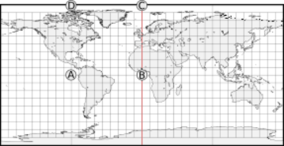
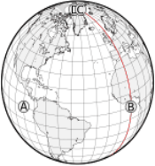
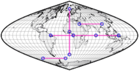
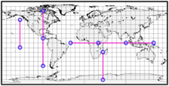
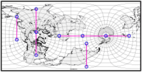
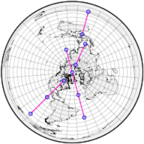
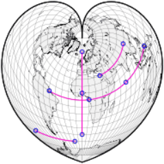
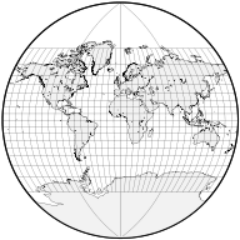

public:: true
上一页:: [[有用的地图属性]] 
下一页:: [[测地线]] 
原文链接:: [Useful Map Properties: Distances and Scale](https://web.archive.org/web/20180322172708/http://www.progonos.com/furuti/MapProj/Normal/CartProp/DistPres/distPres.html)

# 距离可以精确测量吗？
- 任何实用的地图，无论是球形的还是平面的，都会将地球缩小到可用的大小。这种缩小的比例，可以用图形或数字来表示。
- 数字比例尺
  通常是一个比例；例如，在一张1：10万比例的地图上，由1个单位分隔的两个点可以代表实际上相距10万单位的两个城市；地图上的1厘米意味着地球上的1000米。比例尺放大十倍，1：10000，即地图上的1英寸相当于地球上的10000英寸，以此类推。因此，如果在不同的地图中呈现同一区域，较小比例尺的版本更便携，但可能不那么精确和详细。
- 图形比例尺
  至少是一个标有绝对距离的小“标尺”，并直接叠加在地图上。虽然距离计算需要两次测量（一个测量标尺，另一个测量地图本身），但它有一个重要的优势：地图可以缩放后不需要修改图形比例尺，而数字比例尺必须在缩放后重新计算。图形比例尺对于电子设备，如计算机屏幕（其分辨率/物理尺寸比很少能正确校准)和投影(其中显示的尺寸取决于到投影屏幕的距离）特别有用。
- 无论是图形或数字比例尺，只有在地球仪上比例才能直接应用于其表面上的任意一对点。在平面地图上的比例实际上并不恒定，会随着方向和位置而变化。而且它可能是非线性变化的：地图上一条线的两段的长度比对于地球上两段实际距离的比例是不相同的。最后，这是两点在球面上最短距离，在平面地图上的很少能用直线来表示，而且测量任意曲线的长度一般也不是一个简单的过程。
- 因此,地图的范围决定了变形大小(范围越大,长度变形越大),在不确定投影特性的情况下,数字和图形比例尺都不可靠,它们可能都有误导性
- 一些方位角、圆柱形、圆锥形和伪圆柱投影的外边缘提供了一些显著的长度变形的例子，因为地球的极点在地图上投影成了线；一般来说，任何完整世界地图的边缘都会有长度变形，因为点在地图边缘被投影了两次。
- 在左边的圆柱等距图上，点A似乎离C比离b远41%。实际上，红色子午线上的每个点离A都一样远。D和C之间的距离为零，因为它们都位于一个极点上。右边的正投影图从多个角度更好地展示了这些事实。
   
## 标准线和等距离投影
- 标准线 
  地图上的线段，无论是否是直线，没有长度变形（长度与地球上相应的线成正比）即称为标准线。
- 等距离投影
  具有定义明确、显著的标准线集的地图投影即被称等距离投影(译注:沿特定方向的距离，投影之后保持不变)。一些众所周知的例子有:
  * 等距圆柱投影:正轴投影时，所有的子午线和一或两条纬线都是标准线(切或者割圆柱)
  * 等距方位投影:正轴投影时，所有的子午线都是标准线
  * 等距圆锥投影:正轴投影时，所有的子午线和一或两条纬线都是标准线(切或者割圆锥)
- 一个常见的错误认知是假设在地图上绘制的圆表示与地球上相应的形状和相同的距离范围。这只有在从圆心辐射出来的所有直线都是标准线时才是对的。
### 一些投影的标准线（按比例1：2：3标记）
- 正弦曲线投影:在一张赤道Sanson-Flamsteed（或sinusoidal）地图上，所有的纬线都是标准线：如果A段是B段长度e的两倍，地球上相应的线遵循相同的比例。虽然纬线之间的垂直直线距离是真实的尺度，但沿子午线的位置不是，除了中央位置。
  
- 这张正轴等距离圆柱投影跟正弦曲线投影几乎相反：只有子午线和赤道保持一个恒定的尺度。由于地图上所有的纬线处都等长，水平比例尺在顶部和底部迅速增大，在两极达到无穷大。
  
- 标准线与 ((60c2c338-0901-4943-903d-bcaf2c3dff03)) 绑定，而不是与投影的特征绑定。图中的横轴等距圆柱形投影，也被称为卡西尼投影，标准线保持不变，但一般不与子午线重合
  
- 方位等距投影会保留通过中心点的任何线段的距离。 过极点的线是子午线。
  
- 标准线不一定是直的。沃纳热诚投影中的是同心圆弧。在正常方面，它们是以极点为中心的，中心子午线也是标准线。
  
- 并不是所有的直线都是标准线。范德格林特III投影中的纬线是非线性变形：中心附近的子午线比边界附近的子午线稍近一些
  