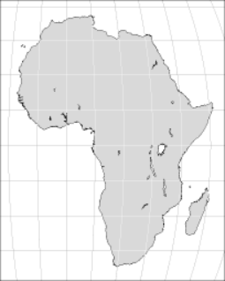

public:: true

# 是否保留了面积比？
- 除了导航目的之外，对于大多数具有普遍意义的地图来说，面积相等是最基本的属性。地图是一种一目了然地传达信息的工具，比表格或数字列表更快、更简洁，视觉比较通常需要真实的面积比。重要应用包括 
  * 科学地公布地理分布情况，如福利水平、污染/毁林、作物产量、温室变暖等等
  * 教育地图集和图表，以及新闻信息
	- **经典的比较:墨卡托 ⨉ 莫尔维德 **
	- {:height 402, :width 264}  
	- 使用墨卡托等角投影（上图）和莫尔韦德等面积投影（下图）的赤道面以相同的比例尺绘制地图。 两行均显示裁剪后的小比例地图、格陵兰岛和非洲。 10° 方里网清楚地表明墨卡托投影如何在极点附近拉伸尺度。 另一方面，它在赤道上没有显示失真，Mollweide 地图明显夸大了垂直比例。
	-   
- 后一个问题非常令人担忧，因为即便是学校和大学的教科书，更不用说报纸和电视节目，在选择地图投影时往往很粗心。这是不幸的，因为地图会产生强大而持久的视觉图像；错误呈现的地图可能会永久扭曲一个人的世界观（然而，这种论点也被用作误导和短视的宣传）。
- 作为一个经典的例子，墨卡托投影，在适当的上下文中是一个非常强大的工具，但遗憾的是经常被用于挂图和流行的插图，在这些地方，它的保形性是无用的，面积比具有误导性。
- 在正轴墨卡托投影中，表面拉伸向极点快速但连续地增加到无穷大。甚至格陵兰岛的北半部看起来也比南半部宽得多——这种投影保留了形状，但仅限于局部。相比之下，Mollweide 的椭圆投影显示了地图所有部分之间的正确大小比例。
- 等面积（也叫等值）投影保留了面积关系；换句话说，给定地球上任何两个区域A和B，以及等面积地图上的相应区域A'和B'，其表面比率A/A'和B/B'是相同的（A和B不需要有相同的形状；形状A和A'可能会不同）。
- 等面积投影不一定是等距的；事实上，为了保持面积，在任何一点上，给定方向上的比例变形必须与正交方向上的比例变形成反比。例如，在正轴 Mollweide 投影中，沿赤道的水平尺度有点太低，而垂直方向的水平尺度有点太高:：其净效果是使各大洲有点过于纤细。
- 尽管墨卡托投影使非洲（最大的大陆之一，29,800,000平方公里）和格陵兰岛（最大的岛屿，2,175,600平方公里）的面积明显相似，但等面积投影显示它们的真实面积比--大约13.7 : 1--要清楚得多。
	- {:height 142, :width 103} 
	  在相同的比例因子下，墨卡托（左）和莫尔韦德（右）地图重新以格陵兰为中心。 第一个的区域仍然被夸大了，但几乎不明显。
- 然而，生活中很少有免费的东西，制图也不例外。像许多等面积设计一样，莫尔维德投影以裁剪的形式付出了沉重的代价，尤其是在高纬度或远离中央子午线的地方。尽管格陵兰岛在以格林威治子午线为中心的赤道方面没有受到特别的影响，但在倾斜投影面重新调整后，它看起来好得多——而且面积仍然正确。公平地说，一张相当于重新居中的墨卡托地图避免了原始地图的大部分区域拉伸，并为格陵兰岛提供了比摩尔维德版本更好的形状，摩尔维德版本明显沿着投影的中心线拉伸垂直比例。另一个证据是，无论一个投影的优点或缺点是什么，它们的相关性肯定会受到绘制的感兴趣区域的影响。